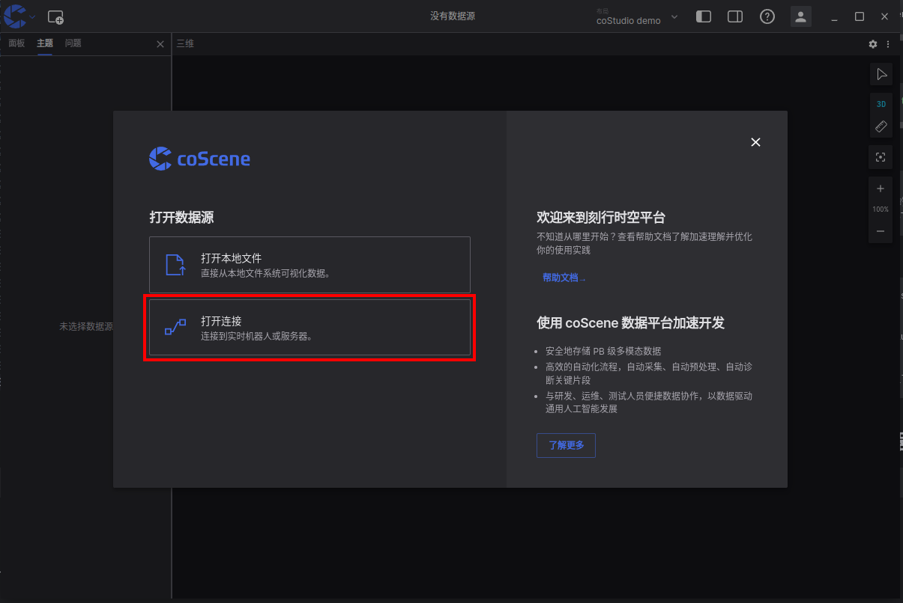
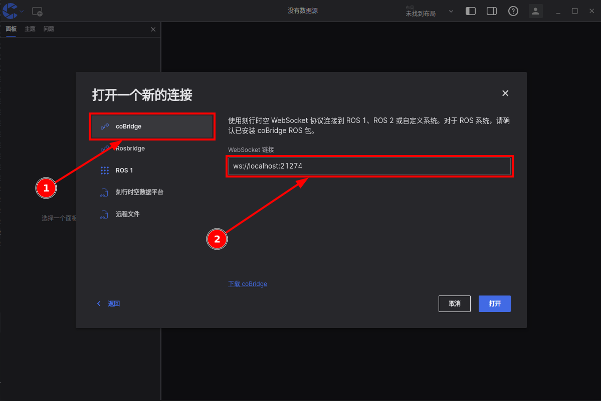
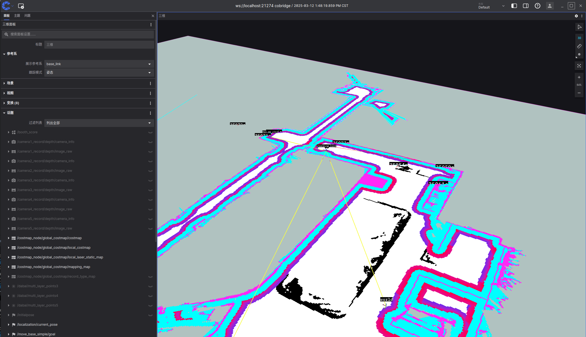

# 通过 coBridge 连接机器

[coBridge](https://github.com/coscene-io/coBridge) 是刻行时空提供的一款开源机端软件，目前支持 **ros1** `noetic`、 **ros2** `foxy` 及 `humble` 版本。cobridge 会以 ros node 的方式运行在机器人端，并通过 websocket 方式与云端进行交互。cobridge 与云端建立链接后，根据云端指令可以实现订阅 ros topic，调用 ros service，实现实时监控机器人状态、远程下发指令等功能。

## 安装 coBridge

在机器端，打开 terminal，依照以下流程安装 coBridge。

1. 导入公钥。

```bash
  wget https://download.coscene.cn/cobridge/coscene.gpg && sudo gpg --dearmor -o /etc/apt/trusted.gpg.d/coscene.gpg coscene.gpg
```

2. 添加源。

```bash
  echo "deb [signed-by=/etc/apt/trusted.gpg.d/coscene.gpg] https://download.coscene.cn/cobridge $(. /etc/os-release && echo $UBUNTU_CODENAME) main" | sudo tee /etc/apt/sources.list.d/cobridge.list
```

3. 更新apt并安装。

```bash
  sudo apt update
  # 注意: 如果 ROS_DISTRO 没有在你的环境变量里面，${ROS_DISTRO} 需要被 'noetic', 'foxy' or 'humble' 替换
  sudo apt install ros-${ROS_DISTRO}-cobridge -y
```

4. 运行 coBridge。

```bash
  source /opt/ros/${ROS_DISTRO}/setup.bash

  # for ros 1 distribution
  roslaunch cobridge cobridge.launch

  # for ros 2 distribution
  ros2 launch cobridge cobridge_launch.xml
```

## 使用 coStudio 对机器进行实时可视化

1. 下载 [coStudio](https://www.coscene.cn/download)。
2. 开启 coStudio 后，选择 “打开连接” 功能。
   
3. 选择 coScene Websocket 选项，在 WebSocket URL 中输入连接地址。`ws://localhost:21274` **（ 21274 为 coBridge 的默认端口号 ）**。
   
4. 打开后即可使用不同面板对机器数据进行实时可视化。
   

## 可视化相关参考链接

- 面板相关设置：[面板设置](https://docs.coscene.cn/docs/category/panel)
- 布局相关设置：[布局](https://docs.coscene.cn/docs/viz/layout)
