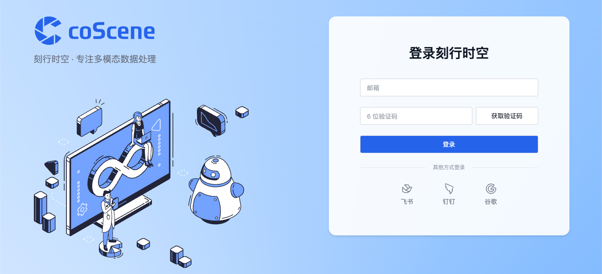
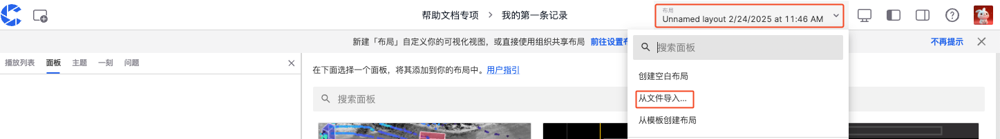
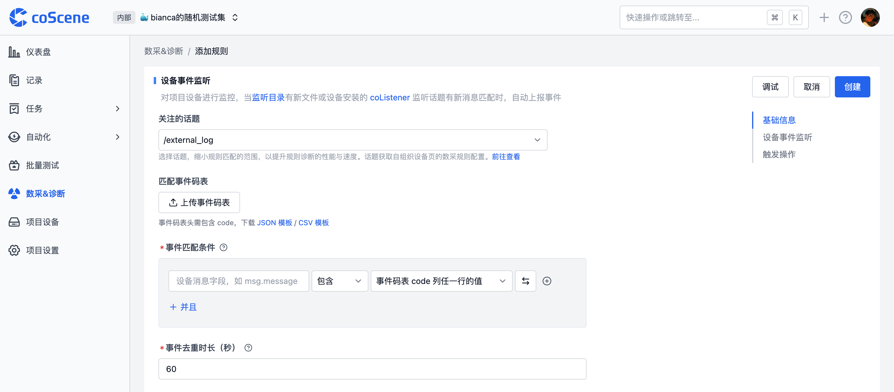

# 快速开始

## 平台能力介绍

刻行时空是一款基于 **SceneOps 理念**的多模态数据管理平台，提供了**数据采集、存储、管理、标注、审核、分析、可视化**等功能，在帮助用户更高效地管理和分析数据同时，还可以通过平台提供算力实现**云端 EB 级别数据回灌测试、云端仿真验证、算法测试**。

- 数据采集：支持设备、传感器、关节等多种数据源，支持手动采集、自动采集、远程采集等多种方式。
- 数据存储：支持多种数据存储方式，如本地存储、云存储、对象存储等。
- 数据管理：支持数据的增删改查、权限管理、数据版本控制等，同时**支持对 hdf5、db3、mcap、bag 等主流格式的数据格式之间的相关转换。**
- 数据标注：支持数据的标注、审核、审核结果统计等。
- 数据分析：支持数据的统计分析、数据挖掘、机器学习等。
- 云端仿真：支持云端仿真验证、云端 EB 级别数据回灌测试、算法测试等。
- 可视化：支持数据（mcap，bag，db3 等主流格式）的可视化分析、数据挖掘、机器学习等。
- 协作：支持多用户协作、多组织协作、多项目协作等。
- 权限管理：支持用户、组织、项目、记录、文件、一刻等资源的权限管理。

## 登录刻行时空

刻行时空平台中，我们提供了几个核心维度的角色与权限的划分，可参考下图的组织架构图:


- 「组织」：组织是刻行时空平台的最高管理单位，相当于一个公司或公司内部的某个团队。

- 「项目」：项目是刻行时空平台的第二级管理单位，在不同的应用场景下可以有不同的意义：
  - 在具身智能数采场景中，一个项目可以对应是一个数采工厂,然后通过第三级的记录来区分技能。也可以对应成一个技能，在项目下通过记录来管理归属于此技能的所有数据。
  - 在商清机器人运维领域中，一个项目可以对应是一个型号的机器人的全部运维问题，也可以定义成某个重点客户的运维问题。
  - 在机器人仿真验证场景中，一个项目可以对应是一个型号的机器人的全部仿真验证环境。

- 「设备」：设备是刻行时空平台的第二级管理单位，对应的是安装了刻行时空端侧软件的设备，如机器人、无人机等。

- 「镜像仓库」：镜像仓库是刻行时空平台的第二级管理单位，用于存放镜像文件，如 Docker 镜像、ROS 镜像等。

- 「记录」：记录是刻行时空平台的第三级管理单位，它一定会归属与第二级管理单位'项目'，在不同的应用场景下可以有不同的意义：
  - 在具身智能数采场景中，一个记录可以对应是一个数采工厂中的一次数采。
  - 在商清机器人运维场景中，一个记录可以对应是某台机器人的一次现场运维数据的记录。
  - 在仿真验证场景中，一个记录可以对应是一个仿真验证环境。

- 「自动化动作/测试程序/测试套件/触发器」：以上单位与记录同级，都需要归属与第二级管理单位'项目'，在不同的应用场景下可以自由排列组合获得不同的能力，可查看对应文档获取详细信息。

而对于我们每一位用户，**每个组织的创建者（或者首位登录者），会默认成为组织的管理员。** 其余成员可以通过与组织创建者的相同的 OA 办公软件认证登录（例如飞书/钉钉等），用户将自动加入管理员创建的组织。或者由组织管理员邀请用户加入组织（邮箱登录）。

每一位用户，在进入组织后，会获得组织成员的权限，可以看到组织内的内部项目/公开项目/以及用户自己创建的私有项目。可以对组织内的设备进行查看和注册，但无管理权限。

用户可以创建属于自己的项目，则默认获得项目管理员权限，在该项目中用户可以创建记录、上传文件、创建自动化动作、创建测试程序、创建测试套件、创建触发器等。

### 管理员

1. 通过浏览器访问[刻行时空平台](https://www.coscene.cn)，点击右上角的【快速登录】，进入登录界面。

   

2. 选择登录方式进入平台：邮箱、飞书、钉钉或谷歌企业邮箱。

   

3. 填写「组织名称」与「组织 ID」，勾选「同意」，点击【创建组织】按钮。

   

4. 创建成功后，将自动进入组织首页。可以开始[管理你的组织](../3-collaboration/organization/1-organizations.md)。

### 普通用户

> 首先请联系组织管理员，邀请你加入组织。或者通过同一飞书/钉钉/谷歌企业邮箱等办公软件，使用相同的途径登录。

1. 通过浏览器访问[刻行时空平台 https://www.coscene.cn/](https://www.coscene.cn)，点击右上角的【快速登录】，进入登录界面。

   

2. 选择与你组织一致的登录方式（邮箱、飞书、钉钉或谷歌企业邮箱）进行登录。

   

3. 选择组织后，即可进入组织，开始你的数据之旅。

   

## 可视化您的数据与日志

**可视化**是刻行时空平台中最核心的能力之一，基于刻行时空强大的能力，用户可以抛弃依赖繁琐的 Rviz/Rviz2 等工具，直观地查看、分析、诊断设备数据、日志、配置文件等数据，帮助用户更高效地管理和分析数据。

### 创建项目

项目是数据管理的单元，对于数据的存储、管理、隔离和应用都发生在项目级别。一个项目可以是一个部门、一个项目组或一个业务线。更多关于项目的介绍，请参考[项目](../3-collaboration/project-collaboration/1-project.md)。

在主页上点击"创建项目"按钮，然后按照指引步骤完成项目创建。


### 创建记录

记录（Record）是描述相关场景的文件集合，用于数据的存储、管理和可视化。记录可以包含：

- 设备故障数据
- 任务执行数据
- 待标注数据集
- ROS Bag、日志、地图、配置文件等

详细信息请参考[记录](../3-collaboration/record/1-quick-start-record.md)。

1. 在项目左侧导航栏，选择「记录」，点击【创建记录】。


2. 在弹窗中输入记录的名称等相关信息，点击【创建】按钮。


3. 创建完成后，自动进入记录详情页，点击【上传】按钮上传 bag/mcap 文件，或点击[下载示例文件](https://coscene-artifacts-prod.oss-cn-hangzhou.aliyuncs.com/docs/example/viz/scene-0001.mcap)后上传。


### 可视化播放记录

数据可视化界面通过可配置的「面板」和「布局」，将设备数据以直观的可视化方式呈现，助力用户高效分析与诊断各类问题。更多关于可视化的介绍，请参考[可视化数据](../viz/1-about-viz.md)。

1. 在记录中上传 bag/mcap/db3/hdf5 后，点击【播放记录】，进入可视化页面。


2. 在可视化页面的布局栏中，选择【从文件导入】，导入<a href="https://coscene-artifacts-prod.oss-cn-hangzhou.aliyuncs.com/docs/example/viz/nuScenes.json" download="nuScenes.json">示例布局</a>。



3. 点击底部【播放】按钮开始播放数据。可以通过切换不同的面板（如三维图、曲线图、状态转换图、表格等）来查看数据。更多面板使用说明，请参考[面板介绍](../viz/4-panel/1-panel-overview.md)。


### 创建并分享一刻

在可视化界面播放数据时，你可以通过创建「一刻」来标记重要的时间点或时间段。「一刻」可以帮助你追踪关键数据变化（如设备异常、性能波动）等值得关注的信息，方便后续查看和分析。更多关于一刻的介绍，请参考[一刻](../viz/5-create-moment-viz.md)。

1. 在可视化播放记录时，点击左下角【创建一刻】，可标记一刻的起点。


2. 再次点击【创建一刻】以标记一刻的终点。此时会自动弹出创建一刻的窗口，蓝色区域表示一刻的时间范围。


3. 填写相关信息后，点击【创建一刻】即可完成。在左侧的一刻面板中查看当前记录的所有一刻。


4. 点击分享按钮可将当前一刻的链接分享给其他成员，方便协作分析。


## 远程连接设备

用户可以与现场正在运行的设备建立联系，详见[设备](../device/1-device.md)

通过远程连接设备，可以实时查看设备的运行状态与各传感器的信息，还可以通过网页 SSH 远程连接设备，进行调试和操作。在机器人的远程运维与操作方面有极大的助力。

### 添加设备

> 前提条件：支持 Linux 设备，arm64 和 x86_64 架构

1. 通过右上角「我的」，进入「组织管理-设备」页面，点击【添加设备】按钮。


2. 在弹框中，选择【系统生成 ID】，点击【复制】按钮，复制安装命令。
   - 若要使用自定义的 ID，参见[设备 ID 配置](../device/2-create-device.md#设备-id-配置)


**刻行时空强烈建议用户使用自定义的 ID，避免出现后续设备重复注册的问题。**

3. 在真实设备上打开 shell 终端，执行安装命令，设备端出现 `Installation completed successfully 🎉` 即表示安装成功。

4. 等待 1-2 分钟，设备会自动展示在设备列表中。联系组织管理员，启用设备的使用权限。


### 网页 SSH

当设备启用后，在「组织管理-设备」页面找到该设备，点击【网页 SSH】按钮即可在浏览器中打开新标签页，远程连接到设备。更多详情请参考[网页 SSH](../device/5-device-remote-control.md#网页-ssh)。


### 实时可视化

通过实时可视化的功能，用户可以实时查看设备的运行状态和数据，实时查看机器人传感器的状态与数据，还可以调用机器人端提供的service，发布 rostopic，订阅 rostopic，调用服务等。实现实时的**远程运维**。

> 前提条件：
>
> 1. 安装 coBridge 组件
>    - coBridge 是一个独立的 ROS 节点，负责通过 WebSocket 协议将设备数据实时传输到前端
>    - 支持的 ROS 版本：
>      - ROS1：<u>Noetic Ninjemys</u>、<u>Melodic Morenia</u>
>      - ROS2：<u>Foxy Fitzroy</u>、<u>Galactic Geochelone</u>、<u>HumbleHawksbill</u>

安装方法：

- 导入公钥：

```bash
curl -fsSL https://download.coscene.cn/coscene-apt-source/coscene.gpg | sudo gpg --dearmor -o /etc/apt/trusted.gpg.d/coscene.gpg
```

- 添加源：

```bash
echo "deb [signed-by=/etc/apt/trusted.gpg.d/coscene.gpg] https://download.coscene.cn/coscene-apt-source $(. /etc/os-release && echo $UBUNTU_CODENAME) main" | sudo tee /etc/apt/sources.list.d/coscene.list
```

- 更新与安装：

```bash
sudo apt update
# CAUTION: ${ROS_DISTRO} need to be replaced by 'noetic', 'foxy' or 'humble', if ROS_DISTRO not in your env
sudo apt install ros-${ROS_DISTRO}-cobridge -y
```

- 运行与启动：

```bash
source /opt/ros/${ROS_DISTRO}/setup.bash  #根据您的 ros 版本替换 ${ROS_DISTRO}

# for ros 1 distribution
roslaunch cobridge cobridge.launch

# for ros 2 distribution
ros2 launch cobridge cobridge_launch.xml
```

\*\* 我们的代码是完全开源的，支持您后续根据您的需求直接基于我们的 cobridge 代码进行二次开发，并合入您的专属软件包中，可查看[ coBridge](https://github.com/coscene-io/coBridge) 源码（C++）

> 2. 启动 coBridge 节点后，即可在网页端查看设备的实时数据

当设备启用后，在「组织管理-设备」页面找到该设备，点击【实时可视化】按钮即可在浏览器中实时查看设备的运行状态和数据。更多详情请参考[实时可视化](../device/5-device-remote-control.md#实时可视化)。


在实时可视化页面，通过配置三维、原始消息、服务调用、远程操纵等面板，可以更直观地调试设备。更多详情请参考[面板介绍](../viz/4-panel/1-panel-overview.md)。


## 采集设备数据

平台可以与真实设备建立连接，通用主动在平台上下发任务的方式，去采集用户需要上传到平台上的数据。

### 添加设备

> 前提条件：支持 Linux 设备，arm64 和 x86_64 架构。

1. 通过右上角「我的」，进入「组织管理-设备」页面，点击【添加设备】按钮。


2. 在弹框中，选择【系统生成 ID】，点击【复制】按钮，复制安装命令。
   - 若要使用自定义的 ID，参见[设备 ID 配置](../device/2-create-device.md#设备-id-配置)


3. 在真实设备上打开 shell 终端，执行安装命令，设备端出现 `Installation completed successfully 🎉` 即表示安装成功。

4. 等待 1-2 分钟，设备会自动展示在设备列表中。联系组织管理员，启用设备的使用权限。


### 手动采集数据

1. **将设备添加到项目**：进入「项目设备」页，点击【添加设备】按钮，选择需要采集数据的设备。


2. **配置采集目录**：进入组织设备配置页，设置采集目录 `collect_dirs` 为设备上存储数据的目录，如：`/home/bag/` 和 `/home/log/`。


**注意：在您配置采集目录时，请确保您需要被采集的数据直接存放在该目录下。**

```yaml
mod:
  name: 'default'
  conf:
    enabled: true
    # 设备端的采集目录，作为项目中数据采集任务与规则采集的指定目录
    collect_dirs:
      - /home/bag/
      - /home/log/
```

3. **创建采集任务**：进入「项目-任务-采集任务」页面，创建采集任务。
   - 选择要采集数据的设备
   - 选择要采集的时间范围：在目标数据路径下，采集「文件更新时间」在指定时间段内的文件
   - 目标数据路径：默认值取自设备配置中的 `collect_dirs`，也可以自定义路径。若填写为文件夹，则采集该文件夹下符合时间范围的文件；若填写为文件，则采集该文件。
   - 任务名称：自定义名称


4. **查看采集结果**：进入「项目-任务-采集任务」页面，点击任务名称查看采集结果，采集完成的数据将自动保存到记录中。


### 自动采集数据

自动采集数据是通过预定义的规则持续监测设备日志，或者监听特定的 topic，在触发特定条件时自动采集相关数据，从而实现运维故障数据的自动上传。详情请参考[数采&诊断](../use-case/data-diagnosis/3-add-rule.md)。

#### 1. **将设备添加到项目**：进入「项目设备」页，点击【添加设备】按钮，选择需要采集数据的设备。


#### 2. **配置监听与采集目录**：进入组织设备配置页，设置监听目录`listen_dirs` 与采集目录 `collect_dirs`

**注意：在您配置采集目录时，请确保您需要被采集的数据直接存放在该目录下，暂不支持自动遍历目录下的子目录，如果是存放在子目录下，需要配置完整路径。**

**注意：如果我们是基于监听 topic 的方式作为基础规则，那么需要在此处配置 topics ，参考如下示例。**


```yaml
mod:
  name: 'default'
  conf:
    enabled: true
    # 设备端的采集目录，作为项目中数据采集任务与规则采集的指定目录
    collect_dirs:
      - /home/bag/

    # 设备端的监听目录，作为项目中规则的监听目录。刻行时空的端侧软件将监控此目录下的文件（文件类型支持 mcap， bag , log 等）里是否包含您设置的 topics ，若有则触发采集
    listen_dirs:
      - /home/bag/

    # 设置文件监听的时效性：若文件的最后更新时间距离当前时间超过 2 小时，则不会被系统监听
    skip_period_hours: 2
  #监听的 topic 名称，例如您的机器人会持续发布一个叫 /error_status 的 topic 来表示出现了告警可能需要采集数据，您可以在规则中配置监听该 topic
  topics:
    - /error_status
```

#### 3. **规则组**

规则组是规则的集合，用于对规则进行分类管理。

##### 添加规则组

在项目中，进入「数采&诊断规则」分页，点击【添加规则组】，添加成功后，可在该规则组内添加具体规则。


##### 规则组的启用与关闭

新添加的规则组默认处于「关闭状态」，若要让项目设备使用其中的规则进行数据监听，需手动开启；

若暂时不需要使用，但后续还会用到，也可将其设为「关闭状态」。


#### 4. 规则组管理

在更多操作中，可进行规则组的重命名和删除操作。


#### 5.**规则创建与配置**

规则是规则组中的单个规则，用于定义触发数据采集与诊断的条件，以及触发后的操作。

##### 添加规则

在规则组中，可通过点击【创建空白规则】或【从规则模板创建】来添加新规则，下面主要介绍创建空白规则的步骤。


为规则命名，规则名称用于区分不同规则，方便后续管理和识别。


##### 设备事件监听

> 此模块是对项目设备进行监控，当预先设定的监听目录里的文件有匹配到您设定的监听话题时，将自动上报事件并记录到当前项目的仪表盘中。



###### 关注的话题

- 设置关注的触发话题能缩小规则匹配范围，提高规则诊断的性能、速度和准确度。

- 若想监听设备中日志类型的文件，请选择`/error_status`。

- 其他话题选项可在组织的设备配置中设置，详情可参考[ 4-设备配置](../device/4-device-collector.md)文档。

###### 匹配事件码表

- 在事件码表中，可定义事件的 code 值、事件名称、等级、解决方案等信息。事件码表必须包含 code 列，作为事件的唯一标识符。

- 上传事件码表（支持 JSON 或 CSV 文件）后，系统会自动解析，还支持预览、下载、删除操作。若要修改表内容，可先下载到本地电脑修改后再上传。


###### 事件匹配条件

- 根据设备消息字段与某个值的匹配关系判断事件是否触发。

- 点击【切换】按钮可在 code 表头和具体值输入框之间切换。

- 在预定义输入框中，设定了事件码表中的 code 值作为匹配变量。

- 在具体值输入框中，直接输入文字信息。

- 若要检测 log 文件中是否有关键词 error 1，则需填写：msg.message 包含 error 1，并且「关注的话题」一栏需要选择 /error_status(这里参考我们第二步中配置的 topic 名称)。

- 若要检测 bag 文件的 /error_status 话题（消息类型为 std_msgs/string）中的 msg.data 消息字段中有关键词 error 1，则需要填写：msg.data 包含 error 1。

- 多行逻辑判断条件之间是并且关系，需同时满足才生效。


###### 事件去重时长

- 若新事件（同一事件）在上次合并事件后的设定时间内发生，则与原事件合并。每次新事件发生时，都重置时间，直到超出时间窗口都无新事件发生时，完成合并。

- 支持范围设置在 1 秒 \~ 86400 秒（1 天）之间。


当 log 文件中出现：1001、1002 或 1003 时（即事件码表中的 code 列任一行值），即可判断为事件匹配成功。

触发操作是指规则条件满足后触发后的操作，目前支持了采集数据、诊断数据两个模块。

##### 采集数据

- 规则条件在设备端触发后，会在本项目中自动创建一条采集任务，采集对应时间的设备数据，采集完成后在记录中生成一条记录，包含触发条件满足时的数据。


- 可以设定上传文件的时间范围、记录名称、记录描述、记录标签、采集限制。

- 上传文件指上传数采目录中符合时间范围的所有文件。

- 记录名称、记录描述支持使用代码变量（使用 `{scope.表头名称}` 的格式）与正文穿插书写。


- 在更多设置中，可利用[文件通配符](https://www.malikbrowne.com/blog/a-beginners-guide-glob-patterns/)进行二次筛选。

- 若有具体的附加文件，如地图文件，可在此处写明具体文件所在地址。


##### 诊断数据

- 对已经采集到平台中的记录执行数据诊断动作，符合触发条件的时间点将自动创建一刻，可在采集后的记录中查看相关一刻。


- 支持设定一刻名称、一刻描述、一刻的属性值，以及是否为诊断出的一刻创建关联的通用任务进行流转。

- 一刻名称、一刻描述、一刻的属性值支持使用代码变量（使用 `{scope.表头名称}` 的格式）与正文穿插书写。


#### 6.**确认规则**：确认规则已启用，且目标设备已拉取到最新的规则配置。

- 启用规则组：点击规则组右侧的启用按钮


- 在设备端执行以下命令，查看是否拉取到最新的规则配置，即出现关键词 `Updated rules`、`listen_dirs`、`collect_dirs`

```bash
      # 查看数采客户端日志
      tail -f ~/.local/state/cos/logs/cos.log
```


#### 7.**查看采集结果**：在「项目-记录」页面，查看设备自动创建的记录。点击记录名称进入详情，查看文件与一刻信息。通过播放记录，在[可视化](../viz/1-about-viz.md)页面查看采集的数据。


| 内容 | 示例 |
| :---: | :---: |
| 文件 |  |
| 一刻 |  |

## 了解更多

- [自动化处理数据](../6-automation/1-quick-start-workflow.md)
- [更新日志](https://docs.coscene.cn/changelog)
