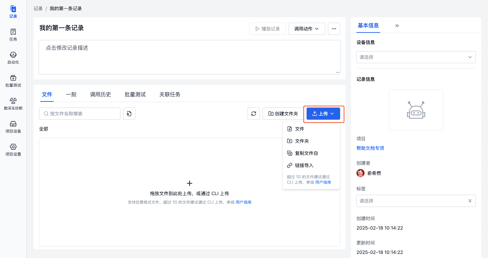
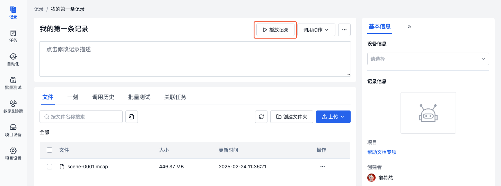
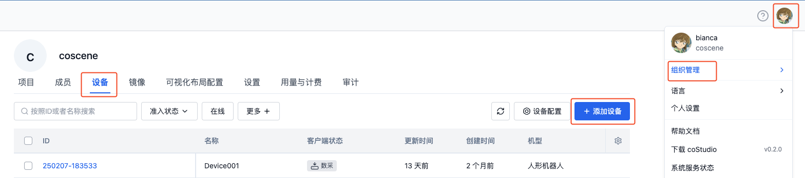
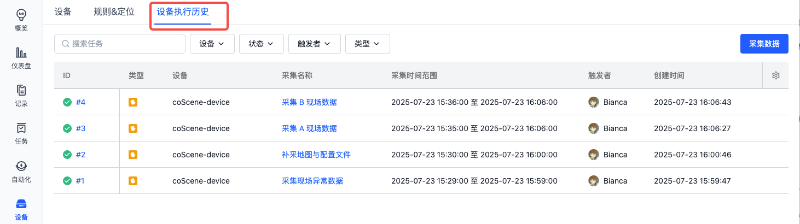

# 快速开始

## 平台能力介绍

刻行时空是一款基于 **SceneOps 理念**的多模态数据管理平台，提供了**数据采集、存储、管理、标注、审核、分析、可视化**等功能，在帮助用户更高效地管理和分析数据同时，还可以通过平台提供算力实现**云端 EB 级别数据回灌测试、云端仿真验证、算法测试**。

- 数据采集：支持设备、传感器、关节等多种数据源，支持手动采集、自动采集、远程采集等多种方式。
- 数据存储：支持多种数据存储方式，如本地存储、云存储、对象存储等。
- 数据管理：支持数据的增删改查、权限管理、数据版本控制等，同时**支持对 hdf5、db3、mcap、bag 等主流格式的数据格式之间的相关转换。**
- 数据标注：支持数据的标注、审核、审核结果统计等。
- 数据分析：支持数据的统计分析、数据挖掘、机器学习等。
- 云端仿真：支持云端仿真验证、云端 EB 级别数据回灌测试、算法测试等。
- 可视化：支持数据（mcap，bag，db3 等主流格式）的可视化分析、数据挖掘、机器学习等。
- 协作：支持多用户协作、多组织协作、多项目协作等。
- 权限管理：支持用户、组织、项目、记录、文件、一刻等资源的权限管理。

## 登录刻行时空

刻行时空平台中，我们提供了几个核心维度的角色与权限的划分，可参考下图的组织架构图:


- 「组织」：组织是刻行时空平台的最高管理单位，相当于一个公司或公司内部的某个团队。

- 「项目」：项目是刻行时空平台的第二级管理单位，在不同的应用场景下可以有不同的意义：
  - 在具身智能数采场景中，一个项目可以对应是一个数采工厂,然后通过第三级的记录来区分技能。也可以对应成一个技能，在项目下通过记录来管理归属于此技能的所有数据。
  - 在商清机器人运维领域中，一个项目可以对应是一个型号的机器人的全部运维问题，也可以定义成某个重点客户的运维问题。
  - 在机器人仿真验证场景中，一个项目可以对应是一个型号的机器人的全部仿真验证环境。

- 「设备」：设备是刻行时空平台的第二级管理单位，对应的是安装了刻行时空端侧软件的设备，如机器人、无人机等。

- 「镜像仓库」：镜像仓库是刻行时空平台的第二级管理单位，用于存放镜像文件，如 Docker 镜像、ROS 镜像等。

- 「记录」：记录是刻行时空平台的第三级管理单位，它一定会归属与第二级管理单位'项目'，在不同的应用场景下可以有不同的意义：
  - 在具身智能数采场景中，一个记录可以对应是一个数采工厂中的一次数采。
  - 在商清机器人运维场景中，一个记录可以对应是某台机器人的一次现场运维数据的记录。
  - 在仿真验证场景中，一个记录可以对应是一个仿真验证环境。

- 「自动化动作/测试程序/测试套件/触发器」：以上单位与记录同级，都需要归属与第二级管理单位'项目'，在不同的应用场景下可以自由排列组合获得不同的能力，可查看对应文档获取详细信息。

而对于我们每一位用户，**每个组织的创建者（或者首位登录者），会默认成为组织的管理员。** 其余成员可以通过与组织创建者的相同的 OA 办公软件认证登录（例如飞书/钉钉等），用户将自动加入管理员创建的组织。或者由组织管理员邀请用户加入组织（邮箱登录）。

每一位用户，在进入组织后，会获得组织成员的权限，可以看到组织内的内部项目/公开项目/以及用户自己创建的私有项目。可以对组织内的设备进行查看和注册，但无管理权限。

用户可以创建属于自己的项目，则默认获得项目管理员权限，在该项目中用户可以创建记录、上传文件、创建自动化动作、创建测试程序、创建测试套件、创建触发器等。

### 管理员

1. 通过浏览器访问[刻行时空平台](https://www.coscene.cn)，点击右上角的【快速登录】，进入登录界面。

   

2. 选择登录方式进入平台：邮箱、飞书、钉钉或谷歌企业邮箱。

   

3. 填写「组织名称」与「组织 ID」，勾选「同意」，点击【创建组织】按钮。

   

4. 创建成功后，将自动进入组织首页。可以开始[管理你的组织](../3-collaboration/organization/1-organizations.md)。

### 普通用户

> 首先请联系组织管理员，邀请你加入组织。或者通过同一飞书/钉钉/谷歌企业邮箱等办公软件，使用相同的途径登录。

1. 通过浏览器访问[刻行时空平台 https://www.coscene.cn/](https://www.coscene.cn)，点击右上角的【快速登录】，进入登录界面。

   

2. 选择与你组织一致的登录方式（邮箱、飞书、钉钉或谷歌企业邮箱）进行登录。

   

3. 选择组织后，即可进入组织，开始你的数据之旅。

   

## 可视化您的数据与日志

**可视化**是刻行时空平台中最核心的能力之一，基于刻行时空强大的能力，用户可以抛弃依赖繁琐的 Rviz/Rviz2 等工具，直观地查看、分析、诊断设备数据、日志、配置文件等数据，帮助用户更高效地管理和分析数据。

### 创建项目

项目是数据管理的单元，对于数据的存储、管理、隔离和应用都发生在项目级别。一个项目可以是一个部门、一个项目组或一个业务线。更多关于项目的介绍，请参考[项目](../3-collaboration/project-collaboration/1-project.md)。

在主页上点击"创建项目"按钮，然后按照指引步骤完成项目创建。


### 创建记录

记录（Record）是描述相关场景的文件集合，用于数据的存储、管理和可视化。记录可以包含：

- 设备故障数据
- 任务执行数据
- 待标注数据集
- ROS Bag、日志、地图、配置文件等

详细信息请参考[记录](../3-collaboration/record/1-quick-start-record.md)。

1. 在项目左侧导航栏，选择「记录」，点击【创建记录】。


2. 在弹窗中输入记录的名称等相关信息，点击【创建】按钮。


3. 创建完成后，自动进入记录详情页，点击【上传】按钮上传 bag/mcap 文件，或点击[下载示例文件](https://coscene-artifacts-prod.oss-cn-hangzhou.aliyuncs.com/docs/example/viz/scene-0001.mcap)后上传。



### 可视化播放记录

数据可视化界面通过可配置的「面板」和「布局」，将设备数据以直观的可视化方式呈现，助力用户高效分析与诊断各类问题。更多关于可视化的介绍，请参考[可视化数据](../viz/1-about-viz.md)。

1. 在记录中上传 bag/mcap/db3/hdf5 后，点击【播放记录】，进入可视化页面。



2. 在可视化页面的布局栏中，选择【从文件导入】，导入<a href="https://coscene-artifacts-prod.oss-cn-hangzhou.aliyuncs.com/docs/example/viz/nuScenes.json" download="nuScenes.json">示例布局</a>。


3. 点击底部【播放】按钮开始播放数据。可以通过切换不同的面板（如三维图、曲线图、状态转换图、表格等）来查看数据。更多面板使用说明，请参考[面板介绍](../viz/4-panel/1-panel-overview.md)。


### 创建并分享一刻

在可视化界面播放数据时，你可以通过创建「一刻」来标记重要的时间点或时间段。「一刻」可以帮助你追踪关键数据变化（如设备异常、性能波动）等值得关注的信息，方便后续查看和分析。更多关于一刻的介绍，请参考[一刻](../viz/5-create-moment-viz.md)。

1. 在可视化播放记录时，点击左下角【创建一刻】，可标记一刻的起点。


2. 再次点击【创建一刻】以标记一刻的终点。此时会自动弹出创建一刻的窗口，蓝色区域表示一刻的时间范围。


3. 填写相关信息后，点击【创建一刻】即可完成。在左侧的一刻面板中查看当前记录的所有一刻。


4. 点击分享按钮可将当前一刻的链接分享给其他成员，方便协作分析。


## 远程连接设备

用户可以与现场正在运行的设备建立联系，详见[设备](../device/1-device.md)

通过远程连接设备，可以实时查看设备的运行状态与各传感器的信息，还可以通过网页 SSH 远程连接设备，进行调试和操作。在机器人的远程运维与操作方面有极大的助力。

### 添加设备

> 前提条件：支持 Linux 设备，查看[设备版本支持说明](../device/2-create-device.md#supported-versions)

1. 通过右上角「我的」，进入「组织管理-设备」页面，点击【添加设备】按钮。



2. 在弹框中，选择【系统生成 ID】，点击【复制】按钮，复制安装命令。
   - 若要使用自定义的 ID，参见[设备 ID 配置](../device/2-create-device.md#设备-id-配置)


**刻行时空强烈建议用户使用自定义的 ID，避免出现后续设备重复注册的问题。**

3. 在真实设备上打开 shell 终端，执行安装命令，设备端出现 `Installation completed successfully 🎉` 即表示安装成功。

4. 等待 1-2 分钟，设备会自动展示在设备列表中。联系组织管理员，启用设备的使用权限。


5. 将设备添加到项目中


### 网页 SSH

在「项目-设备」页面找到该设备，当客户端状态为在线时，点击【网页 SSH】按钮即可在浏览器中打开新标签页，远程连接到设备。更多详情请参考[网页 SSH](../device/5-device-remote-control.md#网页-ssh)。


### 实时可视化

通过实时可视化的功能，用户可以实时查看设备的运行状态和数据，实时查看机器人传感器的状态与数据，还可以调用机器人端提供的service，发布 rostopic，订阅 rostopic，调用服务等。实现实时的**远程运维**。

> 前提条件：
>
> 确认已在设备端安装并启动 coBridge 组件：coBridge 是一个独立的 ROS 节点，负责通过 WebSocket 协议将设备数据实时传输到前端。该节点是 ROS 套件中的一部分，若已安装并启用 ROS node，则无需再次安装
> 
> - 查看 [coBridge 安装教程](../client/2-apt-source-install.md)
> - 运行与启动：
> 
> ```bash
> # for ros 1 distribution
> roslaunch cobridge cobridge.launch
>
> # for ros 2 distribution
> ros2 launch cobridge cobridge_launch.xml
> ```
> \*\* 我们的代码是完全开源的，支持您根据需求直接基于 [coBridge 源码](https://github.com/coscene-io/coBridge)进行二次开发，并合入您的专属软件包中


在「项目-设备」页面找到该设备，当客户端状态为在线时，点击【实时可视化】按钮即可在浏览器中实时查看设备的运行状态和数据。更多详情请参考[实时可视化](../device/5-device-remote-control.md#realtime-visualization)。


在实时可视化页面，通过配置三维、原始消息、服务调用、远程操纵等面板，可以更直观地调试设备。更多详情请参考[面板介绍](../viz/4-panel/1-panel-overview.md)。


## 采集设备数据

平台可以与真实设备建立连接，通用主动在平台上下发任务的方式，去采集用户需要上传到平台上的数据。

### 添加设备

> 前提条件：支持 Linux 设备，查看[设备版本支持说明](../device/2-create-device.md#supported-versions)

1. 通过右上角「我的」，进入「组织管理-设备」页面，点击【添加设备】按钮。


2. 在弹框中，选择【系统生成 ID】，点击【复制】按钮，复制安装命令。
   - 若要使用自定义的 ID，参见[设备 ID 配置](../device/2-create-device.md#设备-id-配置)


3. 在真实设备上打开 shell 终端，执行安装命令，设备端出现 `Installation completed successfully 🎉` 即表示安装成功。

4. 等待 1-2 分钟，设备会自动展示在设备列表中。联系组织管理员，启用设备的使用权限。


5. 将设备添加到项目中


### 手动采集数据

1. **配置采集目录**：进入组织设备配置页，设置采集目录 `collect_dirs` 为设备上存储数据的目录，如：`/home/bag/` 和 `/home/log/`。

   

   **注意：在您配置采集目录时，请确保您需要被采集的数据直接存放在该目录下。**

   ```yaml
   mod:
   name: 'default'
   conf:
      enabled: true
      # （用于手动采集与规则采集）设备端的采集目录，作为项目中手动采集与规则采集的指定目录
      collect_dirs:
         - /home/bag/
         - /home/log/
   ```

2. **采集数据**：在项目设备页面，选择设备，点击采集数据

   

   选择需要采集的时间范围、采集路径、采集名称与记录名称，开始采集

   

    - **采集时间范围**
      - 时间判断依据：文件的创建时间与最后修改时间
      - 注：部分文件系统可能无法获取文件创建时间，仅根据最后修改时间判断文件是否在时间范围内
    - **时间范围采集路径**
      - 默认为 `collect_dirs` 中的路径，可自定义输入绝对文件路径，如：`/home/bag2/`，系统将采集该路径下（包括子文件夹）所有符合时间范围的文件
    - **具体附加文件路径**
      - 输入需要额外采集的绝对文件路径(文件夹/文件)，与时间范围无关，如：`/home/map/`、`/home/device/config.yaml`，系统将采集整个文件夹中的文件或指定的文件
    - **采集名称&记录名称**
      - 采集名称：用于标识该次采集
      - 记录名称：用于标识该次采集将数据保存到的记录

3. **查看采集结果**：采集过程中，可在设备执行历史中查看采集进度，采集完成的数据将自动保存到记录中。

   
   

### 自动采集数据

自动采集数据是通过预定义的规则持续监测设备日志，或者监听特定的 topic，在触发特定条件时自动采集相关数据，从而实现运维故障数据的自动上传。详情请参考[数采&诊断](../use-case/data-diagnosis/3-add-rule.md)。

前提条件：确认数据格式符合要求，详见[特定数据格式](../use-case/data-diagnosis/3-add-rule.md#特定数据格式)

1. **配置监听与采集目录**：进入组织设备配置页，设置监听目录 `listen_dirs` 、采集目录 `collect_dirs`、监听的话题 `topics`

   **注意**：
   - 在配置监听&采集目录时，请确保该目录下有文件，默认只处理该目录下的文件，不处理子目录。如需处理多级目录，则需在 `recursively_walk_dirs` 中设置为 `true`
   - 若基于监听实时 topic 的方式自动采集数据，则需安装并启动 ROS node，详见[添加设备](../device/2-create-device.md)

   

   ```yaml
   mod:
   name: 'default'
   conf:
      enabled: true
      # （用于手动采集与规则采集）设备端的采集目录，作为项目中手动采集与规则采集的指定目录
      collect_dirs:
         - /home/bag/

      # （用于规则采集）设备端的监听目录，作为项目中规则的监听目录。刻行时空的端侧软件将监控此目录下的文件（文件类型支持 mcap， bag , log 等）里是否包含您设置的 topics ，若有则触发采集
      listen_dirs:
         - /home/bag/

      # （用于规则采集）设置文件监听的时效性：若文件的最后更新时间距离当前时间超过 2 小时，则不会被系统监听
      skip_period_hours: 2

      # （用于规则采集）递归遍历所有子文件夹设置，针对监听目录和采集目录，是否遍历填写目录下的所有嵌套子文件夹，默认为否
      recursively_walk_dirs: false

   #（用于规则采集）监听的 topic 名称，例如您的机器人会持续发布一个叫 /error_status 的 topic 来表示出现了告警可能需要采集数据，您可以在规则中配置监听该 topic
   topics:
      - /error_status
   ```

2. **创建规则**

假设设备的 /home/bag/ 目录下会持续生成新的 mcap 文件，以监听 mcap 文件内容为例：

- 条件：当 mcap 文件中包含 topic `/error_status`，且 topic 的 `data` 字段中出现事件码 `1001 ~ 1005` 时
- 操作：自动采集 /home/bag/ 目录中，时间范围在该时间点前 5 分钟后 1 分钟的数据，保存到记录
- 消息内容如下：

    

则对应的规则配置如下：
> 可通过「从规则模版创建-错误码采集规则」直接创建以下规则

- 在项目中添加并启用规则
    - 在项目的「设备-规则&定位」页面，添加规则

      
      

- 输入事件检测信息
   - 关注的话题：选择需要监听的 topic `/error_status`
   - 事件码表：上传符合格式的 **csv 文件**，用于判断 topic 消息中是否包含 `code` 列中的内容，如下图：

      

   - 规则触发条件：mag.data 包含事件码表 code 列任一行的值
   
   上述信息表示：监听 topic `/error_status`，判断其字段 `data` 的消息中，是否包含关键词 `1001 ~ 1005`

- 采集数据
   - 时间范围：
      - 采集 `collect_dirs` 中，在触发时间点前 5 分钟，后 1 分钟的文件
      - 时间判断依据：根据文件内容获取起止时间
   - 记录：用于标识每次采集将数据保存到的记录
      - 如：`code: {scope.code}-name: {scope.name}`，当触发了事件码`1002`时，本次采集的数据将生成一条名为「code:1002-name:目标点不可达！请协助」的记录
- 关键时刻定位
   - 当数据上传到记录后，自动在触发时间点「创建一刻」，标记关键时刻，便于后续分析问题
- 启用规则
   - 规则启用后，项目设备才会使用该规则进行数据监听

   

- 查看采集结果
   - 当设备端监听目录 /home/bag/ 中出现新的 mcap 文件，且文件内的 topic 消息触发规则时，将自动上传数据到记录中
   - 用户可下载[示例 mcap 文件](https://coscene-artifacts-prod.oss-cn-hangzhou.aliyuncs.com/sample_data/example_code.mcap)，将其复制到 /home/bag/ 中，等待约 3-5 分钟即可触发上传

        

## 了解更多

- [自动化处理数据](../6-automation/1-quick-start-workflow.md)
- [更新日志](https://docs.coscene.cn/changelog)
