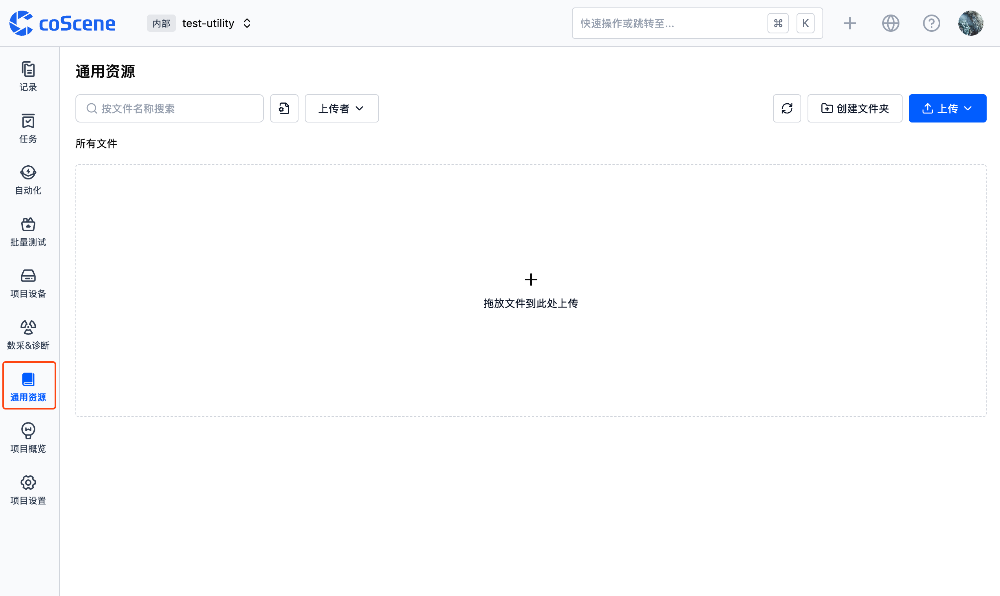

# 通用资源存储

在刻行时空平台中，常见的机器人数据通常存储在项目记录中。

在实际使用过程中，某些信息可能需要被多个实体或数据共享，例如项目说明文档、地图文件、URDF 文件、TF 配置、布局文件等。这些信息可以存储在通用资源存储中，供多个实体或数据共享使用。

通用资源存储提供了一个便捷的存储空间，支持多个实体或数据共享使用。您可以在任意项目中找到【通用资源】功能，上传所需的文件。

常见的使用场景包括：在可视化中引用共享的 URDF 文件，将项目说明文档上传到通用资源等。
