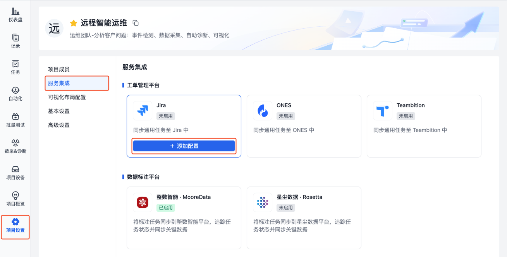
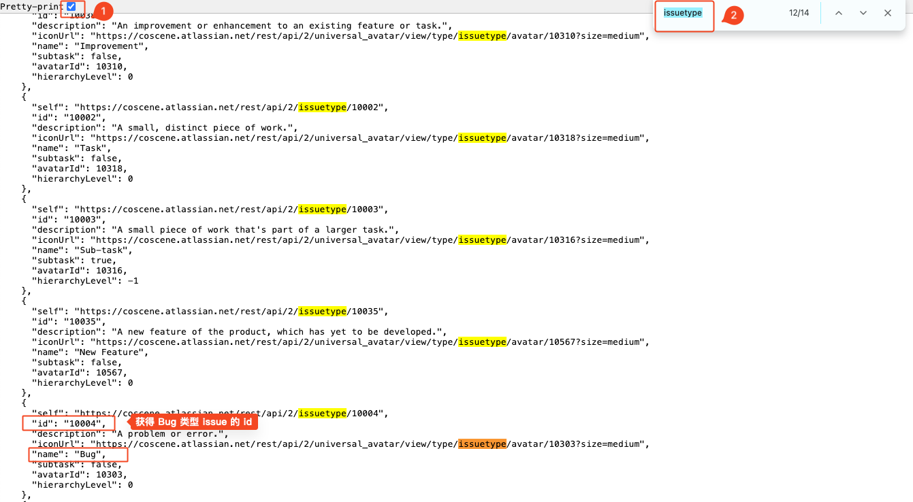
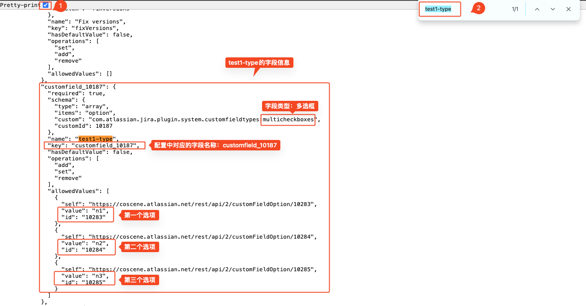
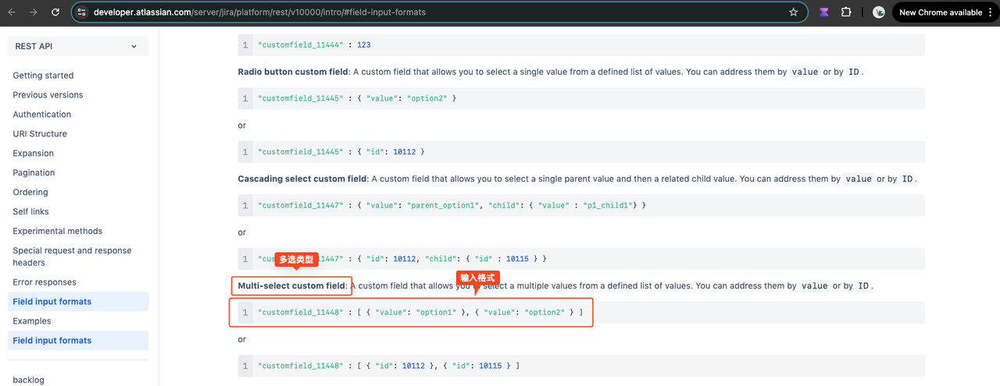
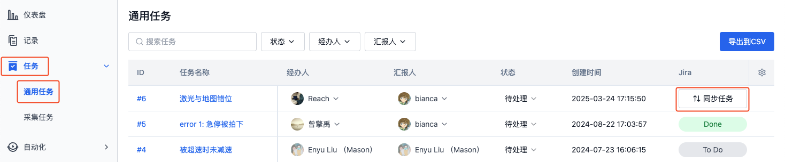
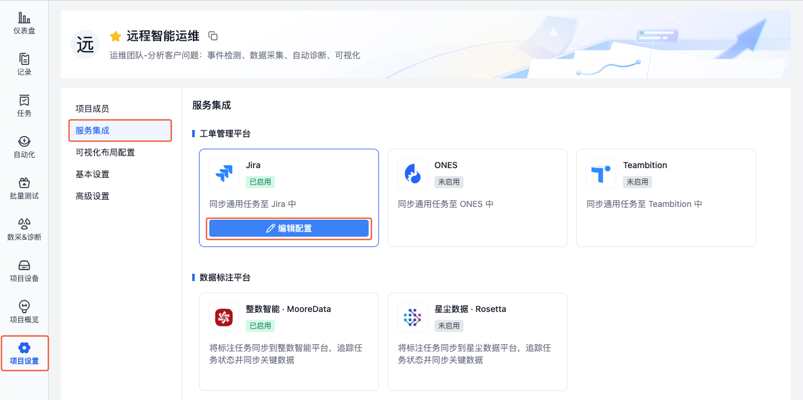
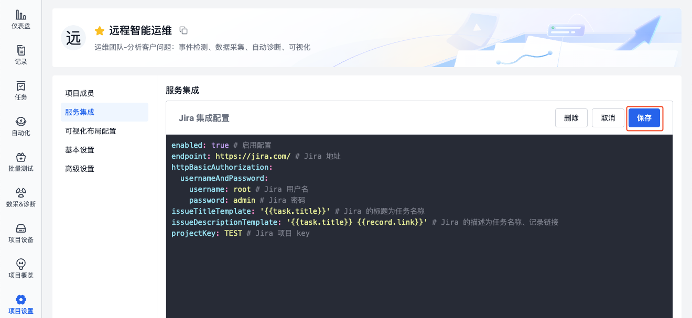
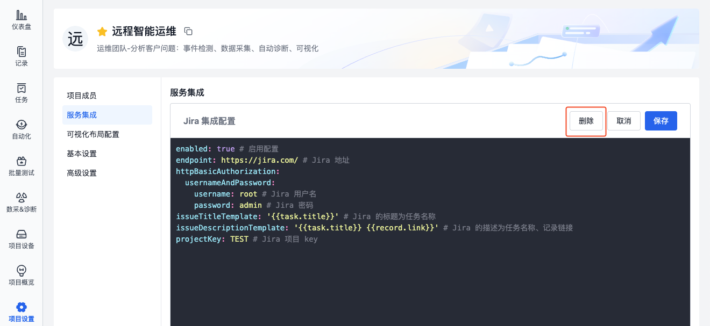

# Jira 集成
## 简介
配置 Jira 集成后，可将项目的通用任务同步至 Jira，实现企业工单平台对任务的统一管理。以下是典型的使用场景：
1. 设备发生问题时，自动上传数据并在 Jira 中创建任务
2. 可视化分析数据时，在关键时间点创建任务并同步至 Jira

## 操作流程
### 配置集成

> 每个项目单独配置，仅项目管理员可编辑

1. 进入需要配置集成的项目，在项目设置 - 服务集成 - Jira 中，点击【添加配置】按钮。

    

2. 填写集成配置并保存，字段说明如下

    ```yaml
    enabled: true # 启用配置

    endpoint: https://jira.com/ # Jira 地址
    httpBasicAuthorization:
      usernameAndPassword:
        username: root # Jira 用户名
        password: admin # Jira 密码

    projectKey: TEST # Jira 项目 Key
    issueType: 'Bug' # Jira issue 类型
    issueTitleTemplate: '{{task.title}}' # Jira issue 的标题，如：任务名称
    issueDescriptionTemplate: | # issue 的描述
      【任务名称】：{{task.title}}
      【设备 ID】：{{device.id}}
      【记录链接】：{{record.link}}

    customFields: # issue 自定义字段
      customfield_1:
        id: '88888' # 字段 1（下拉框样式），选择 id 为 88888 的选项
      customfield_2: TEST # 字段 2（文本框样式），输入内容为 TEST
      customfield_3: # 字段3，输入 P1
        value: P1
    ```

- **enabled**
  
  Jira 集成状态，启用/停用（true/false）。默认启用，停用后将无法同步任务到 Jira 中

- **endpoint**

  Jira 地址，如：`https://www.atlassian.com/`

- **username**
  
  Jira 用户名，以该用户的身份在 Jira 项目中创建 issue、获取 issue 信息

- **password**
  
  Jira 用户名对应的密码

- **projectKey**

  Jira 项目 Key，在该项目中创建 issue。项目的 Key 需要在 Jira 平台上进行查询，如下：

  

- **issueType**

  issue 类型，配置需要创建什么类型的 issue（故障/任务/其他），获取方式如下：

  1. 打开浏览器，按需修改后输入以下网址，获取 Jira 项目中所有 issue 类型的信息。

     ```Plain Text
     {jira_endpoint}/rest/api/2/project/{projectKey}
     ```

     其中：
     - `{jira_endpoint}` ：Jira 地址，如：https://www.atlassian.com/
     - `{projectKey}` ：Jira 项目 Key

  2. 获取到所有 issue 类型信息后，通过 ctrl + f 快捷键快速查找需要配置的 issue 类型对应的 id，如：查找 `issuetype` 为 `Bug` 的 id 值

        

  3. 找到 issue 类型对应的 id 后，将其配置到 `issueType` 字段中。
    
      ```yaml
      issueType: '10004' # Jira issue 类型
      ```

- **issueTitleTemplate**

  Jira issue 的标题模板，可自定义或使用变量，默认使用通用任务标题，即`'{{task.title}}'`

- **issueDescriptionTemplate**

  Jira issue 的描述模板，可自定义或使用变量

- **customFields**

  issue 自定义字段，可自定义或使用变量。自定义字段的名称与值的获取方式如下：

  1. 打开浏览器，按需修改后输入以下网址，获取 Jira 项目中所有字段的信息。

     ```Plain Text
     {jira_endpoint}/rest/api/2/issue/createmeta?projectKeys={projectKey}&expand=projects.issuetypes.fields
     ```

     其中：
     - `{jira_endpoint}` ：Jira 地址，如：https://www.atlassian.com/
     - `{projectKey}` ：Jira 项目 Key

  2. 获取到所有字段信息后，通过 ctrl + f 快捷键快速查找需要配置的自定义字段名称，如：查找 `test1-type` 字段的名称与值

       

  3. 根据 [Jira 官方文档](https://developer.atlassian.com/server/jira/platform/rest/v10000/intro/#field-input-formats) 输入对应的字段格式， 在 Jira 配置中输入字段的名称与值。以多选框 `test1-type` 为例：
     - 找到 Jira 官方文档中的「多选类型」，复制格式

       

     - 在 Jira 配置的自定义字段下，粘贴「多选类型」的格式，根据之前查找出的 `test1-type` 字段的名称与值，替换其中的内容

        ```yaml
        customFields: 
          "customfield_10187" : [ { "value": "n1" }, { "value": "n2" } ]
        ```


### 变量说明
集成中的任务信息支持使用变量，详见下表：

| 变量名 | 含义 |
|--------|------|
| `{{task.title}}` | 任务名称 |
| `{{record.title}}` | 记录名称 |
| `{{record.description}}` | 记录描述 |
| `{{record.labels}}` | 记录标签 |
| `{{record.link}}` | 记录链接 |
| `{{device.id}}` | 设备 ID |
| `{{device.title}}` | 设备名称 |

### 同步任务到 Jira

> Jira 集成配置完成后，项目中的通用任务即可同步到 Jira 中。了解[通用任务](../project-collaboration/2-general-task.md)

1. 进入项目的「通用任务」页面，点击任务对应的【同步任务】按钮

    

2. 同步成功后，即展示创建的 Jira 链接及状态。点击状态按钮，可跳转到 Jira 中查看 issue 详情。

## 管理 Jira 集成
> 仅项目管理员可管理 Jira 集成

### 编辑集成
1. 在项目中，进入「项目设置-服务集成」页面，点击 Jira 的【编辑配置】。

   

2. 完成配置后，点击【保存】。

   

### 删除集成
1. 在项目中，进入「项目设置-服务集成」页面，点击 Jira 的【编辑配置】。

   

2. 点击【删除】，二次确认后即可删除集成信息，删除后将无法同步任务到 Jira 中。

   
