# Teambition 集成

## 简介
配置 Teambition 集成后，可将项目的通用任务同步至 Teambition，实现企业工单平台对任务的统一管理。以下是典型的使用场景：
1. 设备发生问题时，自动上传数据并在 Teambition 中创建任务
2. 可视化分析数据时，在关键时间点创建任务并同步至 Teambition

## 前提条件
请确保你的 Teambition 企业已发布「企业内部应用」，步骤如下：

1. 进入[Teambition 开放平台](https://open.teambition.com/app)，创建新应用-企业内部应用，详见[Teambition 发布应用文档](https://open.teambition.com/docs/documents/5d89d63f8acc9d00143ac733)
2. 进入应用开发 - 权限管理页面，开通以下权限

| 开通项 | 图示 |
|------|------|
| 任务-任务查看权限 | 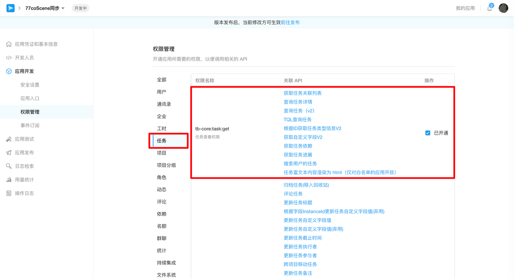 |
| 任务-任务创建权限 | 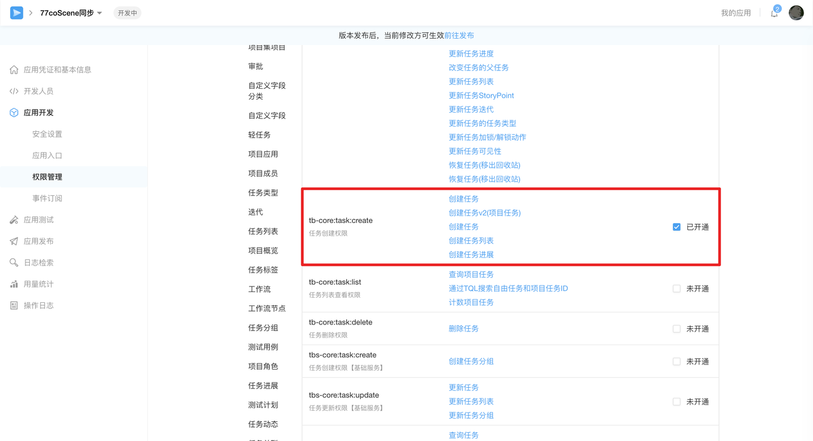 |
| 项目-项目查看权限 | 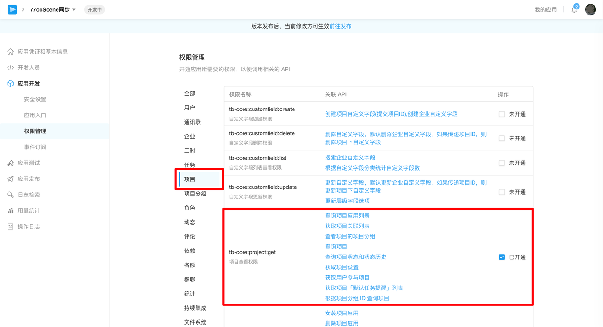 |
| 项目-获取缺陷分类列表 | 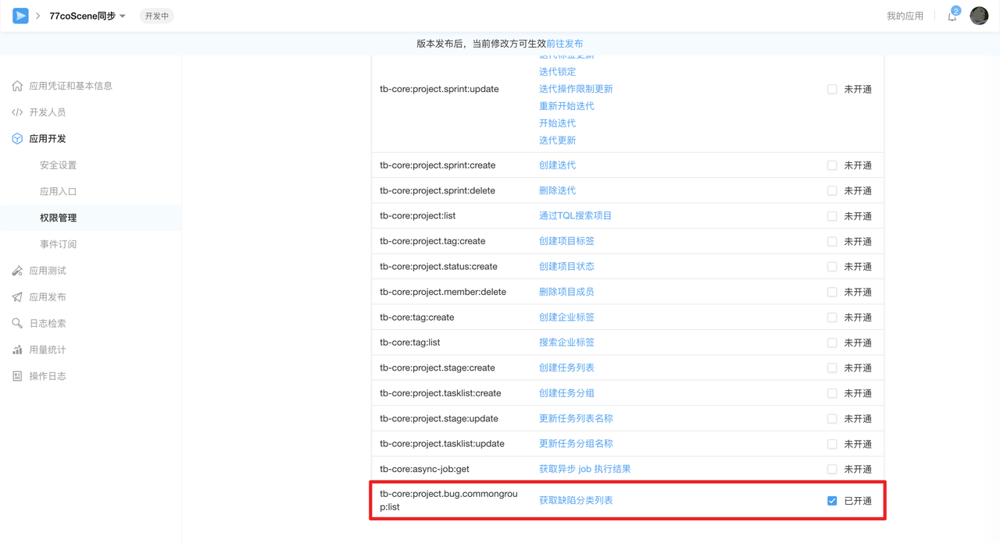 |
| 工作流节点-搜索企业工作流 | 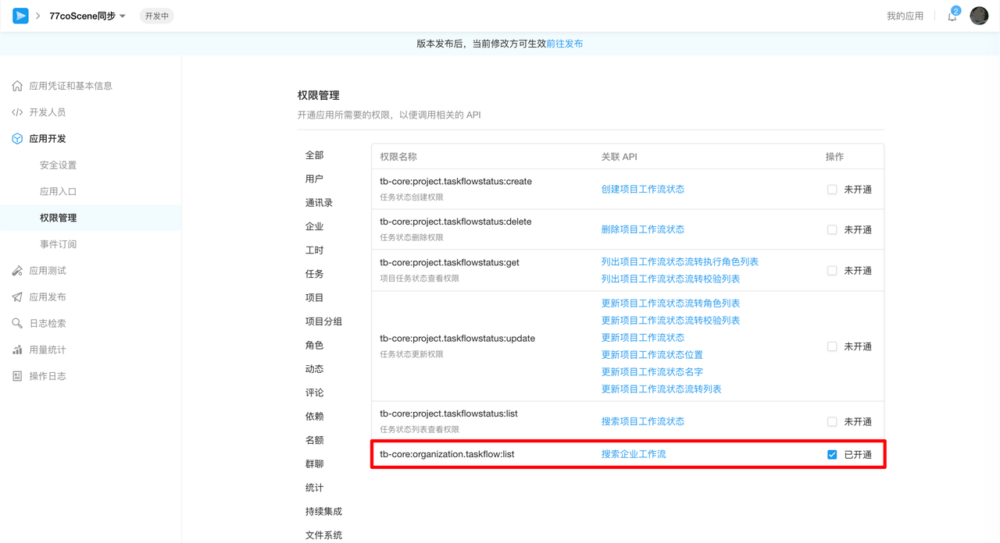 |

3. 在应用发布页面发布应用，并联系企业管理员进行审核
4. 在应用凭证与基本信息页面，复制应用的 App ID 与 App Secret，用于后续项目集成

## 操作流程
### 配置集成
> 仅项目管理员与组织管理员有编辑权限，其余角色不可见

1. 进入需要配置集成的项目，在项目设置 - 服务集成 - Teambition 中，点击【添加配置】按钮。

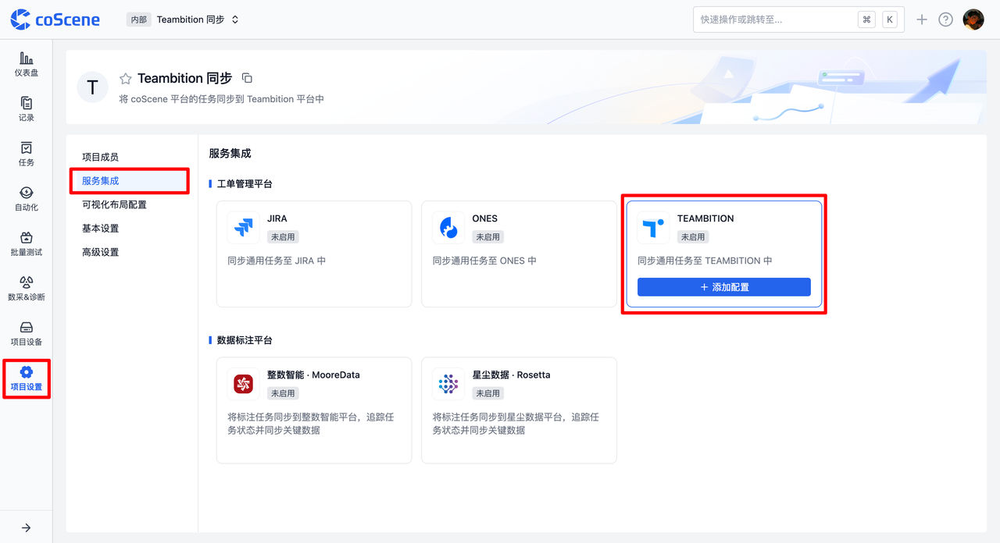

2. 填写集成配置并保存，字段说明如下

```yaml
enabled: true # 启用配置
endpoint: https://teambition.com # Teambition 应用的网页地址
apiEndpoint: https://open.teambition.com/api/ # Teambition API 地址
appCredential:
  appId: xxxxxxxxxxxxxxxxxxxxxxxx # Teambition 应用的唯一标识符（App ID）
  appSecret: xxxxxxxxxxxxxxxxxxxxxxxx # Teambition 应用的安全密钥（App Secret）
userId: xxxxxxxxxxxxxxxxxxxxxxxx # Teambition 任务创建者的 UID
orgId: xxxxxxxxxxxxxxxxxxxxxxxx # Teambition 的组织 ID
projectId: xxxxxxxxxxxxxxxxxxxxxxxx # Teambition 的项目 ID

issueTitleTemplate: '{{task.title}}' # Teambition 的标题为任务名称
issueDescriptionTemplate: |
  【任务名称】：{{task.title}}
  【记录名称】：{{record.title}}
  【记录描述】：{{record.description}}
  【记录标签】：{{record.labels}}
  【设备 ID】：{{device.id}}
  【记录链接】：{{record.link}}
assignee: '{{moment.customFields.assignee}}' # Teambition 任务执行者的 UID，取自一刻属性值中 assignee 对应的值
deadline: '{{moment.triggerTime}}' # Teambition 任务的截止时间，取自一刻的触发时间
sprintId: '{{device.customFields.sprint}}' # Teambition 的迭代 ID，取自设备自定义字段 sprint 的值
scenarioFieldConfigId: xxxxxxxxxxxxxxxxxxxxxxxx # Teambition 任务类型（需求/缺陷/任务）的 ID
customFields:
  - id: xxxxxxxxxxxxxxxxxxxxxxxx # Teambition 自定义字段的 ID
    type: commongroup # Teambition 自定义字段的类型
    values:
      - title: '{{moment.customFields.bug}}' # Teambition 自定义字段的值，取自一刻属性值中 bug 对应的值

```

- **enabled**
  
  是否启用配置，默认为`true`

- **endpoint**

  Teambition 应用的网页地址，默认为`https://teambition.com`

- **apiEndpoint**

  Teambition API 地址，默认为`https://open.teambition.com/api/`

- **appId**

  Teambition 应用的唯一标识符（App ID），可在[Teambition 开放平台](https://open.teambition.com/app)的「应用凭证与基础信息」页获取。

- **appSecret**

  Teambition 应用的安全密钥（App Secret），可在[Teambition 开放平台](https://open.teambition.com/app)的「应用凭证与基础信息」页获取。
  
  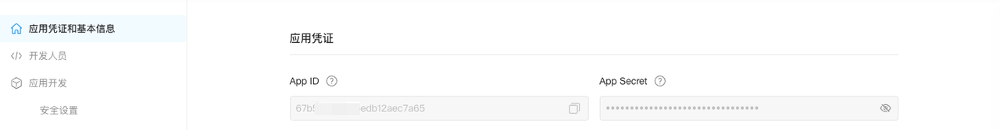

- **userId**

  Teambition 任务创建者的 UID，可在账号设置-个人账号中心获取。

  | 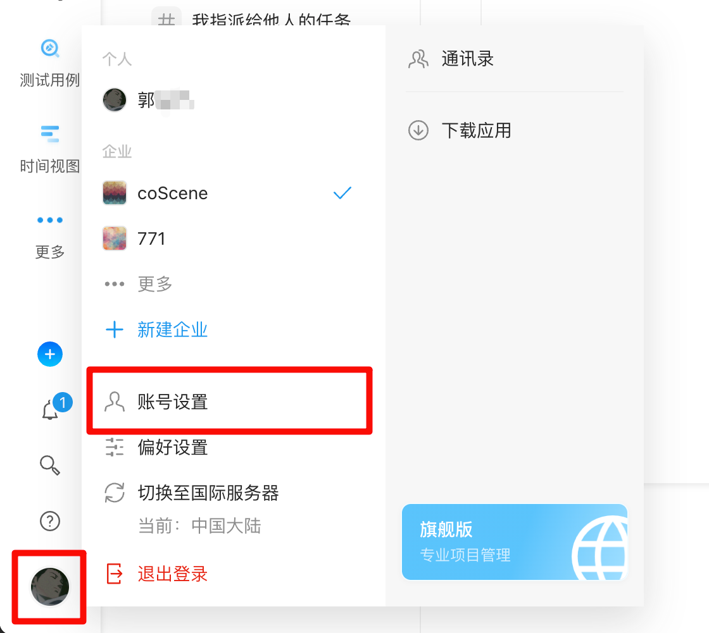 | 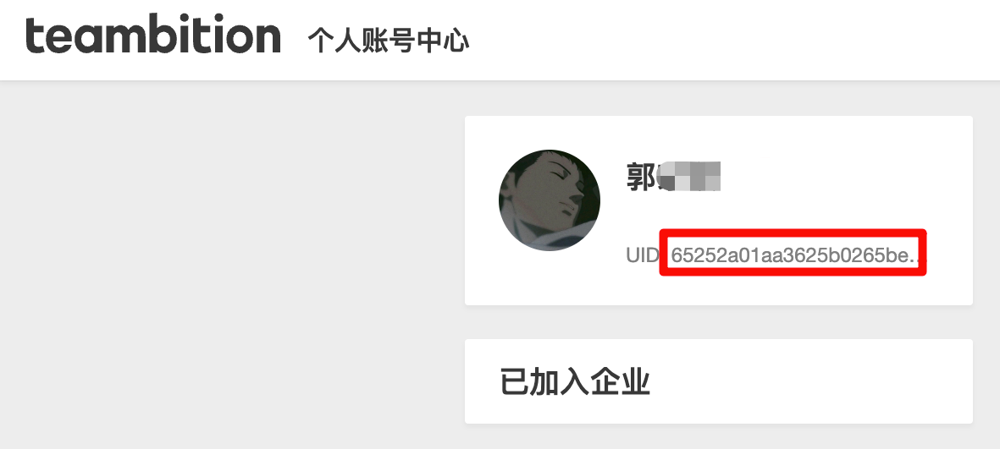 |
  |:---:|:---:|

- **orgId**

  Teambition 的组织 ID，可在浏览器的 URL 中获取。

  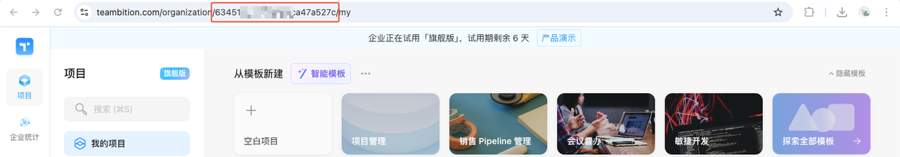

- **projectId**

  Teambition 的项目 ID，可进入项目后，在浏览器的 URL 中获取。

  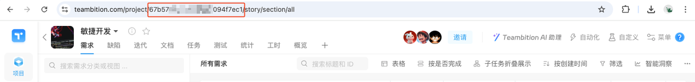

- **issueTitleTemplate**

  Teambition 任务标题，可自定义，默认使用通用任务标题，即`'{{task.title}}'`

- **issueDescriptionTemplate**

  Teambition 任务备注，可自定义或使用变量

- **assignee**

  Teambition 任务执行者的 UID，可在账号设置-个人账号中心获取（同userId）。

- **deadline**

  Teambition 任务的截止时间，默认为一刻的触发时间，即`'{{moment.triggerTime}}'`

- **sprintId**

  Teambition 任务的迭代 ID，可进入项目的迭代，在浏览器的 URL 处获取。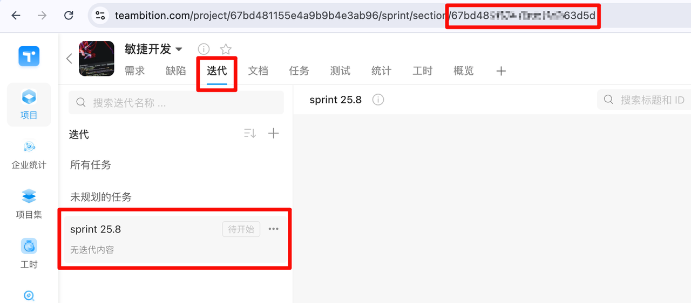

- **scenarioFieldConfigId**

  Teambition 任务类型（需求/缺陷/任务），在项目中打开浏览器开发者模式，可获取对应的 id。
  
  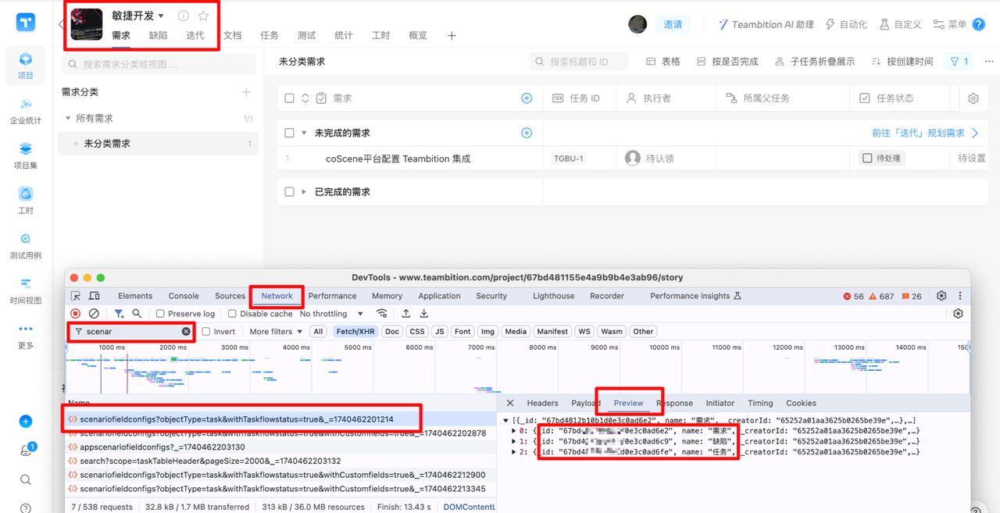

- **customFields**

  Teambition 任务的自定义字段，一个自定义字段的配置信息如下：

  ```yaml
    - id: 67b****e93d23d # 自定义字段的 ID
    values:
        - title: **** # 自定义字段的值
  ```
  
  - 自定义字段的 ID 可在浏览器开发者模式中获取
    
    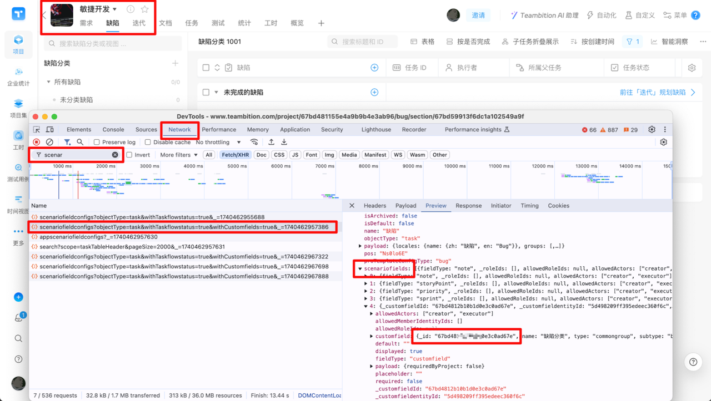

  - 自定义字段的值可自定义或使用变量

  - 其中，「缺陷分类」字段需增加字段类型`type: commongroup`

    ```yaml
    customFields:
    - id: 67b2c****015 # 字段的 ID
        type: commongroup # 字段类型，若为其他自定义字段，无需填写此行
        values:
        - title: **** # 字段的值
    ```

### 变量
集成中的任务信息支持使用变量，详见下表：

| 变量名 | 含义 |
|--------|------|
| `{{task.title}}` | 任务名称 |
| `{{record.title}}` | 记录名称 |
| `{{record.description}}` | 记录描述 |
| `{{record.labels}}` | 记录标签 |
| `{{record.link}}` | 记录链接 |
| `{{device.id}}` | 设备 ID |
| `{{device.title}}` | 设备名称 |
| `{{device.customFields.sprint}}` | 设备自定义字段`sprint`的值 |
| `{{moment.customFields.name}}` | 一刻属性值中`name`字段的值 |
| `{{moment.triggerTime}}` | 一刻的触发时间 |

### 同步任务到 Teambition
1. 前往已配置的数采&诊断规则中，将「诊断数据」模块中的「创建通用任务」与「同步通用任务至 Teambition 中」设置为「是」

    

2. 当监听到设备触发规则时，将自动上传数据并在 Teambition 中创建任务
  - 根据规则采集的数据
    
    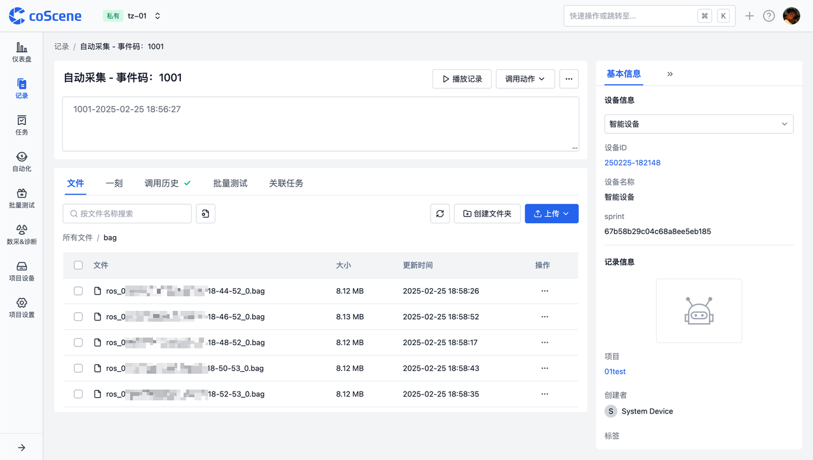
    
  - 自动诊断数据，并创建出一刻
    
    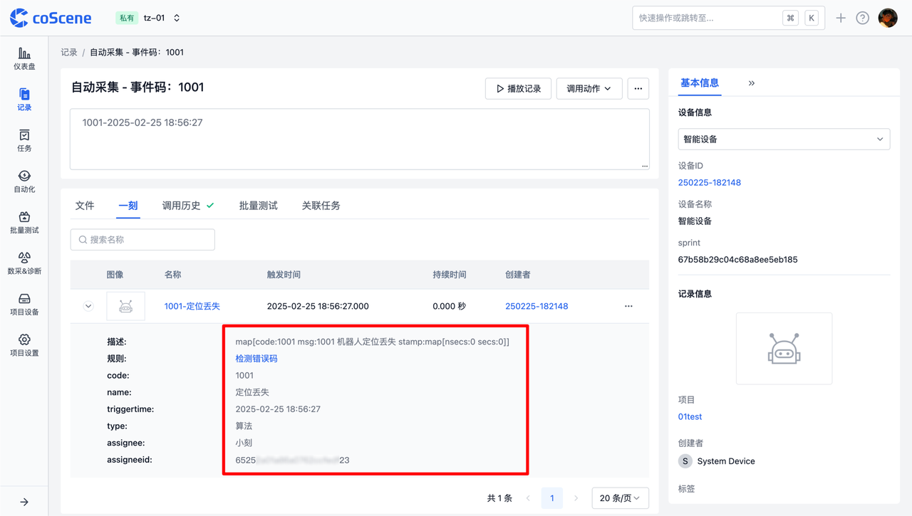
  
  - 根据创建出来的一刻，系统自动创建「通用任务」并同步到 Teambition 平台中
    
    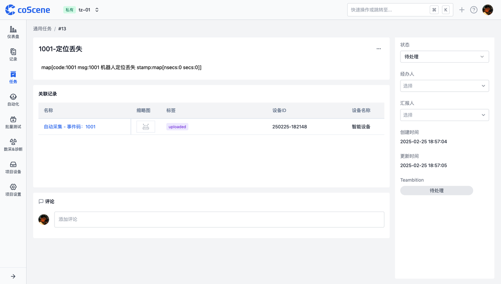
    
  - 在 Teambition 中可查看到一条任务
    
    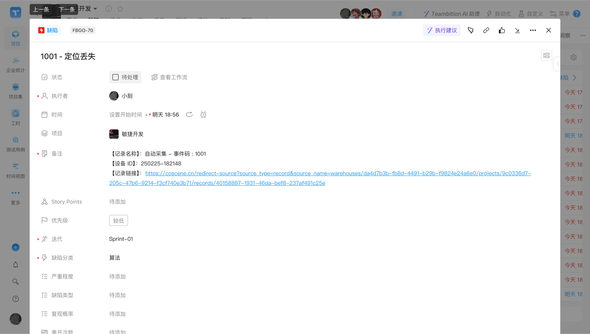

## 常见问题解答
**问：Teambition 中的 userId 出现了文本溢出，无法直接在界面上复制，怎么办？**
答：使用浏览器的开发者模式查看 userID，在 Network - me - id ，复制双引号中间的部分即可，详细操作如下图所示。

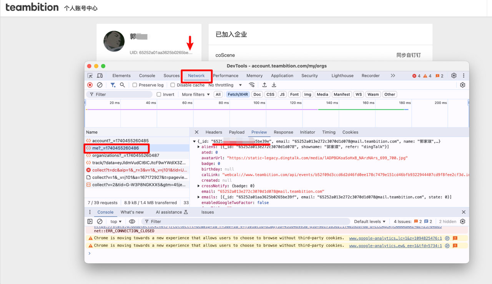

**问：保存 Teambition 集成时，提示「请检查 yaml 文件格式」？**
答：检查 yaml 内容中使用变量的部分，是否已使用英文输入法的单引号 ' ' 括起，如下图所示的`'{{moment.triggerTime}}'`就少了右边部分的单引号。

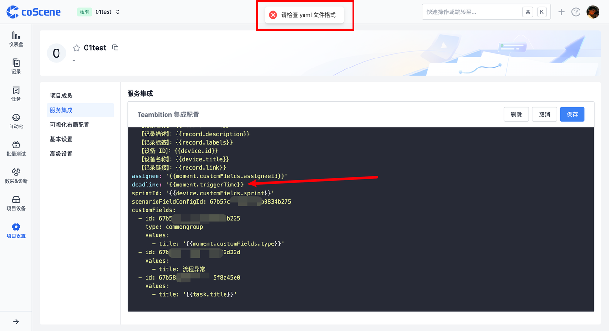