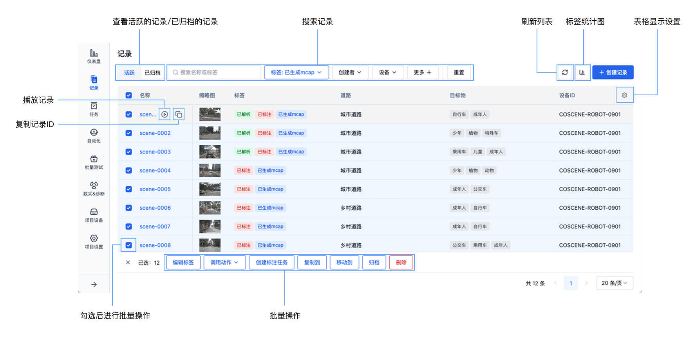
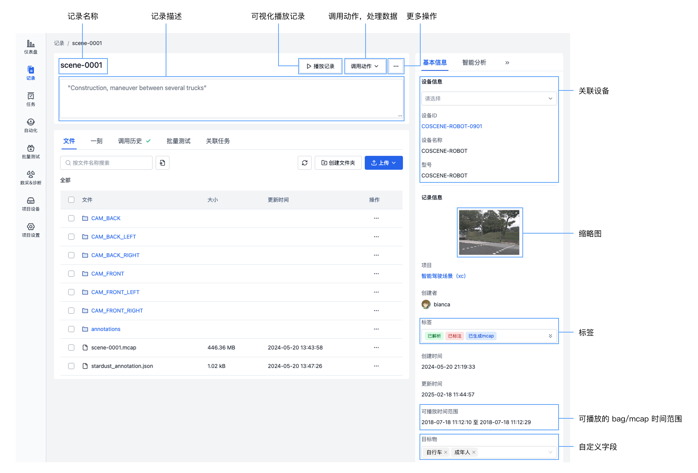
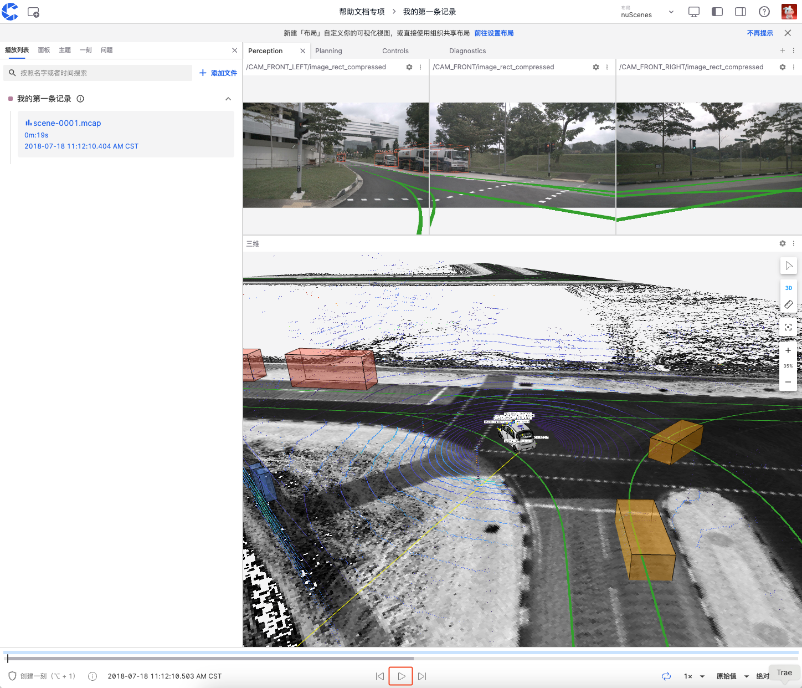
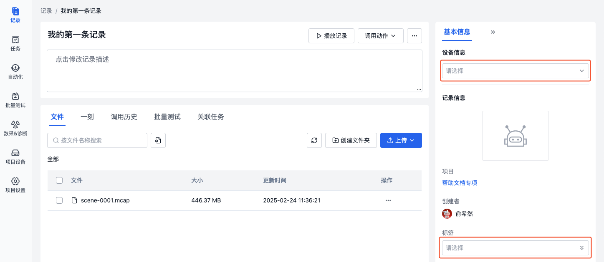
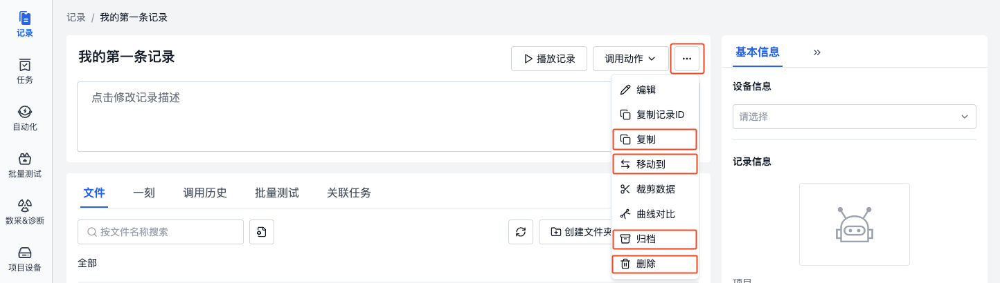

# 快速上手记录

## 认识记录

记录是一个描述相似场景的文件集合，用于存储、管理、可视化数据。一条记录中可以存放设备发生一次故障时产生的数据、设备执行一次任务时产生的数据、待标注的一小段数据集，如 ROS Bag、日志、地图、配置文件、图片与视频等。

## 记录界面

### 记录列表页

### 记录详情页

- **文件**：上传到记录中的文件
- **一刻**：记录中的关键时间点，如：在某时刻发生了故障
- **调用历史**：在记录中调用动作，对数据进行处理的历史记录
- **批量测试**：对记录中的数据进行批量测试的历史记录
- **关联任务**：记录关联的通用任务、采集任务、标注任务以及评论

## 快速上手记录

### 创建记录并上传文件

1. 进入项目，在项目左侧边栏，选择「记录」，点击【创建记录】按钮。

2. 在弹窗中输入记录名称与相关信息后，点击【创建】。
3. 创建完成后，自动进入记录详情页，点击【上传】按钮上传 bag/mcap 文件，或点击[下载示例文件](https://coscene-artifacts-prod.oss-cn-hangzhou.aliyuncs.com/docs/example/viz/scene-0001.mcap)后上传。

### 播放记录

1. 在记录中上传 bag/mcap 后，点击【播放记录】，进入可视化页面。

2. 在可视化页面的布局栏中，选择【从文件导入】，导入<a href="https://coscene-artifacts-prod.oss-cn-hangzhou.aliyuncs.com/docs/example/viz/nuScenes.json" download="nuScenes.json">示例布局</a>。

3. 点击底部【播放】按钮，可视化数据。 更多操作详见[可视化数据](../../viz/1-about-viz.md)。

### 编辑记录

在记录详情页，可编辑记录的相关信息，如名称、描述、设备、标签等。

1. 点击可直接编辑记录名称与描述。

2. 在记录基本信息栏，可选择设备与标签。

- **设备**：选择记录关联的项目设备
- **标签**：自定义记录的标签，可添加、编辑、删除标签

### 管理记录
在记录的【更多】操作中，可进行以下操作：

- **复制记录**：将记录复制到当前项目或其他项目
- **移动记录**：将记录移动到其他项目
- **归档记录**：将记录进行归档，不再作为常用数据
- **删除记录**

更多操作详见后续文档。