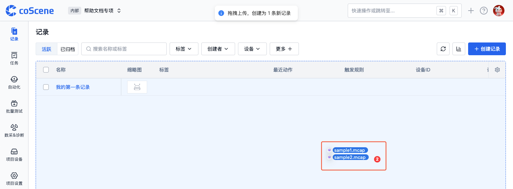
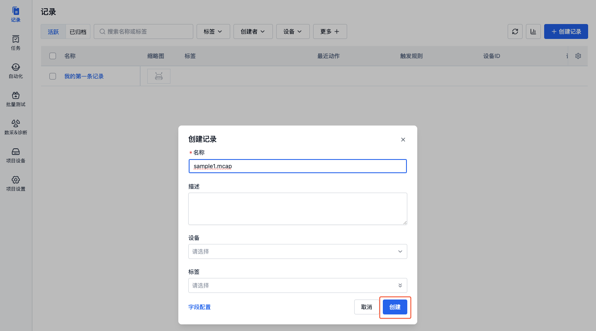
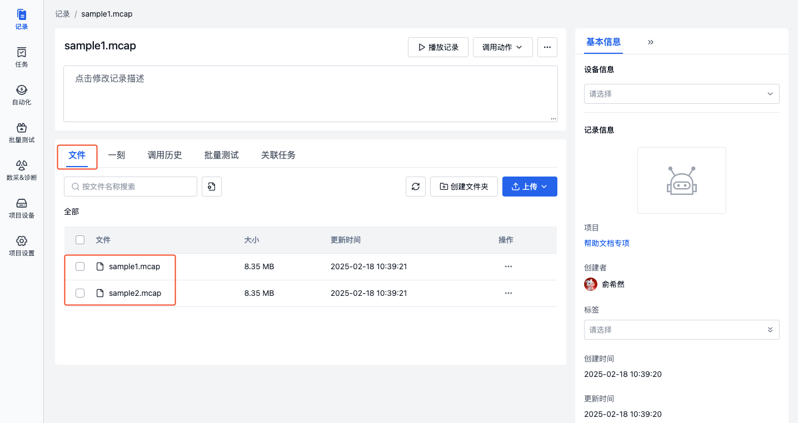
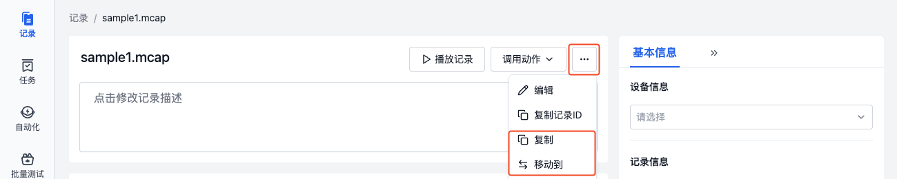

# 创建记录

## 简介
> 仅项目成员及以上权限角色可创建记录

记录是描述相似场景的文件集合。当需查看或处理设备在一段时间内产生的数据时，可以在项目中创建一条记录，并将设备数据上传至记录中。以下是 4 种创建记录的方式：
1. 直接创建
2. 通过复制/移动记录创建
3. 采集任务创建
4. 命令行工具 coCLI 创建

## 直接创建记录
可通过点击【创建记录】按钮、拖拽文件到记录列表 2 种方式直接创建记录。

### 点击按钮创建
1. 在项目左侧边栏，选择「记录」，点击【创建记录】按钮。

2. 在弹窗中输入记录的名称等相关信息，点击【创建】按钮。

3. 创建完成后，自动进入记录详情页，点击【上传】按钮上传文件。

### 拖拽文件创建

1. 选择本地文件后将其拖拽至记录列表区域。

2. 拖拽松手后，在创建记录弹窗中输入相关内容，点击【创建】按钮。

3. 记录创建后，拖拽的文件将自动上传到记录中。

## 通过复制/移动记录创建
将记录复制/移动到指定的项目中，实现数据的重新分类与整理。

1. 在记录详情中的更多操作中，选择【复制到】/【移动到】。

2. 在弹窗中选择要复制到/移动到的目标项目，点击【确定】按钮后，即可在目标项目中查看对应的记录。

## 通过采集任务创建记录
### 手动采集任务创建
若需采集设备在指定时间段内的文件，可手动创建「采集任务」。任务完成后，采集到的数据将自动上传至记录中。详见 [通用数据采集](../../use-case/1-common-task.md)。

### 规则采集任务创建
若需采集设备执行关键任务或发生重要事件时的数据，可在「数采&诊断规则」中添加规则。当规则触发时，会自动创建「采集任务」，将采集到的数据上传至记录中。详见 [数采&诊断规则](../../use-case/data-diagnosis/2-get-started.md)。

## 通过 coCLI 创建记录
若要将本地文件批量上传到记录中，可使用 coCLI 工具。

## 了解更多
- [可视化播放记录](../../viz/1-about-viz.md)