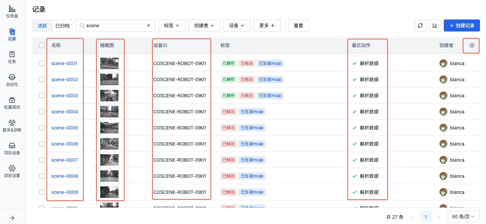
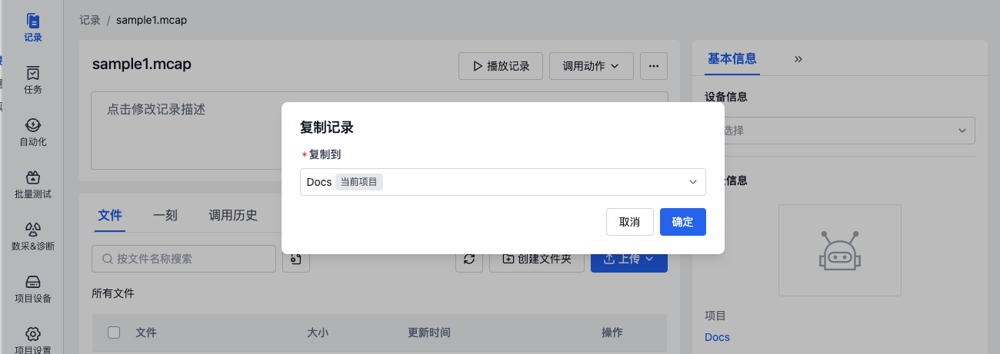
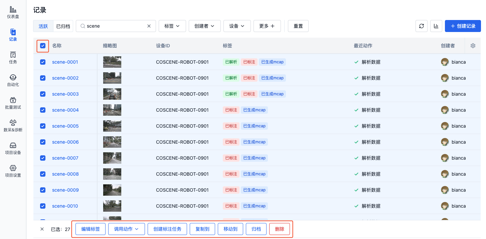
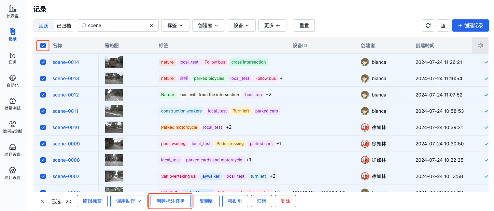
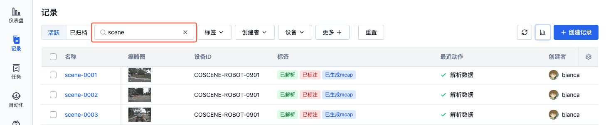

# 管理记录

记录支持以下操作：

- **基础操作**：查看、编辑、复制、移动、归档、删除
- **数据处理**：调用动作、标注
- **搜索与筛选**：筛选记录

## 基础操作

### 查看

在记录列表页，可查看记录的名称、缩略图、设备、标签、最近动作、自定义字段等信息。

- 点击记录名称，可进入记录详情页
- 点击缩略图，可放大查看
- 点击设备 ID，可进入项目设备的详情页
- 点击最近动作，可查看最近一次动作的详情
- 点击表格右上角的【设置】按钮，可设置表格的显示字段与排序方式

  

### 编辑

在记录详情页，可编辑记录的相关信息，如名称、描述、设备、标签等。

1. 点击可直接编辑记录名称与描述。

   

2. 在记录基本信息栏，可选择设备与标签。

- 设备：选择记录关联的项目设备
- 标签：自定义记录的标签，可添加、编辑、删除标签

  

### 复制与移动

将记录复制/移动到指定的项目中，实现数据的重新分类与整理。

1. 在记录详情中的更多操作中，选择【复制到】/【移动到】。

   

2. 在弹窗中选择要复制到/移动到的目标项目，点击【确定】按钮后，即可在目标项目中查看对应的记录。

   

### 归档

归档功能可将已完成分析的数据转为只读状态，并从活跃列表中移出，便于历史数据的长期管理。使用场景如下：

- 数据分析工作已完成，需要长期保存结果
- 阶段性实验数据需要归档保存
- 历史数据需要与活跃数据分开管理
- 需要保护重要数据避免误操作

1. 在记录详情中的更多操作中，选择【归档】。二次确认后，记录将被归档。

   

2. 在记录列表的归档栏，可查看归档的记录。

   

3. 在已归档记录的详情中，点击「更多」操作中的【解除归档】按钮，可将记录从归档状态转为活跃状态。

   

### 删除

> 删除后，记录将无法恢复。

在记录详情中的更多操作中，选择【删除】。二次确认后，记录将被删除。

### 批量操作

在记录列表页，勾选需要操作的记录，可进行批量编辑标签、复制、移动、归档、删除等操作。

## 数据处理

### 调用动作

在记录详情页，可调用动作对记录进行处理，如：裁剪数据、自动诊断、数据对比等。

1. 在记录详情页，点击【调用动作】按钮，选择需要对记录进行的操作。

   

2. 若需要大规模调用记录进行批量调用同一个动作
   - 可在记录列表中勾选需要处理的记录，点击【调用动作】按钮，选择需要对记录进行的操作。
   - 也可通过筛选过滤后，使用页面右上角的【对当前过滤器下所有记录调用动作】按钮进行操作。

   

2. 当动作执行完成后，即可在「调用历史」中查看处理结果。详见[自动化动作](../../6-automation/1-quick-start-workflow.md)章节。

### 数据标注

> 仅配置了数据标注平台集成的项目可以使用，详情请咨询刻行时空。

在记录列表页，勾选需要标注的记录，点击【创建标注任务】按钮，即可在对应的标注平台生成标注任务。

## 搜索与筛选

### 搜索

  在记录列表的搜索框中，输入记录名称中的关键词进行模糊搜索，可在页面右下角查看搜索结果数量

  

### 筛选

  1. 在记录列表中，可使用筛选对记录的标签、创建者、设备、记录自定义字段、设备自定义字段等属性进行过滤：

  

  2. 通过点击「添加条件」、「添加条件组」，添加更多的筛选条件：
  - 支持设置多个筛选条件
  - 支持设置筛选条件的运算符，如等于、不等于、包含、不包含等
  - 支持添加最多 3 层嵌套筛选条件组
  - 每个条件之间默认为「并且」关系，可手动切换为「或者」关系
  - 点击每一行条件后的叉号，可删除该条件
  - 点击每一组条件后的删除按钮，可删除该组条件

   

  3. 设置完筛选条件后，点击「查询」按钮，即可根据筛选条件查询符合要求的记录。
  - 系统会在本地电脑缓存中记住你的筛选条件，以备再次进入记录列表时使用。
  - 点击「清空」按钮，可清除所有筛选条件。
 
  

 

