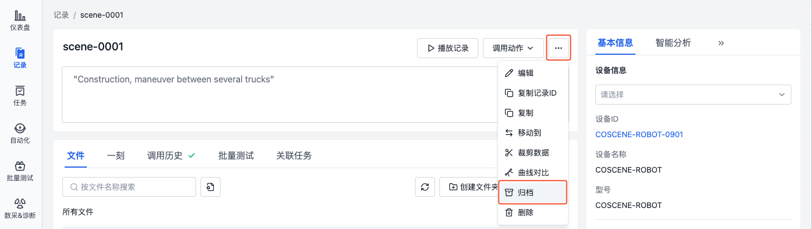
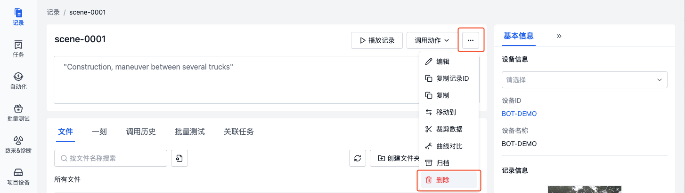

# 管理记录

记录支持以下操作：
- **基础操作**：查看、编辑、复制、移动、归档、删除
- **数据处理**：调用动作、标注
- **搜索统计**：搜索过滤、标签统计

## 基础操作
### 查看
在记录列表页，可查看记录的名称、缩略图、设备、标签、最近动作、自定义字段等信息。
- 点击记录名称，可进入记录详情页
- 点击缩略图，可放大查看
- 点击设备 ID，可进入项目设备的详情页
- 点击最近动作，可查看最近一次动作的详情
- 点击表格右上角的【设置】按钮，可设置表格的显示字段与排序方式

  

### 编辑
在记录详情页，可编辑记录的相关信息，如名称、描述、设备、标签等。

1. 点击可直接编辑记录名称与描述。

    

2. 在记录基本信息栏，可选择设备与标签。

- 设备：选择记录关联的项目设备
- 标签：自定义记录的标签，可添加、编辑、删除标签

  

### 复制与移动
将记录复制/移动到指定的项目中，实现数据的重新分类与整理。

1. 在记录详情中的更多操作中，选择【复制到】/【移动到】。

    

2. 在弹窗中选择要复制到/移动到的目标项目，点击【确定】按钮后，即可在目标项目中查看对应的记录。

    

### 归档
归档功能可将已完成分析的数据转为只读状态，并从活跃列表中移出，便于历史数据的长期管理。使用场景如下：
- 数据分析工作已完成，需要长期保存结果
- 阶段性实验数据需要归档保存
- 历史数据需要与活跃数据分开管理
- 需要保护重要数据避免误操作

1. 在记录详情中的更多操作中，选择【归档】。二次确认后，记录将被归档。

    

2. 在记录列表的归档栏，可查看归档的记录。
   
    

3. 在已归档记录的详情中，点击「更多」操作中的【解除归档】按钮，可将记录从归档状态转为活跃状态。

    

### 删除
> 删除后，记录将无法恢复。

在记录详情中的更多操作中，选择【删除】。二次确认后，记录将被删除。

### 批量操作
在记录列表页，勾选需要操作的记录，可进行批量编辑标签、复制、移动、归档、删除等操作。

## 数据处理
### 调用动作
在记录详情页，可调用动作对记录进行处理，如：裁剪数据、自动诊断、数据对比等。

1. 在记录详情页，点击【调用动作】按钮，选择需要对记录进行的操作。

    

2. 当动作执行完成后，即可在「调用历史」中查看处理结果。详见[自动化动作](../../workflow/1-quick-start-workflow.md)章节。

### 标注
> 仅配置了标注集成的项目可以使用。详情请咨询刻行时空。

在记录列表页，勾选需要标注的记录，点击【创建标注任务】按钮，即可在对应的标注平台生成标注任务。

## 搜索统计
### 搜索和过滤

- **搜索**

  在记录列表的搜索框中，输入关键字，对记录的名称、描述与标签进行搜索：

  

- **过滤**

  在记录列表的过滤项中，可对记录的标签、创建者、设备、记录自定义字段、设备自定义字段等属性进行过滤：

  

### 标签统计
点击记录列表中的【统计】按钮，查看每个标签下的记录数量：

  
