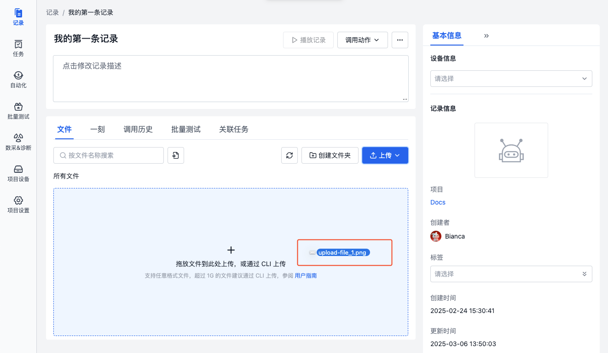
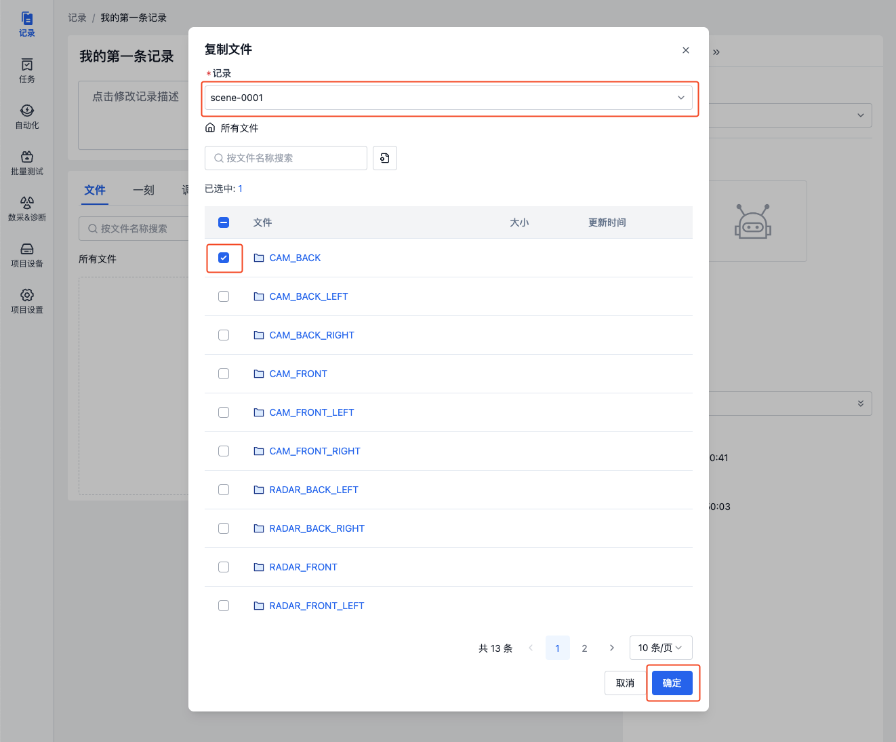
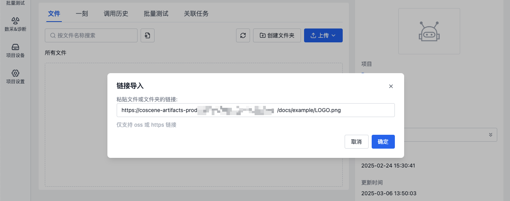

# 上传文件

## 简介

> 仅项目成员及以上权限角色可上传文件

在[创建记录](2-create-record.md)后，可通过以下方式上传文件：

1. 本地直接上传
2. 从其它记录复制
3. 链接导入
4. 命令行工具 coCLI 上传

## 本地上传

通过拖拽文件，或点击【上传】按钮，将本地的文件/文件夹上传到记录中。

- 通过【上传】按钮上传

  在记录详情页面，点击【上传】按钮，选择文件/文件夹，即可上传。

  

- 通过拖拽文件上传

  在记录详情页面，将文件/文件夹拖拽至文件列表区域，即可上传。

  

## 从其它记录复制

将其它记录中的文件复制到当前记录，实现文件的快速复用。

1. 在记录详情页，点击【上传】中的【复制文件自】按钮。

   

2. 在弹窗中，选择要从哪条记录中复制文件，勾选文件/文件夹，点击【确定】按钮。

   

## 链接导入

通过粘贴文件 URL 的方式，将远程文件导入到记录中。

1. 在记录详情页，点击【上传】中的【链接导入】按钮。

   

2. 在弹窗中，粘贴文件 URL，点击【确定】按钮。

   

3. 当「通过链接上传文件」动作执行完成后，即可在文件列表中查看导入的文件。

   

## 命令行工具 coCLI 上传

若要将本地文件批量上传到记录中，可使用[命令行工具 coCLI](../../developers/cocli/1-cli-install.md)。

## 了解更多

- [管理文件](5-manage-file.md)

## 常见问题

1. **问：上传同名文件是什么逻辑**

   答：本地上传同名文件时，会自动覆盖；通过系统动作生成的文件，如：解压缩、链接导入等，会自动重命名，即在文件名后加上后缀。

2. **问：上传文件到一半时，网络中断，文件上传失败，如何处理？**

   答：上传文件失败时，会在上传进度弹框中显示「上传失败」的状态，需要重新上传该文件。

3. **拖拽上传文件夹时，文件上传了两份，为什么？**

   答：若拖拽时展开了文件夹，并选中了文件夹与文件夹下的文件，则会将其分别进行上传。仅拖拽文件夹上传即可解决该问题。

4. **链接导入失败，如何处理？**

   答：请检查链接是否正确，是否为公开链接。
