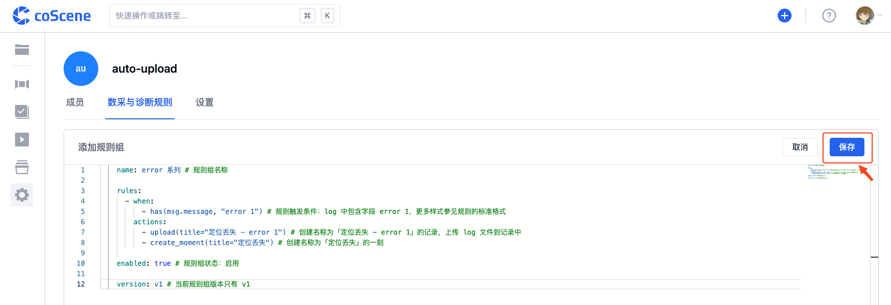
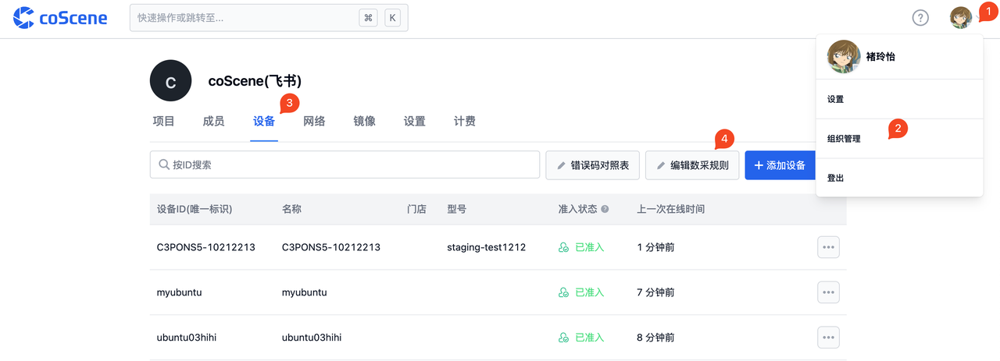
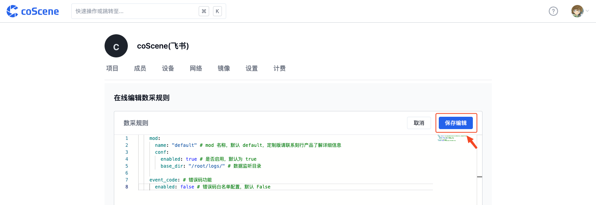
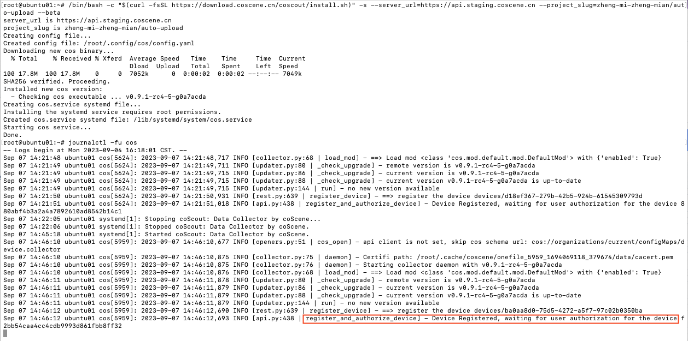
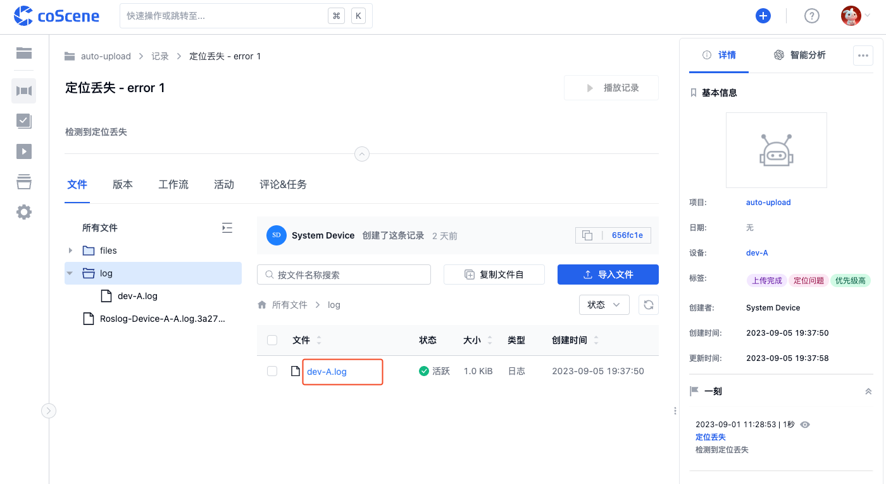
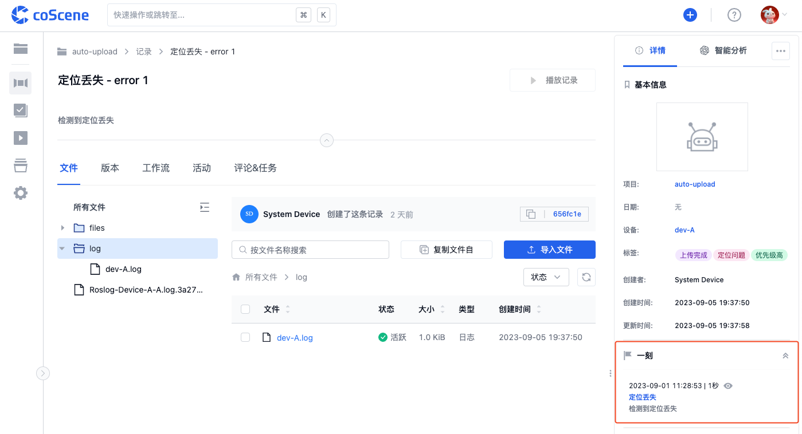

# 实现你的数据采集与诊断

以设定场景为例，实现你的数据自动采集与诊断：

- 当设备 dev-A 的 log 中出现字段「error 1」时，上传 log 文件到记录中，并在字段出现的时间点创建一刻

<br />

## 前提条件

1. 请准备好一台设备

2. 请确认你在刻行的组织角色为「管理员」。若不是管理员，请联系组织管理员更新你的组织角色。

    

3. 请创建名为 auto-upload 的项目，详情参见[创建项目](https://docs.coscene.cn/docs/get-started/create-project-flow#3-%E5%88%9B%E5%BB%BA%E9%A1%B9%E7%9B%AE)。

<br />

## 在项目中添加规则

1. 进入 auto-upload 项目

    

2. 在项目中，进入「管理项目-数采与诊断规则」页面，点击【添加规则组】

    

3. 清空规则中的默认内容后，复制下述规则，粘贴在编辑器中

    ```yaml
    name: error 系列 # 规则组名称

    rules:
      - when:
          - has(msg.message, "error 1") # 规则触发条件：log 中包含字段 error 1
        actions: 
          - upload(title="定位丢失 - error 1") # 创建名称为「定位丢失 - error 1」的记录，上传 log 文件到记录中
          - create_moment(title="定位丢失") # 创建名称为「定位丢失」的一刻

    enabled: true # 规则组状态：启用

    version: v1 # 当前规则组版本只有 v1
    ```

    *更多规则样式参见规则的标准格式
    
4. 点击【保存】按钮

    

<br />

## 配置数采设备信息

1. 进入组织管理页面的「设备」分页，点击【编辑数采规则】按钮

    

2. 清空规则中的默认内容后，复制下述规则，粘贴在编辑器中

    ```yaml
    mod:
      name: "default" # mod 名称，默认 default，定制版请联系刻行产品了解详细信息
      conf: 
        enabled: true # 是否启用，默认为 true
        base_dir: "/root/logs/" # 数据监听目录
    
    event_code: # 错误码功能
      enabled: false # 错误码白名单配置，默认 False

    ```
    
    *更多配置参见[数采规则格式](https://docs.coscene.cn/docs/receipts/device/device-authorize#%E6%95%B0%E9%87%87%E8%A7%84%E5%88%99%E6%A0%BC%E5%BC%8F)

3. 点击【保存编辑】按钮

    

<br />

## 准入设备
> 以 linux 设备为例，其他设备的注册方式参见[设备注册](https://docs.coscene.cn/docs/receipts/device/device-authorize#%E8%AE%BE%E5%A4%87%E6%B3%A8%E5%86%8C)

<br />

1. 打开设备终端，执行以下命令并输入密码，进入 root

    ```
    sudo su
    ```

2. 在设备终端，创建文件监听目录 `/root/logs`
   
    ```
    mkdir logs
    ```
    
3. 在刻行平台，进入组织管理页面的「设备」分页

    

4. 复制安装命令，以 root 账户粘贴到设备终端

    

5. 在设备终端执行命令，查看日志

    ```
     journalctl -fu cos
    ```
    
    - 当日志中出现如下字段时，表示已安装完毕，设备正在等待管理员审核

        

6. 在组织管理页面的「设备」分页，找到需要审核的设备，点击【同意准入】

    
   
<br />

## 在设备监听目录中写入文件

1. 确认设备已获取到数采与诊断规则

    - 当日志中出现如下字段时，表示已成功获取到规则

      
   
2. <a href="https://coscene-artifacts-prod.oss-cn-hangzhou.aliyuncs.com/docs/4-receipts/data-diagnosis/dev-A.log.zip" download>点击此处下载</a> 设备 dev-A 生成的 dev-A.log。其内容如下：

    ```
    2023-09-01 11:28:47.000 INFO "Demo Log message 1"
    2023-09-01 11:28:48.000 INFO "Demo Log message 2"
    2023-09-01 11:28:49.000 INFO "Demo Log message 3"
    2023-09-01 11:28:50.000 WARN "Demo Log message 4"
    2023-09-01 11:28:51.000 INFO "Demo Log message 5"
    2023-09-01 11:28:52.000 INFO "Demo Log message 6"
    2023-09-01 11:28:53.000 INFO "Demo Log message 7"
    2023-09-01 11:28:54.000 INFO "Demo Log message 8"
    2023-09-01 11:28:55.000 INFO "Demo Log message 9"
    2023-09-01 11:28:56.000 INFO "Demo Log message 10"
    2023-09-01 11:28:57.000 WARN "Demo Log message 11"
    2023-09-01 11:28:58.000 ERROR "Demo Log message 12 error 1"
    2023-09-01 11:28:59.000 INFO "Demo Log message 13"
    2023-09-01 11:29:00.000 INFO "Demo Log message 14"
    2023-09-01 11:29:01.000 INFO "Demo Log message 15"
    2023-09-01 11:29:02.000 INFO "Demo Log message 16"
    2023-09-01 11:29:03.000 INFO "Demo Log message 17"
    2023-09-01 11:29:04.000 INFO "Demo Log message 18"
    2023-09-01 11:29:05.000 INFO "Demo Log message 19"
    2023-09-01 11:29:06.000 INFO "Demo Log message 20"
    ```

3. 在本机终端执行命令，将文件 dev-A.log 复制到设备端 `/root/logs/` 中
   
    ```
    scp Downloads/dev-A.log root@ubuntu:/root/logs

    # 其中 Downloads/dev-A.log 为本机 dev-A.log 文件所在目录，root@ubuntu 为设备名称，二者需按实修改
    ```

4. log 数据上传
   
    - 当日志中出现如下字段时，表示 log 数据正在上传到刻行平台

      
   
<br />

## 查看创建的记录

1. 进入 auto-upload 项目

    

2. 查看自动创建的记录

    

3. 查看记录中上传的数据

    

4. 查看在触发时间点创建的一刻

    

<br />
