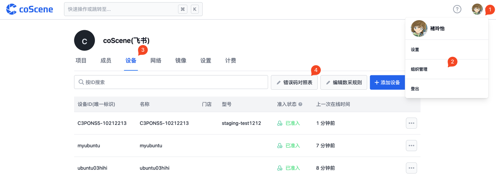
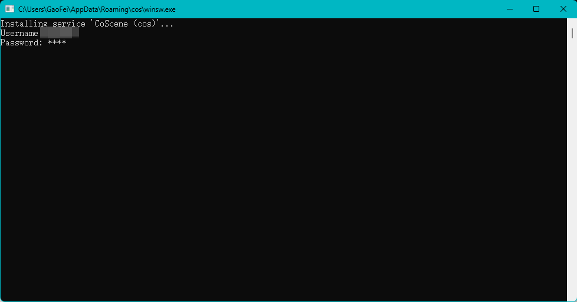

# 设备准入
> 准入的设备可按数据采集规则，将数据自动上传到项目中

设备准入包含三个步骤：配置数采规则、设备注册、设备审核。

<br />

## 配置数采规则
> 数采规则应用于组织中的全部设备，仅组织管理员可编辑
 
数采规则定义需要监控的设备日志所在目录、设备信息文件的存放目录等。数采规则的结构格式参见下文。

<br />

进入组织管理页面的「设备」分页，点击【编辑数采规则】按钮。


在线编辑数采规则，在完成配置后点击【保存编辑】。


<br />

## 数采规则格式

数采规则主要对三个模块进行设置：

- **数据收集器设置（collector）**：完成数据采集后，是否删除设备端数据
- **存储设置 （mod）**：设备端数据的存储目录；设备标识文件的地址
- **事件设置（event_code）**：事件错误码的上传规则地址以及是否上传条件限制
- **更新设置（updater）**：当前程序是否开启自动更新

<br />

示例数采设备信息文件如下:

```yaml
collector:
    delete_after_upload: true # 默认值为 False
    delete_after_interval_in_hours: 48 # 默认值为 -1，即不删除文件
    scan_interval_in_secs: 60 # 默认值：60，即 60s 对文件夹扫描一次

mod:
  name: "default" # mod 名称，默认 default，定制版请联系刻行产品了解详细信息
  conf: 
    enabled: true # 是否启用，默认为 true
    robot_file: "/root/.ros/sn.txt" # 设备标识文件，用于存放设备唯一标识码，如 sn
    base_dir: "/root/.ros/auto-upload/" # 数据监听目录

event_code: # 错误码功能
  enabled: false # 错误码白名单配置，默认 False
  whitelist:
    '1001': 8  # key 为错误码，字符串类型；value 为次数，表示在 reset_interval_in_sec 周期内只上传规定次数，多余数据会忽略上传
  reset_interval_in_sec: 86400 # 计算周期，默认为一天
  code_json_url: cos://organizations/current/configMaps/device.errorCode # 默认采用云端配置模式，支持其他公开文件

updater:
  enabled: true # 自动升级配置，默认值：True
```

<br />

### 数据收集器设置

设置完成数据采集后，是否删除设备端数据，以释放设备端硬盘存储

```yaml
# 数据收集器设置
collector:
    delete_after_upload: true # 默认值为 False
    delete_after_interval_in_hours: 48 # 默认值为 -1，即不删除文件
    scan_interval_in_secs: 60 # 默认值：60，即 60s 对文件夹扫描一次
```

<br />

### 存储设置

设置设备端数据的存储地址

```yaml
# 数据处理设置，可定制，具体信息请咨询刻行产品了解详细过程
mod:
  name: "default" # mod 名称，默认 default，定制版请联系刻行产品了解详细信息
  conf: 
    enabled: true # 是否启用，默认为 true
    robot_file: "/root/.ros/sn.txt" # 设备标识文件，用于存放设备唯一标识码，如 sn
    base_dir: "/root/.ros/auto-upload/" # 数据监听目录
```

<br />

### 事件代码设置

设置触发数据采集的事件错误码和条件

```yaml
# 事件代码设置
event_code: # 错误码功能
  enabled: false # 错误码功能是否启用，默认 False
  whitelist:
    '1001': 8  # key 为错误码，字符串类型；value 为次数，表示在reset_interval_in_sec周期内只上传规定次数，多余数据会忽略上传
  reset_interval_in_sec: 86400 # 计算周期，单位为秒，默认值为 86400s
  code_json_url: cos://organizations/current/configMaps/device.errorCode # 默认采用云端配置
```

- **whitelist**：在白名单中的事件错误码发生时，会触发数据的自动上传。可设置该错误码发生后，最多上传的次数，防止同一问题多次重复上报
- **reset_interval_in_sec**：重置关于错误码「最多上传的次数」的设置。例如 86400 表示 24 小时后，当同一错误码再次发生时，「上传次数」重新从 1 开始计数
- **code_json_url**：事件代码的 JSON 数据源地址

<br />

### 更新设置

设置是否自动更新数采程序

```yaml
# 更新设置
updater:
  enabled: true # 是否自动更新数采程序，默认值为 true
```

<br />

## 配置错误码对照表

> 按需配置，仅存在事件错误码的设备可使用错误码对照表功能

错误码对照表管理错误码和错误信息的对应关系。主要用于：
- 辅助查看数采规则中关于事件白名单的设置
- 在自动采集数据创建的记录中，将错误码和错误信息一一对应

<br />

### 在组织中配置错误码

在组织管理-设备页面，点击【错误码对照表】按钮。



在线编辑错误码对照表，在完成配置后点击【保存】。

<br />

### 错误码对照表格式

错误码对照表格式如下：

```yaml
"1001": 机器无法移动 # 错误码：1001，错误信息：机器无法移动
"1002": 任务异常结束 # 错误码：1002，错误信息：任务异常结束
```

注意：当使用定制版本时，即 mod name 不是 “default”，错误码格式存在定制的情况，具体请和刻行联系。

<br />

## 设备注册

### 前提条件

设备数据默认上传到 auto-upload 项目。请确认项目是否存在；若不存在，需先创建名为 auto-upload 的项目，详情参见[创建项目](https://docs.coscene.cn/docs/get-started/create-project-flow#3-%E5%88%9B%E5%BB%BA%E9%A1%B9%E7%9B%AE)。当其他项目中配置数据自动采集与诊断规则时，设备数据也会根据规则将数据上传到对应项目。

<br />

### Linux 设备

#### 联网安装注册

进入组织管理页面的「设备」分页


复制安装命令


打开终端窗口，进入设备端，粘贴安装命令


安装完成，注册成功


<br />

#### 离线安装注册

1. 下载安装脚本 [install.sh](https://download.coscene.cn/coscout/install.sh)、离线二进制文件压缩包 [cos_binaries.tar.gz](https://download.coscene.cn/coscout/tar/latest/cos_binaries.tar.gz) 到设备端
 
2. 程序需要安装 systemd service，**请使用 root 账户执行下列命令**

3. 给安装脚本赋权，在命令行执行
  
    ```
    chmod +x install.sh
    ```

4. 在设备端执行本地安装命令

    以离线二进制文件压缩包 `cos_binaries.tar.gz` 放置在设备的 `/root/cos_binaries.tar.gz` 位置为例

    ```
    $ ./install.sh --server_url=*** --project_slug=*** --use_local=/root/cos_binaries.tar.gz
    ```

    其中，参数 `--server_url` 与 `--project_slug` 可参考上文「联网安装注册-复制安装命令」获取，参数 `--use_local` 为离线二进制文件压缩包的路径。

<br />

#### 查看日志

在设备端执行以下命令，查看数据采集程序的日志信息

```
journalctl -fu cos
```

<br />

### Windows 设备

#### 联网安装注册

> 以下操作需在设备端执行

<br />

1. **管理员权限**打开 cmd

2. 在 cmd 中运行安装命令

   ```yaml
   powershell -c "Set-ExecutionPolicy RemoteSigned; Invoke-WebRequest -Uri https://download.coscene.cn/coscout/install-beta.ps1 -OutFile install.ps1; ./install.ps1 --server_url=*** --project_slug=*** --beta"
   ```
   
   其中，参数 `--server_url` 与 `--project_slug` 可参考上文「联网安装注册-复制安装命令」获取

<br />

#### 安装问题解答

1. 问题：安装过程中弹出 service 注册框
   
   解决方案：输入当前 windows 系统用户名及密码
   
   

2. 问题：识别为病毒，无法安装
   
   解决方案1：关闭 windows defender

   解决方案2：windows defender 中添加 whitelist

   
   
   
   
<br />

## 设备审核
> 仅组织管理员可审核设备

在设备端完成数采程序的安装后，刻行平台的组织管理-设备页中，就会增加该设备，且其对应的准入状态为「待审核」。审核通过的设备即为「已准入」状态，准入的设备可按规则，将数据自动上传到项目中。

<br />

进入组织管理页面的「设备」分页


找到需要审核的设备，点击【同意准入】


设备准入成功


<br />
