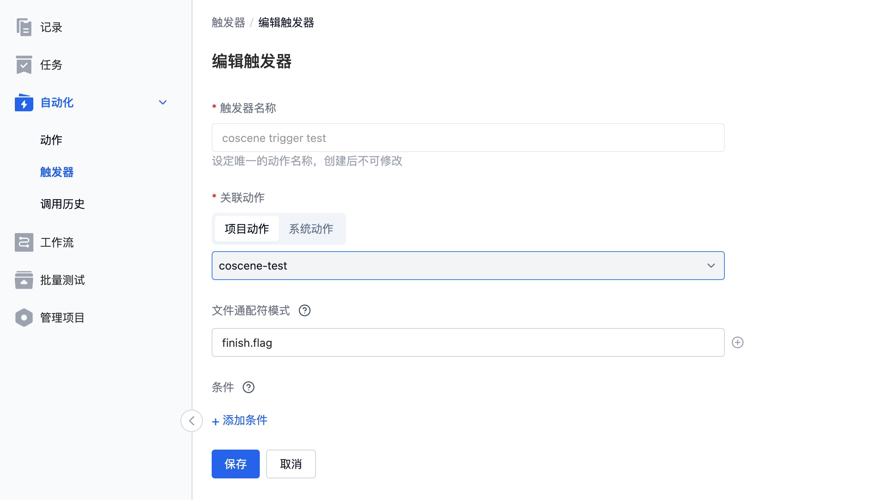

## 序言

本文将针对刻行提供的自动化模块功能进行介绍，并提供一个示例流程让您快速的了解和上手使用相关的功能。

## 概念介绍

该模块主要有三个子功能入口，动作、触发器和调用历史。

### 动作

动作定义了用户的行为，指用户想要执行的操作逻辑，主要是用户自己的业务代码逻辑。例如列举目录下所有文件 (`ls -al`)、运行特定的程序 (`python hello.py`) 等。动作分为项目动作和系统动作两类，项目动作为用户自定义动作，系统动作为刻行内置的动作（针对部分用户场景，刻行进行统一开发，提升客户效率）。

### 触发器

触发器定义了动作的触发时机，当新文件上传成功时，触发器会依据配置进行检查。文件通配符可以限制上传文件的名称格式等，条件组可以约束上传文件所属记录的范围，例如只允许有 `hello` 标签的记录在文件上传成功时触发运行。

### 调用历史

调用历史展示了项目内所有动作的执行历史，用户可以点击记录查看单条运行记录的详情信息，提供了状态、时间、操作用户等概览信息。另外也提供了具体的执行日志信息，用户可以查看日志来检测程序的运行情况，方便开发调试。

## 示例

### 1. 创建动作

* 动作名称和描述请依据需求自行填写。
* 标签，用户可以自行定义相关的标签信息。当后续创建的动作增多时，可以通过标签进行归类过滤筛选；如果不需要可以不用填写。示例中写了 `hello` 标签。
* 镜像，当用户存在自定义镜像上传至刻行平台时可以使用自定义镜像，或者使用公开的镜像信息；这里以 `busybox:latest` 镜像作为示例。
* 命令，镜像运行之后执行的命令信息，请依据自定义镜像的实际需求修改，** 请注意命令和相关的参数等均需要独立成行 **，如图示例 `ls -al $（COS_FILE_VOLUME)` 为三行，列举挂载的数据目录下的所有文件信息。
* 环境变量，用户可以预设相关的环境变量提供给程序读取使用，刻行预设了部分环境变量（详情请查看下面环境变量定义介绍），请避免使用相关的名称避免程序出现意料之外的错误。示例为空，暂不需要。
* 计算要求，依据自定义程序的要求，请选择相应的规格要求，避免资源不足导致程序被系统终止运行。示例中选择了最小的 `1核/2G` 的规格。

#### 环境变量
刻行预设了部分的环境变量信息，用户可以直接读取变量使用，无须再次定义。
* `COS_CODE_VOLUME` 代码的挂载目录，值为 `/cos/codes`
* `COS_BIN_VOLUME` 二进制文件的挂载目录，值为 `/cos/bins`
* `COS_BUNDLE_VOLUME` 测试包文件的挂载目录，值为 `/cos/bundles`
* `COS_FILE_VOLUME` 原始上传数据文件的挂载目录，值为`/cos/files`
* `COS_ARTIFACT_VOLUME` 批量测试的 artifact 目录，用户可以在运行过程中将产出物写入到相关目录进行保存，值为 `/cos/artifacts`
* `COS_OUTPUT_VOLUME` 输出文件的目录，用户可以将程序的输出数据写入到相关的目录进行保存，例如 bag 文件。后续可以与原始 bag 文件进行对比播放，具体值为 `/cos/outputs`

下列的环境变量的值为可选项，当存在时为 uuid 格式的 id 信息，不存在时为空。
* `COS_ORG_ID` 组织 ID
* `COS_USER_ID` 用户 ID
* `COS_WAREHOUSE_ID` warehouse ID
* `COS_PROJECT_ID` 项目 ID
* `COS_RECORD_ID` 记录 ID

#### 计算要求
1 核代表最高可以使用 1 核的 cpu，2G 代表最大使用 2G 的内存。当程序使用超过配置的计算资源时，可能会导致程序被刻行系统终止导致程序非正常退出，请预估使用资源并配置合理的计算要求。
默认提供了四种配置，`1核/2G`, `2核/4G`, `4核/8G`, `8核/16G` ，如果有更高的需求，请联系刻行团队。

### 2. 创建触发器

* 触发器名称，请按照要求执行填写相关名称
* 关联动作，这里选择 `项目动作`，然后选择刚才创建 `coscene-test` 的动作；如果创建动作时为其他名称，请选择对应的名称
* 文件通配符，具体的格式请参考网页处说明信息了解。这里以 `finish.flag` 文件为例，表示当上传文件名为 `finish.flag` 时触发器验证通过会触发动作执行。
* 条件，支持筛选关联记录的标签信息，当只有符合标签的要求记录才可以满足触发器条件。**请注意，记录标签的改变并不会触发刻行系统检验相关的触发器**，例如给记录打上一个新的标签，触发器并不会检验然后运行对应的动作，*当前只有上传文件才会触发触发器的运行*

这里没有配置条件信息，然后我们点击创建触发器。

### 3. 创建记录

我们去到记录页面，创建一个新的记录信息。

### 4. 上传文件

首先在本地创建一个名为 `finish.flag` 的空文件，然后进入刚才创建的记录，拖拽 `finish.flag` 文件到刻行网页进行上传。

### 5. 查看调用历史

在 `finish.flag` 文件上传成功之后，系统会对触发器的条件进行判断。按照上述示例的配置，触发器符合相关的要求，会触发执行相应的动作。所以在文件上传文件完成之后，调用历史会出现相关的调用记录。

点击查看详情

查看对应 job 的日志发现，我们执行了 `ls -al $(COS_FILE_VOLUME)` 命令，获取了挂载的记录下面的文件列表信息。至此我们已经完成了一次自动化的创建和触发流程，请按照需求修改相关的配置进行业务实现。
