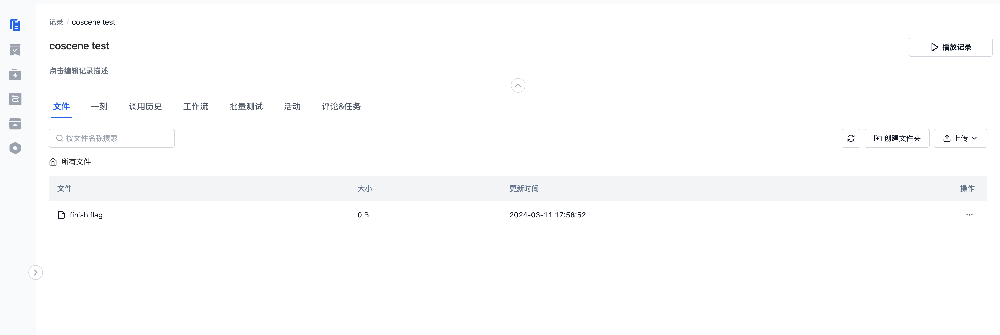

# 快速入门

在 5 分钟或更短的时间内尝试刻行自动化的功能。

## 介绍

本文将带领你创建一个动作，作用是列举对应记录下面所有的数据文件信息。创建一个关联的触发器，当纪录中上传了名为 `finish.flag` 的文件时，自动触发前面的动作，完成一次自动化的操作。

## 开始

### 1. 创建动作

依据下面的截图，创建一个如图所示的动作。

* 动作名称和描述请依据需求自行填写。
* 标签，示例中写了 `hello` 标签。
* 镜像，以 `busybox:latest` 镜像作为示例。
* 命令，示例 `ls -al $(COS_FILE_VOLUME)` 为三行，列举挂载的数据目录下的所有文件信息。
* 环境变量，示例为空，暂不需要。
* 计算要求，示例中选择了最小的 `1核/2G` 的规格。

### 2. 创建触发器

* 触发器名称，请按照要求执行填写相关名称
* 关联动作，这里选择 `项目动作`，然后选择刚才创建 `coscene-test` 的动作；如果创建动作时为其他名称，请选择对应的名称
* 文件通配符，这里填写 `finish.flag` ，表示当上传文件名为 `finish.flag` 时触发器验证通过会触发动作执行。
* 条件，示例暂时不需要相关配置。

这里没有配置条件信息，然后我们点击创建触发器。

### 3. 创建记录

我们去到记录页面，创建一个新的记录信息。

### 4. 上传文件

首先在本地创建一个名为 `finish.flag` 的空文件，然后进入刚才创建的记录，拖拽 `finish.flag` 文件到刻行网页进行上传。

### 5. 查看调用历史

在 `finish.flag` 文件上传成功之后，系统会对触发器的条件进行判断。按照上述示例的配置，触发器符合相关的要求，会触发执行相应的动作。所以在文件上传文件完成之后，调用历史会出现相关的调用记录。

点击查看详情

查看对应 job 的日志发现，我们执行了 `ls -al $(COS_FILE_VOLUME)` 命令，获取了挂载的记录下面的文件列表信息（finish.flag 文件）。至此我们已经完成了一次自动化的创建和触发流程，请按照需求修改相关的配置进行业务实现。

## 下一步

你已经成功的创建了第一个自动化流程，如果需要了解更加详细的介绍信息，请阅读后续的文档介绍。
