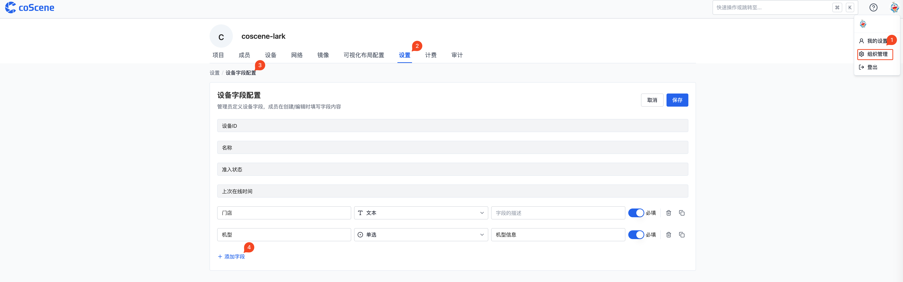
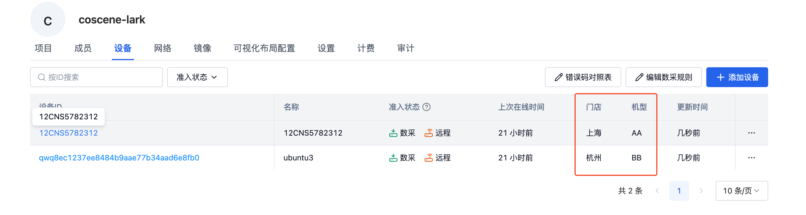

# 关于设备

**在刻行时空数据平台中，设备主要发挥着两大关键作用：**
- 充当记录的基础信息载体，明确数据的来源渠道；
- 与真实设备端建立连接，作为数据采集的目标对象，在相关记录中，能够额外添加设备信息，进而实现对该设备上传数据的精准检索与全面统计。
 

**平台中分为组织设备与项目设备两个模块：**
- 组织设备：用于组织中所有设备的统一管理
- 项目设备：由组织设备分配到各个项目中，一台组织设备可添加到多个项目中，但对应的是同一真实设备

1·111111111

## 基本元素

设备主要包含 4 个基本元素：

- 设备 ID：设备的唯一标识
- 名称：自定义设备的名称，例如比 ID 更容易辨别的别名
- 准入状态：当设备为设备端主动注册时，存在相关的状态信息；网页端添加时，无相关信息
- 上次在线时间：当设备为设备端主动注册时且已准入之后，设备会定时上报心跳信息；网页端添加时无相关信息。

## 自定义字段

> 自定义字段配置当前只有组织管理员可以操作。

组织管理 - 设置 - 设备字段配置 - 添加字段，用户可以按照需求添加相关的字段信息。当保存之后相关设备信息就会展示对应的字段信息。

