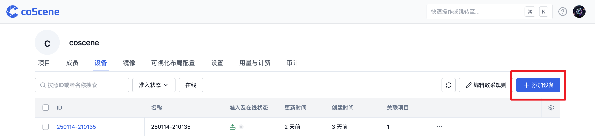
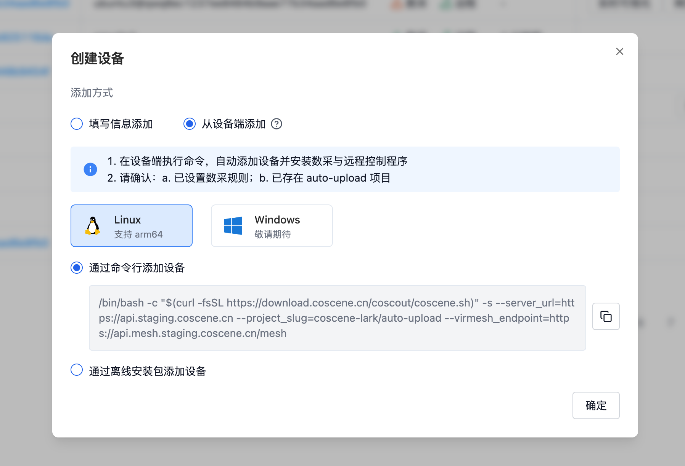
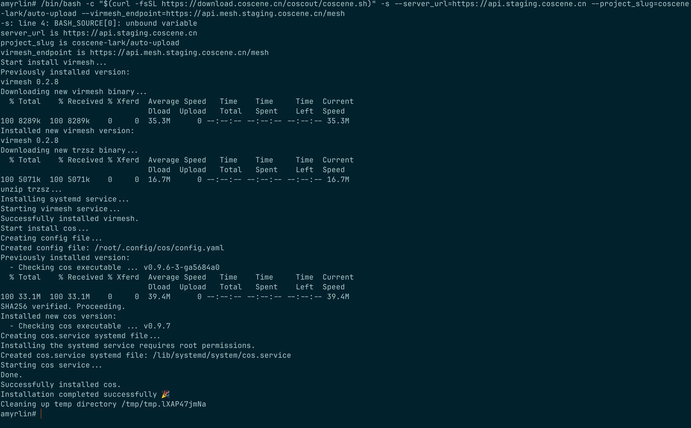
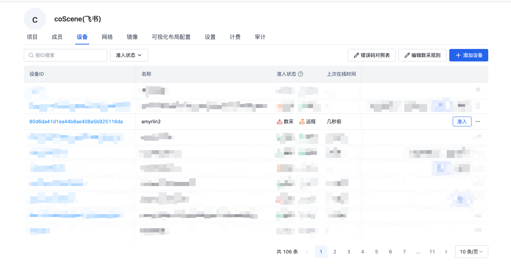
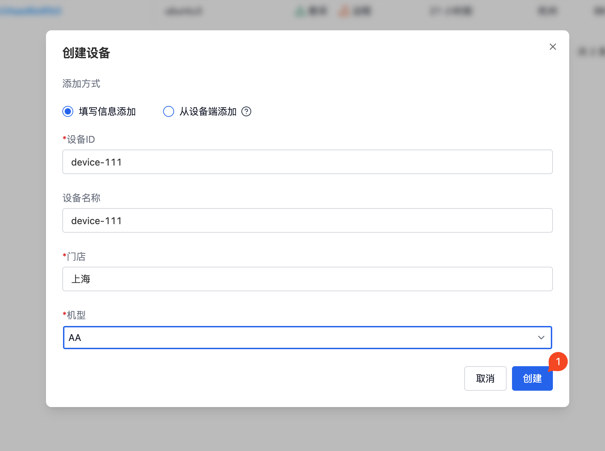

# 添加设备

<div style={
{ 
    padding: '12px 16px', backgroundColor: '#EFF6FF', borderRadius: '4px',  border: '1px solid', borderColor: '#2563EB', color: '#111827' }
}>
<p style={{margin: 0}}>🤖 仅**组织成员**及以上权限可以添加设备</p>
</div>

<br/>
若你所在的组织新增了一台设备，并期望在平台中创建一台与线下真实设备相对应的设备，可以前往组织页面，通过使用 “添加设备” 的操作方式来进行创建

平台提供了 3 种添加一台新设备到组织中的方式：

| 添加方式            | 适用场景                                 |
| :-----------      | :-----------                            |
| 在设备端执行命令添加  | 适合少量设备逐一准入与平台通信              |
| 使用离线安装包添加    | 适合设备出厂批量准入与平台通信              |
| 填写信息添加         | 快速创建仅用于数据流转的设备，不与平台通信    |

下面，我们分别介绍这几种方式的区别与操作教程


## 在设备端执行命令添加

在「组织管理」页面的「设备」分页，点击【添加设备】按钮




当前只支持**Linux 设备**，支持 arm64 和 x86_64 的架构，暂不支持 Windows 设备，如有相关的需求，请联系刻行团队。

*当前程序需要安装 systemd service，**请使用 root 账户执行下列命令**。*

### 联网安装

1. 选择【通过命令行添加设备】，复制相关的命令信息



2. 进入设备端，打开 shell 终端，粘贴复制的安装命令，回车执行。



1. 安装完成之后，在设备列表页即可查看到相关的设备（依据设备的性能，启动存在一定的延时导致网页端的刷新存在一定的延迟）。此时设备已完成了注册操作，后续更多操作请查看[设备准入](./3-manage-device.md#设备准入)。



### 离线安装注册

下面命令假设用户位于 `/root` 目录下，如果切换目录，请注意更改相关的路径信息。

1. 下载安装脚本 [coscene.sh](https://download.coscene.cn/coscout/coscene.sh)、离线二进制文件压缩包 [cos_binaries.tar.gz](https://download.coscene.cn/coscout/tar/latest/cos_binaries.tar.gz) 到设备端，存放位置分别为 `/root/coscene.sh`, `/root/cos_binaries.tar.gz`
2. 在 root 目录下，给安装脚本赋予执行权限。
```shell
chmod +x /root/coscene.sh
```

3. 以离线二进制文件压缩包 `cos_binaries.tar.gz` 放置在设备的 `/root/cos_binaries.tar.gz` 位置为例

```shell
./coscene.sh --server_url=*** --project_slug=*** --virmesh_endpoint=*** --use_local=/root/cos_binaries.tar.gz
```
在 root 目录执行上述命令进行离线安装操作，其中，参数 `--server_url` ，`--project_slug` ，`--virmesh_endpoint`请参考网页端生成结果获取，参数 `--use_local` 为离线二进制文件压缩包的路径。如果修改了二进制文件的目录位置，请修改 `--use_local` 参数，避免出现安装出现错误。

### 设备信息

当设备端安装之后，程序会默认在 `/root/.config/cos/sn.txt` 文件中写入一个 UUID 的 Hex 值作为当前机器的 ID 标识，绑定云端记录的设备 ID。使用设备的网络名称 + ID 的组合作为设备名称的默认值。

 > `/root/.config/cos/sn.txt` 作为机器端记录 ID 的唯一文件，请勿删除。否则会导致无法匹配云端记录，导致设备重新注册。


### 查看日志信息

在设备端执行以下命令，查看数据采集程序的日志信息。

```shell
journalctl -fu cos
```
## 填写信息添加

在「组织管理」页面的「设备」分页，点击【添加设备】按钮。


在「添加设备」弹框中，输入设备 ID 及其他信息后，点击【创建】。其中，设备 ID 为唯一标识，不可重复。
 
当组织管理员设置了[自定义字段](./1-device.md#自定义字段)时，用户需要按照页面提示将所有的必填项填写完整。如图示例中，门店和机型为自定义字段信息。



点击创建后，成功添加了设备。