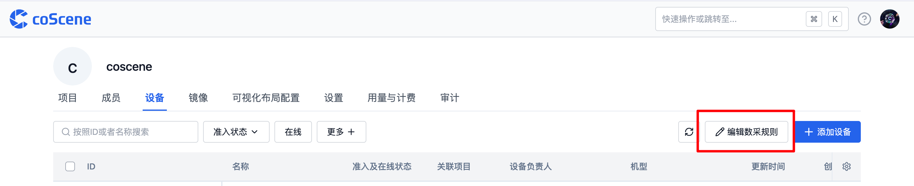
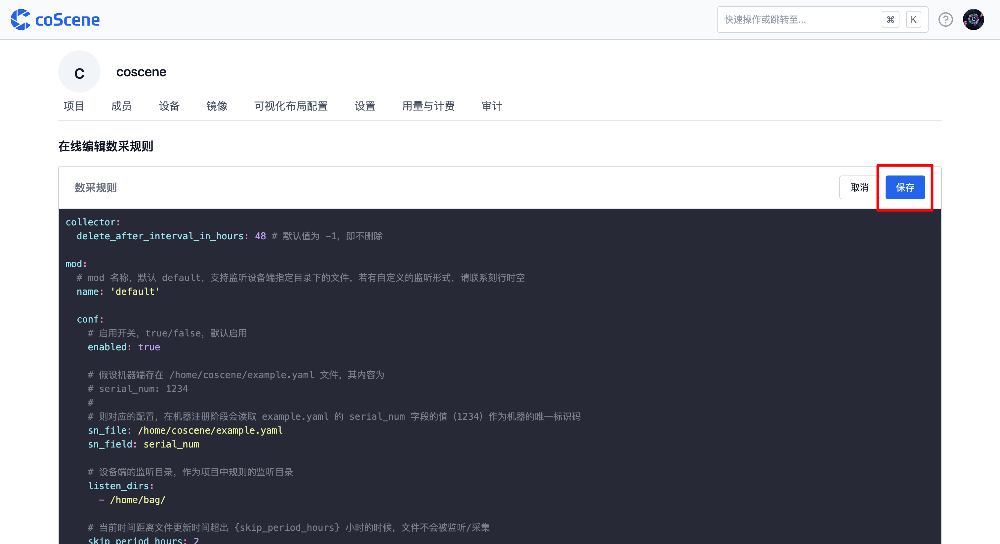

# 数采客户端配置

## 关于数采客户端配置

<div style={
{ 
    padding: '12px 16px', backgroundColor: '#EFF6FF', borderRadius: '4px',  border: '1px solid', borderColor: '#2563EB', color: '#111827' }
}>
<p style={{margin: 0}}>🤖 权限：**仅组织管理员**可编辑数采规则，统一对全组织设备进行配置</p>
</div>
<br />
数据采集配置由组织管理员进行编辑操作，其应用于组织内已安装数据采集客户端的设备。这些设备会依据数采规则自动监听设备上的数据，且全组织设备共用一套数采配置。

如果需要按照项目划分采集规则，请参考[关于数据自动采集与诊断](../9-data-diagnosis/1-intro.md) 使用规则引擎来处理满足相关需求。

在数采配置过程中，需定义如设备 ID 获取位置、设备端监听目录、客户端初始化监听时间范围、采集目录、规则触发话题、客户端自动更新机制等关键信息。设备准入后，会主动拉取组织配置的数采规则信息，并依据其在机器端动态运行。

## 入口

在组织管理页面的「设备」分页，点击【编辑数采规则】按钮，即可进入数采客户端配置编辑界面。此处使用 yaml 语言进行编辑操作。



完成配置后点击【保存】，配置将对全组织已准入数采客户端的设备立即生效。



## 数采规则格式详解

数采规则主要对 5 个模块进行设置：

| 模块名称                    | 功能描述                                                       |
| --------------------------- | -------------------------------------------------------------- |
| 数据收集器设置（collector） | 完成数据采集后，是否删除设备端数据                             |
| 存储设置（mod）             | 设备 ID 存放位置；监听目录；客户端初始化监听时间范围；采集目录 |
| 设备事件属性（device）      | 事件的属性值                                                   |
| 规则触发话题（topic）       | 规则触发话题                                                   |
| 更新设置（updater）         | 当前程序是否开启自动更新                                       |

示例模板如下：

```yaml
collector:
  delete_after_interval_in_hours: 48 # 默认值为 -1，即不删除

mod:
  # mod 名称，默认 default，支持监听设备端指定目录下的文件，若有自定义的监听形式，请联系刻行时空
  name: 'default'

  conf:
    # 启用开关，true/false，默认启用
    enabled: true

    # 假设机器端存在 /home/coscene/example.yaml 文件，其内容为
    # serial_num: 1234
    #
    # 则对应的配置，在机器注册阶段会读取 example.yaml 的 serial_num 字段的值（1234）作为机器的唯一标识码
    sn_file: /home/coscene/example.yaml
    sn_field: serial_num

    # 设备端的监听目录，作为项目中规则的监听目录
    listen_dirs:
      - /home/bag/

    # 当前时间距离文件更新时间超出 {skip_period_hours} 小时的时候，文件不会被监听/采集
    skip_period_hours: 2

    # 设备端的采集目录，作为项目中数据采集任务与规则采集的指定目录
    collect_dirs:
      - /home/bag/
      - /home/log/

# 假设机器端存在 /home/coscene/device.yaml 文件，其内容为
# soft_version: v1.0
#
# 则设备触发规则后，将读取 device.yaml 文件中的 soft_version: v1.0 作为生成事件的属性值
# 若要查看事件统计面板，请联系刻行时空
device:
  extra_files:
    - /home/coscene/device1.yaml
    - /home/coscene/device2.yaml

# 话题，作为项目中规则触发话题的选项来源，以缩小规则匹配的范围
# 假设存在 error_code 话题
topics:
  - error_code

# 自动更新
updater:
  # 自动更新开关，true/false，默认关闭
  enabled: false
```

下面我们一一介绍这些功能及用法：

### 数据收集器设置（collector）

此模块用于设置完成数据采集后是否删除设备端数据，以有效管理设备端硬盘存储。可配置的参数包括：

- `delete_after_upload`：默认值为 false，若设置为 true，则上传后删除设备端数据。

- `delete_after_interval_in_hours`：默认值为 -1，即不删除文件；若设置为具体时长（如 48），则默认会删除该时长以前的旧数据。

- `scan_interval_in_secs`：默认值为 60，即每 60 秒对文件夹扫描一次。

```yaml
# 数据收集器设置
collector:
  delete_after_upload: true # 默认值为 false
  delete_after_interval_in_hours: 48 # 默认值为 -1，即不删除文件；否则默认会删除 48 小时以前的旧数据
  scan_interval_in_secs: 60 # 默认值：60，即 60s 对文件夹扫描一次
```

### 存储设置（mod）

主要负责设置设备端数据的存储地址相关信息：

- `name`：名称默认名称 `default`，支持监听设备端指定目录下的文件，如有自定义监听形式，请联系刻行时空。

- `conf`：启用开关，`true/false`，默认启用。

- `sn_file`：假设机器端存在对应文件（如 `/home/coscene/example.yaml`），其内容包含设备唯一标识码（如 `serial_num: 1234`），则在机器注册阶段会读取该文件指定字段的值（`1234`）作为机器的唯一标识码。

- `sn_field`：对应标识码字段名。

- `listen_dirs`：设备端的监听目录，作为项目中规则的监听目录。

- `collect_dirs`：设备端的采集目录，作为项目中数据采集任务与规则采集的指定目录。

```yaml
mod:
  # mod 名称，默认 default，支持监听设备端指定目录下的文件，若有自定义的监听形式，请联系刻行时空
  name: 'default'

  conf:
    # 启用开关，true/false，默认启用
    enabled: true

    # 假设机器端存在 /home/coscene/example.yaml 文件，其内容为
    # serial_num: 1234
    #
    # 则对应的配置，在机器注册阶段会读取 example.yaml 的 serial_num 字段的值（1234）作为机器的唯一标识码
    sn_file: /home/coscene/example.yaml
    sn_field: serial_num

    # 设备端的监听目录，作为项目中规则的监听目录
    listen_dirs:
      - /home/bag/

    # 当前时间距离文件更新时间超出 {skip_period_hours} 小时的时候，文件不会被监听/采集
    skip_period_hours: 2

    # 设备端的采集目录，作为项目中数据采集任务与规则采集的指定目录
    collect_dirs:
      - /home/bag/
      - /home/log/
```

### 设备事件属性（device）

假设机器端存在特定文件（如 `/home/coscene/device.yaml`，内容为 `soft_version: v1.0`），则设备触发规则后，将读取该文件中的指定内容（如 `soft_version: v1.0`）作为生成事件的属性值。还可通过 `extra_files` 配置其他相关文件。

```yaml
# 假设机器端存在 /home/coscene/device.yaml 文件，其内容为
# soft_version: v1.0
#
# 则设备触发规则后，将读取 device.yaml 文件中的 soft_version: v1.0 作为生成事件的属性值
# 若要查看事件统计面板，请联系刻行时空
device:
  extra_files:
    - /home/coscene/device1.yaml
    - /home/coscene/device2.yaml
```

### 规则触发话题（topic）

话题作为项目中规则触发话题的选项来源，可缩小规则匹配的范围，提高监听效率。例如，假设存在 `error_code` 话题，可进行如下配置：

```yaml
# 话题，作为项目中规则触发话题的选项来源，以缩小规则匹配的范围
# 假设存在 error_code 话题
topics:
  - error_code
```

### 更新设置（updater）

用于设置是否自动更新数采客户端，默认为不自动更新`false`，若改为`true` 则在我们发布新版数采客户端后设备联网将自动更新。

```yaml
# 自动更新
updater:
  # 自动更新开关，true/false，默认关闭
  enabled: false
```

---

通过以上详细步骤和说明，管理员可全面、准确地对设备数采客户端进行配置，确保设备数据采集工作的高效运行。

如有任何疑问，请随时联系我们获取支持。
