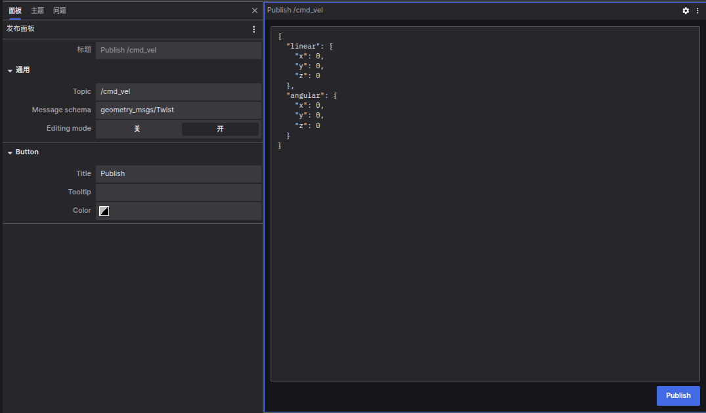

# 发布面板

发布面板（Publish Panel）允许您在指定的主题上发布消息，从而将信息通过 [coBridge](https://github.com/coscene-io/coBridge) 发送回您的机器人系统。

## 设置选项
- 编辑模式 (Editing mode): 启用后，您可以编辑消息内容；禁用后，仅显示发布按钮。
- 按钮标题 (Button Title): 设置发布按钮的标签。
- 按钮提示 (Button Tooltip): 为按钮添加悬停提示信息。      
- 按钮颜色 (Button Color): 自定义按钮的颜色。

## 交互
1. 指定主题：输入您希望发布消息的主题，系统会自动推断其消息架构名称，并在文本字段中生成相应的 JSON 消息模板。
2. 选择架构：点击架构名称字段，将显示常见 ROS 架构的下拉列表。选择一个架构后，文本字段会自动填充对应的 JSON 消息模板。
3. 编辑消息：根据需要修改消息模板，以自定义您希望发送回机器人系统的内容。
4. 发布消息：点击“发布”按钮，将消息发送到指定的主题。

## 注意

- 如果 web 端未连接到支持发布功能的机器端，“发布”按钮将被禁用。
- 当连接到已安装 coBridge 的机器人时，机器端的 coBridge 配置中必须声明 clientPublish 功能，以支持从 Web 端发布 topic 信息。

**通过发布面板，您可以方便地向机器人系统发送自定义消息，增强与机器人系统的交互能力。**
