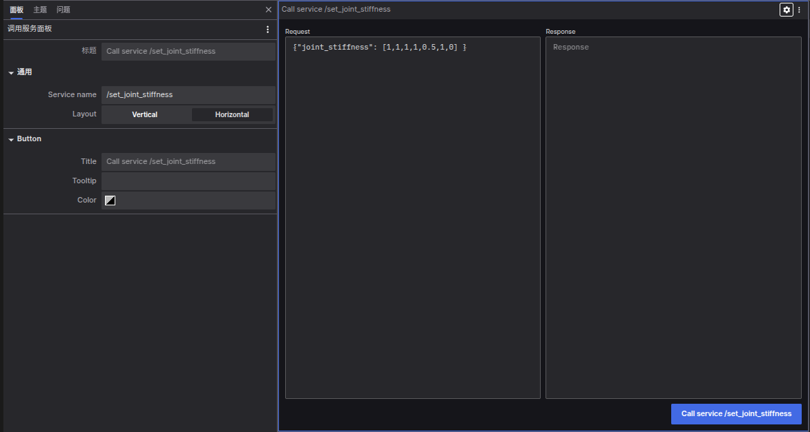

# 服务调用面板

服务调用面板（Service Call Panel）允许您通过 coBridge 调用机器端服务并查看其响应。

## 设置选项
### 通用设置
- 服务名称 (Service name)： 要请求的服务名称。
- 布局 (Layout)： 请求和响应输入的布局方式，可选择“垂直 (Vertical) ”或“水平 (Horizontal) ”。

### 按钮设置
- 标题 (Title)： 按钮文本。
- 提示 (Tooltip)： 按钮的提示文本。
- 颜色 (Color)： 按钮颜色。

## 交互
在连接到支持的数据源之前，“调用服务”按钮将处于禁用状态。在“请求”输入框中使用有效的 JSON 格式化服务请求，然后点击“调用服务”按钮。结果将显示在“响应”输入框中。

**通过服务调用面板，您可以方便地与机器人系统的服务进行交互，发送请求并查看响应，增强对系统的控制和监测能力。**
