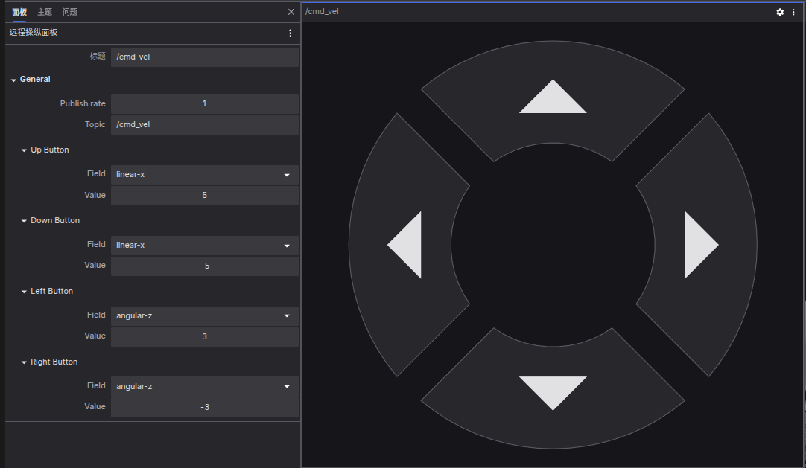

# 远程操纵面板

远程操纵面板允许您通过在指定主题上发布 geometry_msgs/Twist 或 geometry_msgs/msg/Twist 消息，来远程控制您的机器人。要使用控制面板远程操作已连接的机器人，您需要通过 [coBridge](https://github.com/coscene-io/cobridge) 机器人建立通信。

## 设置
- 发布频率 (Publish rate)： 设置发布 Twist 消息的频率。
- 主题 (Topic)： 指定发布 Twist 消息的主题。
- 上/下/左/右按钮 (Up/Down/Left/Right button)： 为每个方向按钮分配对应的字段（ 线性或角速度的 x、y 或 z ）及其值。

## 支持的消息类型：
- Twist：
  **ROS 1**: `geometry_msgs/Twist`

- **ROS 2**: `geometry_msgs/msg/Twist`

 
**要使用此面板，您的数据源必须提供符合上述支持的消息架构的消息。**

## 工作原理

  远程操纵面板是一个特化的 “发布” 面板，其工作原理与 “发布” 面板类似，都是通过 coBridge 向机器端下发topic。
  
  如果要实现远程操纵，机端必须有组件能够对于云端下发的 topic 做相关的处理。
  