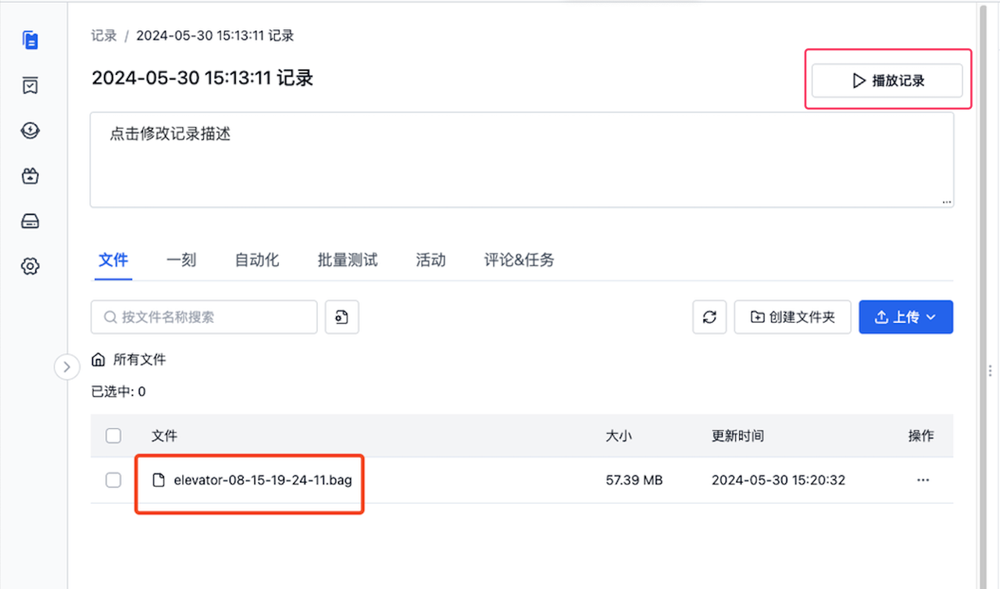

# 利用三维面板可视化你的数据

本章节将以记录中的 “elevator-08015-19-24-11.bag” 文件为例，展示使用刻行的三维面板可视化数据的步骤。

## 文件准备

1. 在项目中创建一条包含 bag 文件的记录，创建步骤详情请见[创建记录](../i/viz-3-1.png)

2. 点击记录详情页中的播放记录或文件名，进入可视化页面

   
### 查看/隐藏全部 topic

<video src="https://coscene-artifacts-prod.oss-cn-hangzhou.aliyuncs.com/docs/4-recipes/viz/3D-showhide-all-topic.mp4" controls="controls" width="700" height="400"></video>

### 查看/隐藏某个 topic

<video src="https://coscene-artifacts-prod.oss-cn-hangzhou.aliyuncs.com/docs/4-recipes/viz/3D-showhide-a-topic.mp4" controls="controls" width="700" height="400"></video>

## 设置点云属性

点云可设置点的大小、衰减时间、颜色等信息。

### 设置点的大小

<video src="https://coscene-artifacts-prod.oss-cn-hangzhou.aliyuncs.com/docs/4-recipes/viz/3D-setting-point-size.mp4" controls="controls" width="700" height="400"></video>

### 设置点的衰减时间

<video src="https://coscene-artifacts-prod.oss-cn-hangzhou.aliyuncs.com/docs/4-recipes/viz/3D-setting-decay-time.mp4" controls="controls" width="700" height="400"></video>

### 设置点的颜色

<video src="https://coscene-artifacts-prod.oss-cn-hangzhou.aliyuncs.com/docs/4-recipes/viz/3D-setting-color.mp4" controls="controls" width="700" height="400"></video>

## 导入静态 TF

<video src="https://coscene-artifacts-prod.oss-cn-hangzhou.aliyuncs.com/docs/4-recipes/viz/3D-input-static-TF.mp4" controls="controls" width="700" height="400"></video>

## 设置 静态 Bag

> 将带 TF 的 bag 设为「静态 Bag」，在播放时仅使用 bag 中的 TF 而不播放该 bag

<video src="https://coscene-artifacts-prod.oss-cn-hangzhou.aliyuncs.com/docs/4-recipes/viz/set-static-bag.mp4" controls="controls" width="700" height="400"></video>
