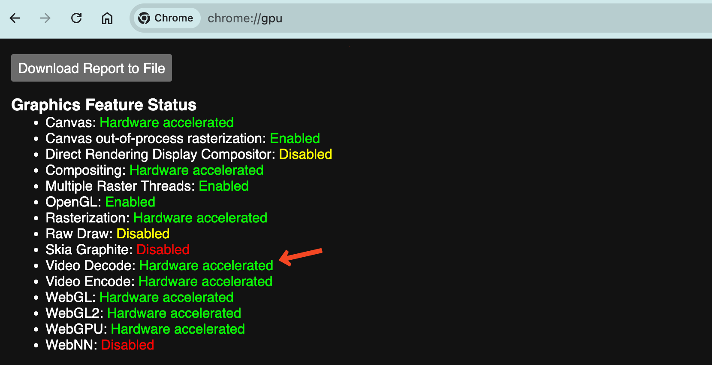
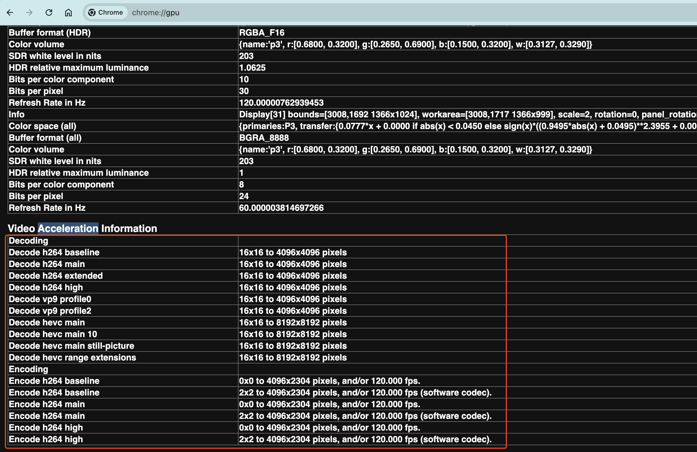
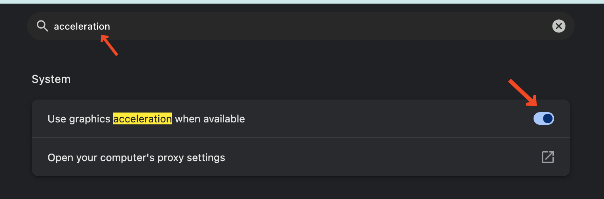
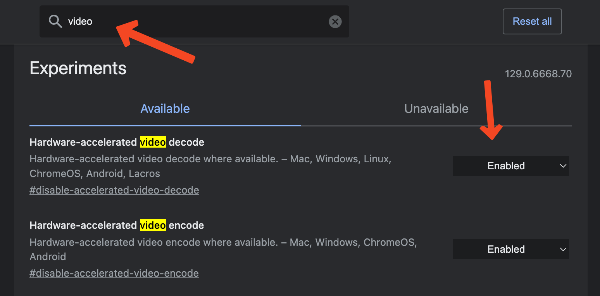
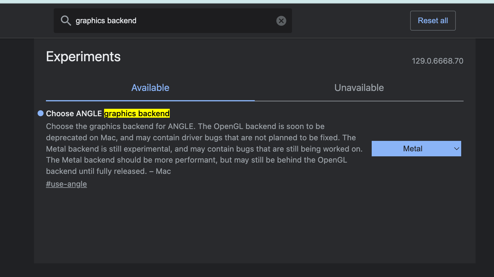

# 图像面板

## 故障排除

### 画面撕裂及卡顿
当画面呈现撕裂和卡顿时，可能的原因是视频解码导致的延迟, 当浏览器无法使用硬件加速解码时会使用系统 CPU 解码，CPU 解码性能会显著低于硬件解码并且此时系统 CPU 负载和功耗也会影响到解码效率。硬件加速解码通常更快且性能开销更少, 请确保确认已启用该功能。

以下步骤可以帮助您检查当前硬件是否支持硬件加速解码，并启用该功能。

### 检查视频加速:
您可以通过打开 Google Chrome 并在地址栏中输入 <code>chrome://gpu</code> 来检查您的平台是否支持硬件加速视频解码。如果在此页面上未看到 <code>Video Decode: Hardware accelerated</code> 或 <code>Video Acceleration</code> 部分为空，则代表当前未开启硬件加速解码。

<table>
  <tr>
    <td>
    
    </td>
    <td>
    
    </td>
  </tr>
</table>

### 启用视频加速:
访问 <code>chrome://settings</code>，搜索 <code>acceleration</code>，确保 <code>Use graphics acceleration when available</code> 切换已启用。

访问 <code>chrome://flags</code>，搜索 <code>video</code>，确保 <code>Hardware-accelerated video decode</code> 已启用。

MacOS：

对于 MacOS，当在基于 Chromium 的浏览器中将图形后端(graphics backend) 更改为使用 <code>Metal</code> 时，观察到显著的性能提升。您可以在 <code>about://flags</code> 中进行更改。

Linux：

- 请注意，Chrome/Chromium 默认不支持 Linux 上的视频加速，可能需要使用自定义 Chrome/Chromium 标记来启用 GPU。
- 确保您的图形驱动程序已更新并正确安装。