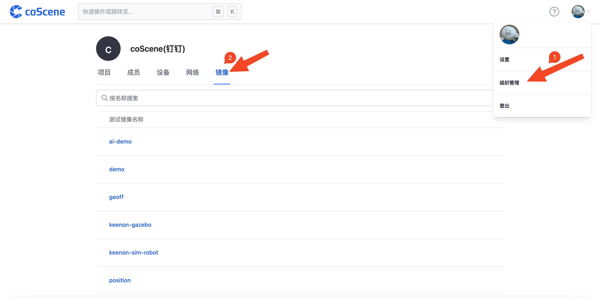
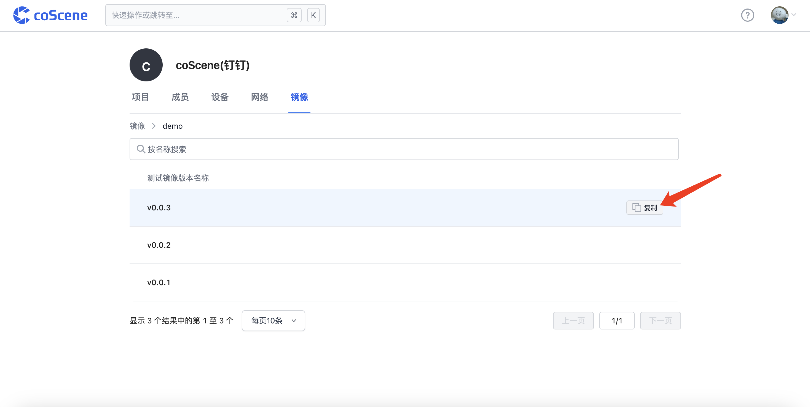

# 推送与管理镜像

了解如何使用 coScene 的镜像仓库存储和管理用户自己构建的 Docker 镜像。

## 前置条件

本机已经安装并启动 Docker

## 1. 认证和登陆刻行的镜像仓库

登陆刻行时空平台，在右上角用户设置下拉面板中，访问【个人设置】，在【个人设置】页面中，访问[【安全】](https://coscene.cn/profile?section=security)页面。

点击生成访问命令，获取登陆平台镜像仓库的命令和密码


在命令行中输入包含用户名的登陆，使用之前获得的认证凭证进行认证


## 2. 准备镜像文件

**2.1 运行 Docker**

**2.2 配置镜像**

新建一个文件夹，其中包含 dockerfile 和相关测试代码

- 示例 dockerfile

  ```bash
  FROM ubuntu:latest

  RUN apt update -y
  RUN apt upgrade -y
  RUN apt install -y python3 unzip python-is-python3
  RUN apt install -y python3-pip
  RUN pip install pytest
  copy tests.py /tests.py
  ```

- 示例测试代码

  ```python
  import os
  import subprocess
  import tempfile

  BUNDLE_DIR = '/cos/bundles'
  DATA_DIR = '/cos/files'
  ARTEFACT_DIR = '/cos/artifacts'

  def __count(word):
      with tempfile.TemporaryDirectory() as d:
          print(d)
          os.system('unzip %s/*.zip -d %s' % (BUNDLE_DIR, d))

          cmd = [d + '/count', word , DATA_DIR, ARTEFACT_DIR]
          print('RUNNING TEST COMMAND')
          print(cmd)
          proc = subprocess.run(cmd, text=True, capture_output=True)
          print('COMMAND RETURN CODE IS: ' + str(proc.returncode))
          output = proc.stdout
          print('COMMAND OUTPUT IS: ' + output)
          return int(output)

  def test_romeo():
      assert __count('romeo') > 0
  ```

  - 若需要在最终的测试结果中输出图型测试报告，请参见 [输出测试结果](../8-regression/6-status-and-output.md#输出图表) 章节。

**2.3 build 镜像**

镜像文件准备完成后，打开终端，进入对应文件夹后执行命令 build 镜像：

:::warning
请根据您在刻行的组织名称，替换镜像地址
:::

```bash
docker build -f dockerfile -t cr.coscene.cn/coscene/image:latest .

# 如果在不同的系统中进行交叉构建
docker build -f dockerfile -t cr.coscene.cn/coscene-lark/image:latest --platform linux/amd64 .
```

完成构建之后，就可以使用 `docker push` 将镜像推送到平台的镜像仓库了。

## 3. 查看组织镜像列表

在[「我的 - 组织管理 - 镜像」](https://coscene.cn/org/images)页面中，可以查看当前组织内的镜像列表：



点击镜像名称，展示该镜像所有版本，可以点击「复制」按钮复制完整的镜像地址：


