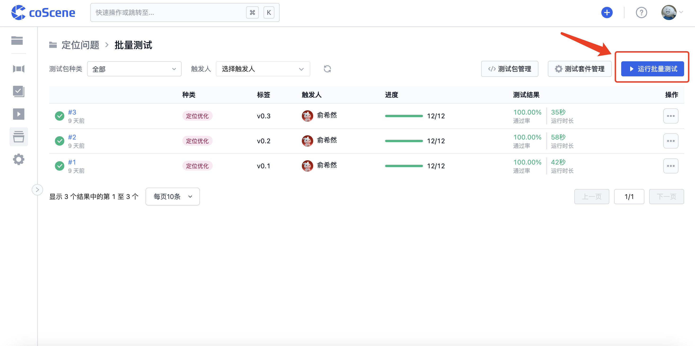
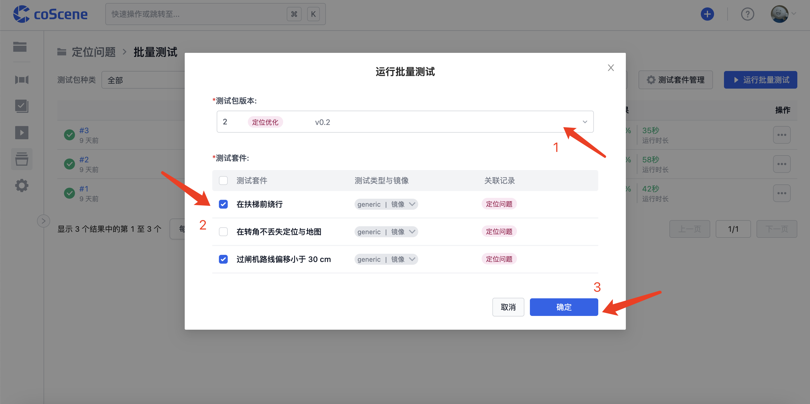
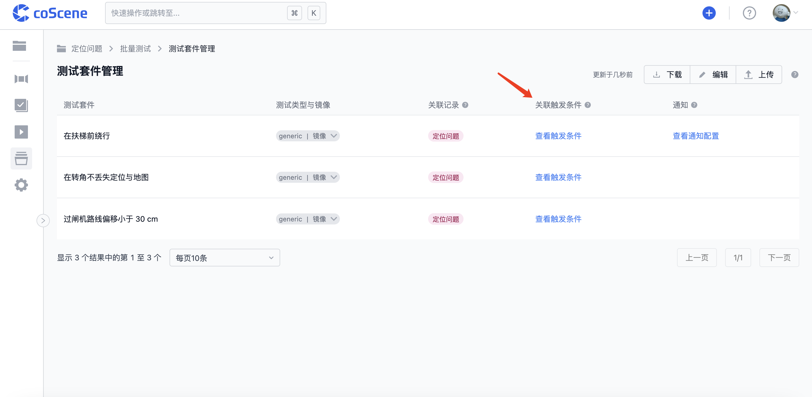
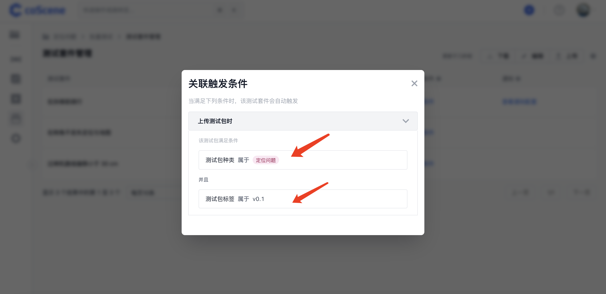
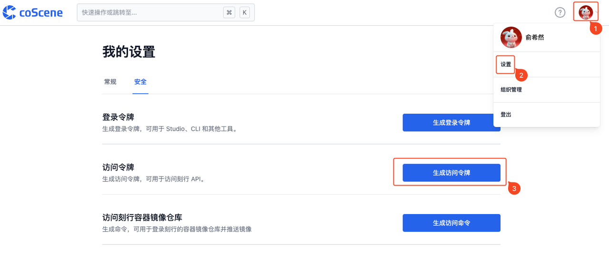
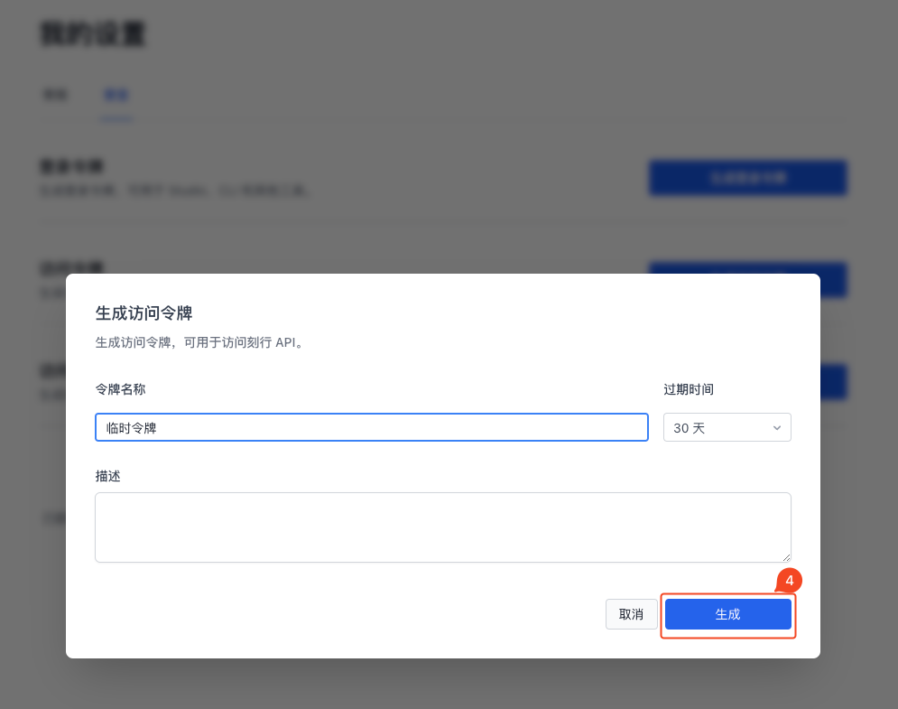

# 运行批量测试

> 了解如何运行批量测试，包括在网站上指定相关条件后触发、通过配置文件指定自动触发条件，以及使用命令行在本地运行批量测试等。

## 网页端运行批量测试

1. 点击进入「批量测试」页面：

- 首次运行批量测试

  

- 非首次运行批量测试

  

<br />

2. 选择测试包版本和需要执行的测试套件后，点击「确定」运行批量测试，会使用符合条件的关联记录作为测试数据执测试套件：

   

<br />

## 自动触发批量测试

上传的测试包种类或标签符配置文件中的预设条件时，测试包完成上传后会自动触发批量测试，使用该测试包文件执行符合条件的全部测试套件。

你可以在配置文件中的「on」字段对测试套件设置自动触发条件，具体格式与规则请参见 [配置文件格式与样例-自动触发测试](../8-regression/9-yaml-sample.md#自动触发测试)。

在「批量测试-测试套件管理」页面中，对于配置了自动触发条件的测试套件，其「关联触发条件」列会显示「查看触发条件」按钮：



你可以点击「查看触发条件」按钮，查看该测试套件自动触发对应的测试包条件：



<br />

## 本地运行批量测试

你可以使用命令行，按照以下说明在本地运行批量测试。

### 下载与配置

1. 输入命令以下载所需文件，各操作系统对应命令如下：

- Linux

  ```bash
  curl https://coscene-artifacts-production.oss-cn-hangzhou.aliyuncs.com/cos/linux/amd64/latest/cos -o cos
  ```

- macOS

  ```bash
  curl https://coscene-artifacts-production.oss-cn-hangzhou.aliyuncs.com/cos/darwin/amd64/latest/cos -o cos
  ```

2. 通过以下命令进行配置：

   ```bash
   # 给 cos 可执行权限
   chmod +x cos

   # 创建配置目录
   mkdir $HOME/.cos

   # 创建配置文件
   cat << EOF > $HOME/.cos/config.yaml
   platform:
       endpoint: ${YOUR_DOMAIN}
       accessToken: ${YOUR_TOKEN}
       project: ${ORG_SLUG}/${PROJECT_SLUG}
   EOF

   # 验证配置
   cos config list
   ```

   其中各参数说明如下：

   - `endpoint` 中 `${YOUR_DOMAIN}` 需替换成实际的网站地址。如下图的网址，`${YOUR_DOMAIN}` 为 `api.coscene.cn`

     

   - `accessToken` 中 `${YOUR_TOKEN}` 的获取步骤如下所示：

     

     

     

   - `project` 中 `ORG_SLUG` 和 `PROJECT_SLUG` 需根据实际替换：

     

  <br />
    
### 运行

你可以参考以下命令示例运行批量测试：

```bash
# 使用最新的测试包运行项目下所有批量测试
cos test run

# 只用本地的配置文件 cos.yaml 运行批量测试
cos test run --test-config cos.yaml

# 使用最新的测试包，对项目下名称为 gazebo 的测试套件运行批量测试
cos test run -t gezebo

# 使用指定的记录 定位采集数据 运行批量测试
cos test run -r 定位采集数据

# 使用标签为 v0.0.1 的测试包，对项目下所有测试套件运行批量测试
cos test run --bundle-tag v0.0.1

# 使用种类为 Gazebo 的测试包，对项目下所有测试套件运行批量测试
cos test run --bundle-category Gazebo

# 上传 bundle.zip 并运行批量测试
cos test run -b bundle.zip
```

 <br />
