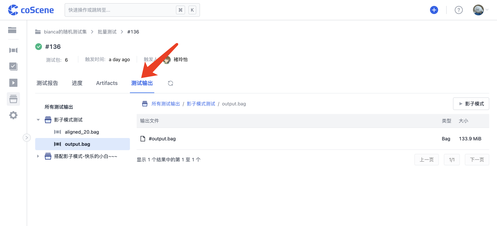
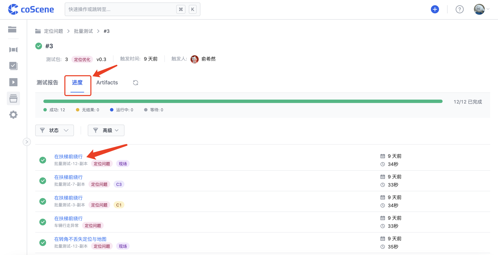
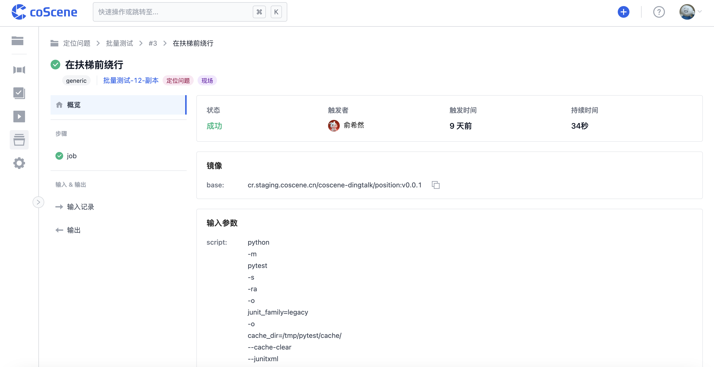
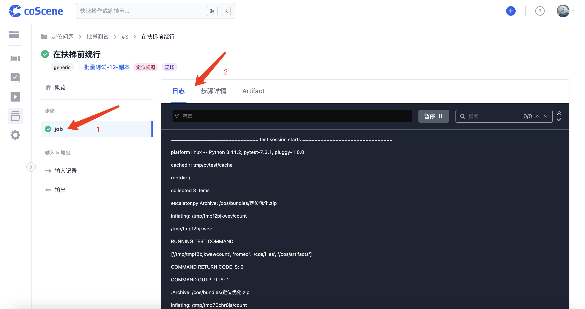
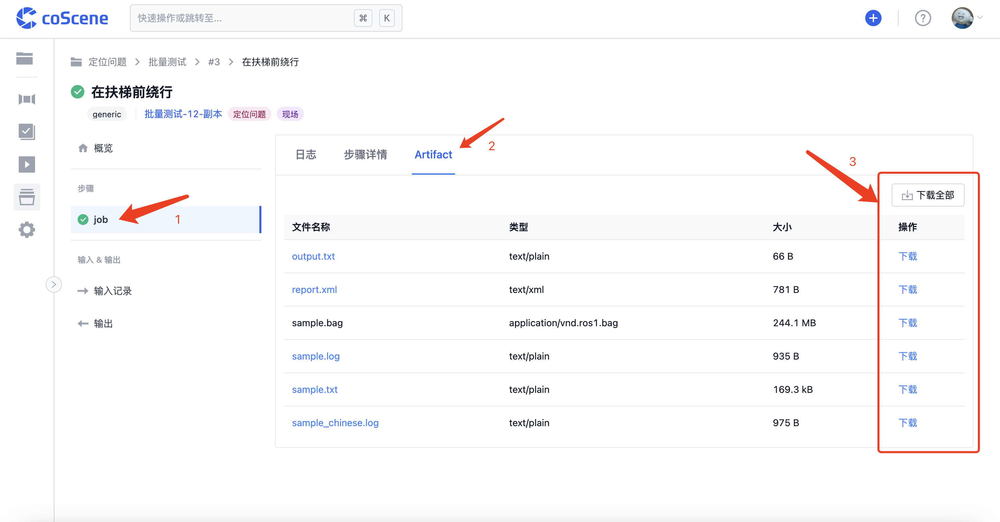
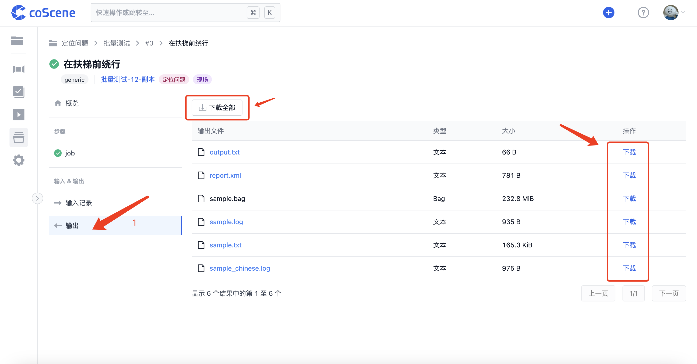
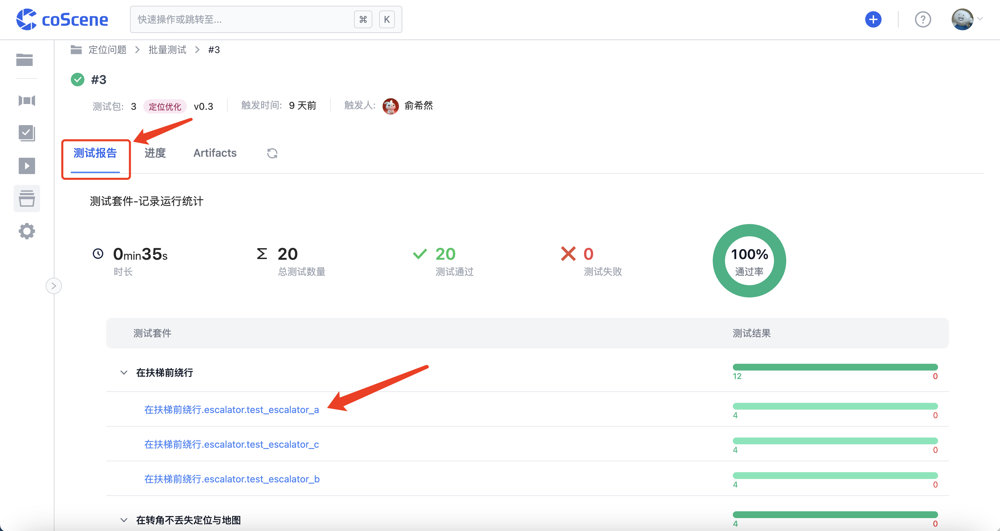
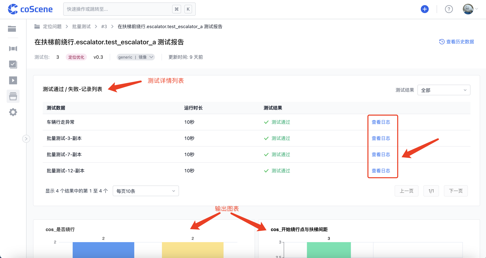
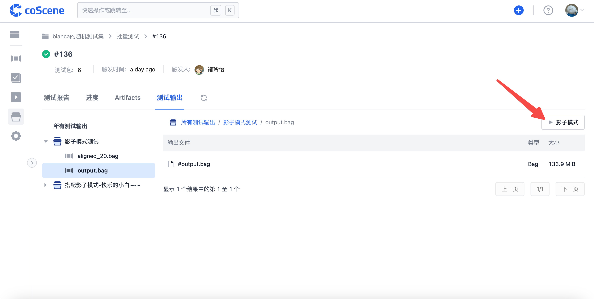

# 输出结果与查看运行信息

> 了解如何自定义输出的测试结果，如何查看批量测试与其中单个测试的进度与运行产物，以及如何在可视化界面下播放影子模式以对比输出等

## 输出测试结果

你可以通过配置文件和测试代码等自定义输出的测试结果，目前支持输出可解析的结果文件与输出图表。

### 输出可解析的结果文件

批量测试支持解析 JUnit XML 格式的结果文件。你可以在配置文件中的「script」参数中使用以下命令在 `path` 处创建一个 XML 格式的结果文件：

```bash
pytest --junitxml=path
```

具体示例请参见 [配置文件格式与样例-输出测试结果文件](../8-regression/9-yaml-sample.md#save-artifacts)。

支持解析的 JUnit XML 格式的结果文件示例如下，其中结果数据到 JUnit XML 格式的映射请参考 [JUnit Mapping](https://www.ibm.com/docs/en/developer-for-zos/14.1?topic=formats-junit-xml-format#junitschema__table_junitmap)：

```xml
<?xml version="1.0" encoding="UTF-8" ?>
  <testsuites id="20140612_170519" name="New_configuration (14/06/12 17:05:19)" tests="225" failures="1262" time="0.001">
    <testsuite id="codereview.cobol.analysisProvider" name="COBOL Code Review" tests="45" failures="17" time="0.001">
      <testcase id="codereview.cobol.rules.ProgramIdRule" name="Use a program name that matches the source file name" time="0.001">
        <failure message="PROGRAM.cbl:2 Use a program name that matches the source file name" type="WARNING">
          WARNING: Use a program name that matches the source file name
          Category: COBOL Code Review – Naming Conventions
          File: /project/PROGRAM.cbl
          Line: 2
        </failure>
      </testcase>
    </testsuite>
  </testsuites>
```

### 输出图表

你可以在测试报告中增加以 "cos\_" 开头的自定义属性，例如`cos_customer_name`，这些自定义属性将与默认指标一起上传到刻行，刻行会对这些自定义属性进行收集和分析，以及将其作为维度对指标进行分组、排序和过滤展示等。

你可以在镜像中的相关测试代码文件中使用以 "cos\_" 开头的自定义图名，以在测试结果中输出图表，其示例格式如下：

```python
  def test_romeo(record_xml_attribute):

    for i in (1, 2, 3):
      rand_float = random.uniform(1, 100)
      record_xml_attribute("cos_test_romeo_val" + str(i), rand_float)
    for i in (1, 2, 3):
      rand_bool = random.choice([True, False])
      record_xml_attribute("cos_test_romeo_bool" + str(i), rand_bool)

    assert __count('romeo') > 0
```

### 输出影子模式文件

> 输出文件至指定目录作为测试输出，其中的.bag文件可与原记录中的文件在可视化界面中对比播放。

你可以配置文件的「script」字段中使用命令将文件输出到 `/cos/outputs` 目录下作为测试输出，具体示例请参见 [配置文件格式与样例-输出影子模式文件](../8-regression/9-yaml-sample.md#generate-shadow-mode)。

测试输出将展示在测试详情页的「测试输出」栏，按照对应测试套件与记录分级展示。



<br />

## 查看运行进度与产物

1. 在批量测试页面的列表中，会展示项目内运行过的批量测试及信息，你可以点击某个批量测试序号以查看其详情页面：

   

2. 在批量测试详情页中，「进度」Tab会展示该批量测试的运行进度和其中所有单个测试的运行状态：

   

   你可以点击某个测试标题以查看其详情页面:

   

   点击「步骤」中的单个步骤标题，可以查看其运行日志、步骤详情和运行产物：

   

   你可以在单个步骤的「Artifact」中，查看与下载该步骤的运行产物：

   

   单个测试详情页的「Artifacts」中，可以查看与下载此测试的所有运行产物：

   

3. 你可以在批量测试详情页的「Artifacts」Tab 中，查看与下载该批量测试的所有运行产物：

   

<br />

## 查看运行结果

当批量测试运行完成后，你可以点击批量测试详情页中的「测试报告」Tab 查看测试套件运行结果统计，包括运行信息以及各测试套件运行解析出的测试用例等:



你可以点击单个测试用例名称，查看该测试用例的运行报告，包括各测试详情列表和输出图表等：



点击页面右上角的「查看历史数据」，可以查看该测试用例的历史结果数据统计，包括测试的运行结果矩阵、指标统计图等：


<br />

## 播放影子模式

测试输出中包含.bag 文件的记录支持影子模式；点击测试详情页的「测试输出」栏中对应记录测试输出列表上方，或者单个测试详情页右上角的「影子模式」按钮进入可视化界面：




测试输出文件将与原记录中的文件一起在可视化界面中对比播放。


