# 快速上手自动化

自动化是一套基于任务的工作流系统，它凭借灵活且强大的特性，为您存储在平台的数据赋予了更多价值。主要应用于数据处理、转换、分析等场景，借助自动化流程，您能够高效处理海量数据，显著提升工作效能。

## 基本信息

### 概念说明

| 概念     | 说明                                                                                                            |
| -------- | --------------------------------------------------------------------------------------------------------------- |
| 动作     | 动作是自动化流程的基本构建块，它代表了一个具体的任务。详见[动作](./2-action-overview.md)                        |
| 触发器   | 触发器是动作的启动条件，它定义了在特定事件发生时，系统应该如何执行相应的动作。详见[触发器](./4-trigger.md)      |
| 调用历史 | 调用历史记录了所有已执行调用的相关信息，包括调用的时间、状态、执行结果等信息。详见[调用历史](./5-invocation.md) |

### 系统目录

自动化的容器在运行过程中，会挂载多个系统目录，方便与平台的数据进行交互，以下是常见的目录。完整的目录请参考[动作运行时信息](./6-action-runtime.md)。

| 目录         | 说明                       |
| ------------ | -------------------------- |
| /cos/files   | 输入目录，即记录中的文件   |
| /cos/outputs | 输出目录，即每个调用的输出 |

## 快速开始

本章节将通过一个简单示例，详细介绍如何创建自动化流程：当上传后缀为 `.zip` 的文件时，系统将自动触发并执行「解压缩动作」。

### 创建动作

1. 进入项目，在「自动化-动作」页面，点击【创建动作】按钮。

   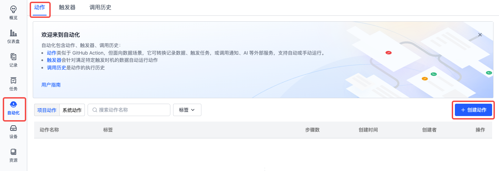

2. 在创建动作页面，填写动作名称、步骤等信息。

- 动作名称：解压文件

  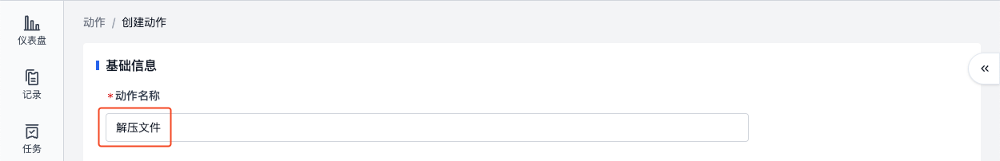

- 添加步骤：

  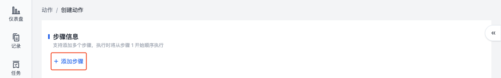

- 步骤名称：unzip
- 镜像：`python:3.12-slim`
  - 这是 Docker Hub 上公开可拉取的 Python 镜像，适合用于快速验证自动化流程。
  - 生产环境建议将脚本和依赖打包为自己的镜像，并推送到组织镜像仓库。每个组织都会自动分配一个刻行镜像仓库，地址通常为 `cr.coscene.cn/<org-slug>`；使用 `cocli registry login` 可完成本地 Docker 登录，动作运行时会自动获得拉取当前组织镜像的授权。
- 命令：将下面 3 行分别填入命令输入框，每一行都是一个独立参数。

  ```bash
  python
  -c
  import pathlib,zipfile;root=pathlib.Path('/cos/files');[zipfile.ZipFile(p).extractall(root) for p in root.rglob('*.zip')]
  ```

  - 该命令使用 Python 标准库扫描 `/cos/files` 下的 `*.zip` 文件，并把内容解压回原记录。
  - 命令和参数需要逐行填写；不要把 `python -c ...` 合并成一行。

- 记录文件挂载权限：读/写
  - 允许该动作在执行期间对原记录进行读写操作

  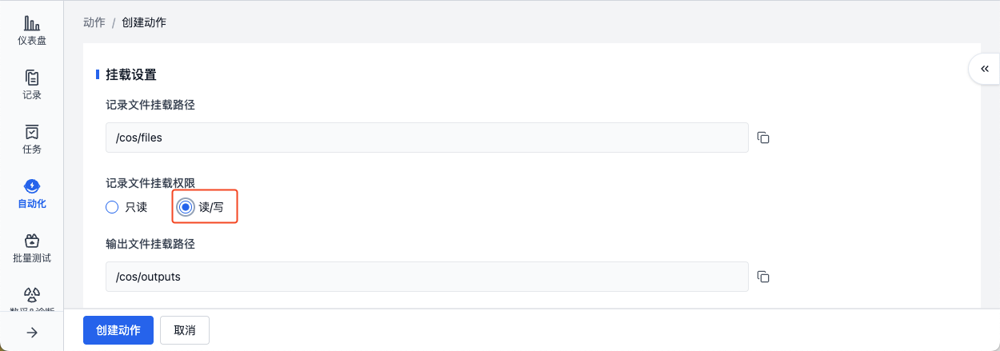

3. 点击【创建动作】按钮，完成动作创建。创建完成的动作将展示在动作列表中。

   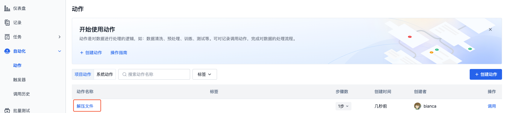

### 创建触发器

1. 进入项目，在「自动化-触发器」页面，点击【创建触发器】按钮。

   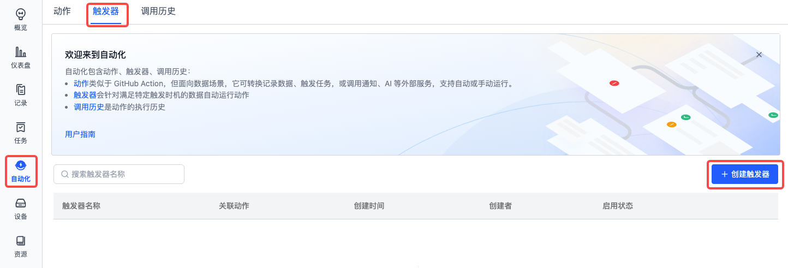

2. 在创建触发器页面，填写触发器名称、触发时机、关联动作等信息。

- 触发器名称：自动解压文件
- 触发时机：上传文件到记录时
- 文件统配符满足：\*.zip
- 关联动作：解压文件

  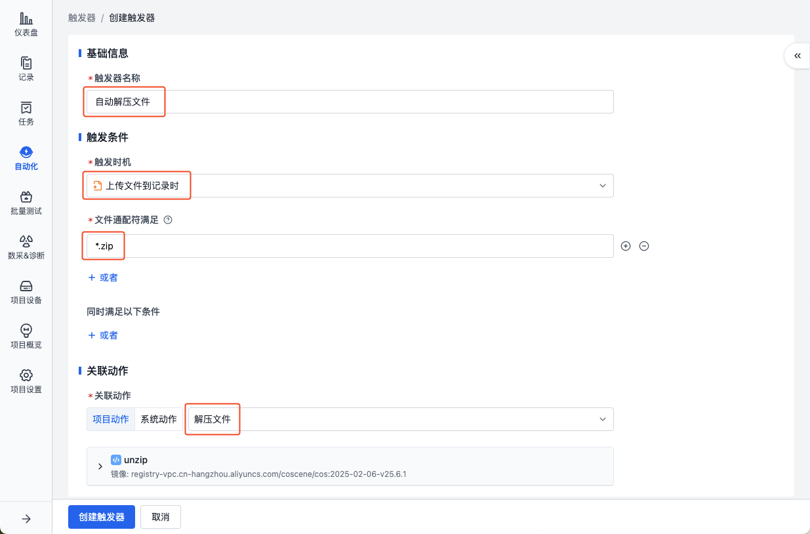

3. 点击【创建触发器】按钮，完成触发器创建。创建完成的触发器默认为启用状态，展示在触发器列表中。

   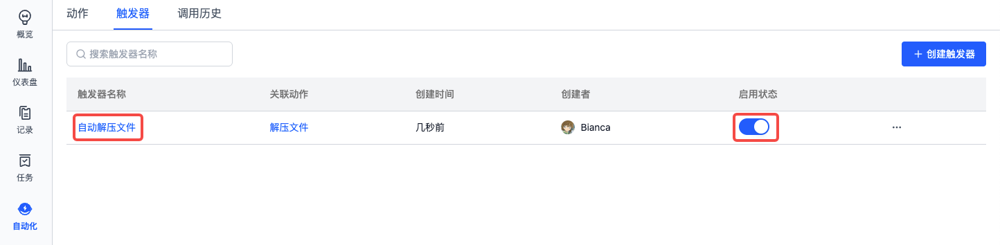

### 创建记录并上传文件

1. 进入项目，在项目左侧边栏，选择「记录」，点击【创建记录】按钮。

   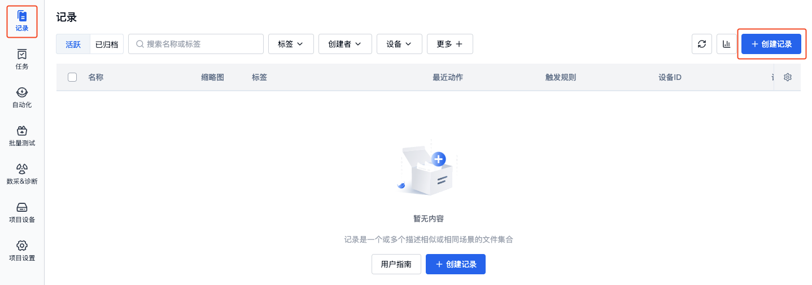

2. 在弹窗中输入记录名称与相关信息后，点击【创建】。
3. 创建完成后，自动进入记录详情页，点击【上传】按钮上传 zip 文件。

   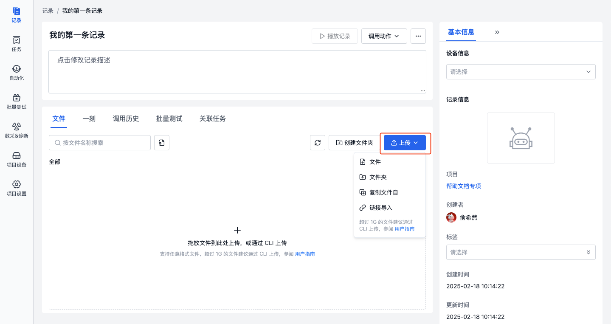

### 查看调用结果

1. 在记录详情的调用历史页，查看自动触发的动作。

   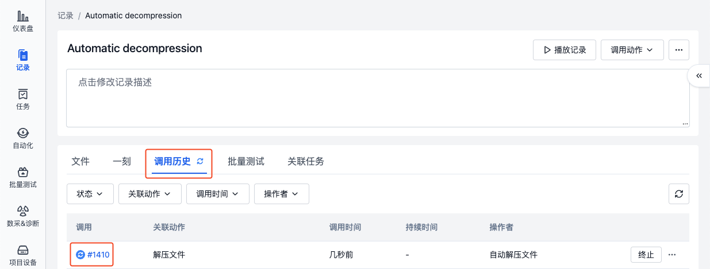

2. 当动作运行完成后，在文件列表中查看解压后的文件。

   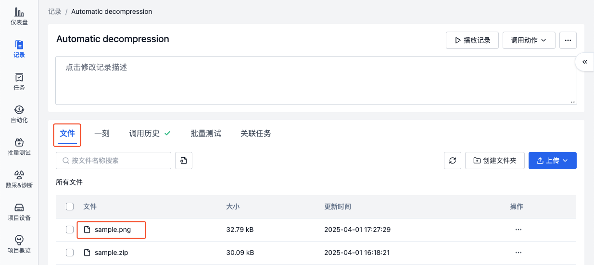

您已成功创建并测试了一个自动化流程，更多操作详见后续文档。
