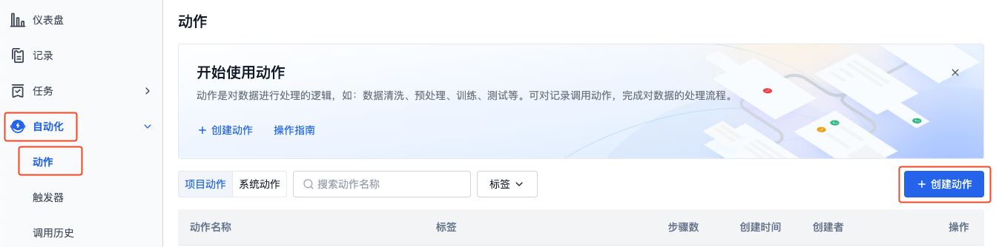
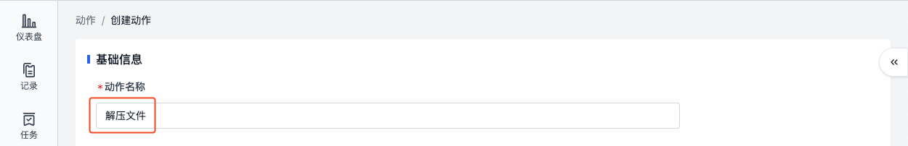
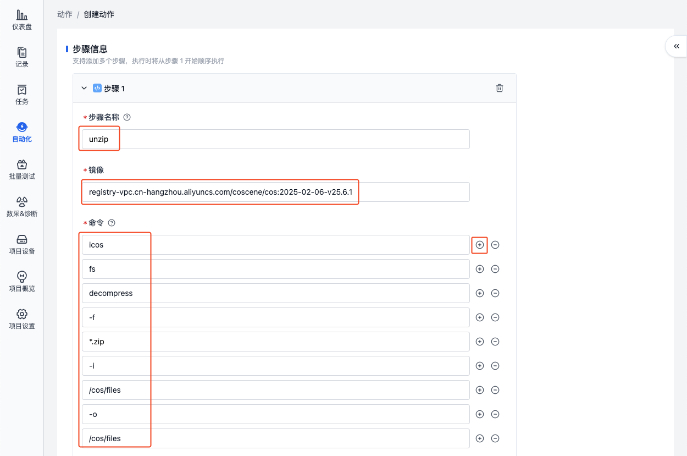

# 快速上手自动化

自动化是一套基于任务的工作流系统，它凭借灵活且强大的特性，为您存储在平台的数据赋予了更多价值。主要应用于数据处理、转换、分析等场景，借助自动化流程，您能够高效处理海量数据，显著提升工作效能。

## 基本信息

### 概念说明

| 概念     | 说明                                                                                                            |
| -------- | --------------------------------------------------------------------------------------------------------------- |
| 动作     | 动作是自动化流程的基本构建块，它代表了一个具体的任务。详见[动作](./2-action-overview.md)                        |
| 触发器   | 触发器是动作的启动条件，它定义了在特定事件发生时，系统应该如何执行相应的动作。详见[触发器](./4-trigger.md)      |
| 调用历史 | 调用历史记录了所有已执行调用的相关信息，包括调用的时间、状态、执行结果等信息。详见[调用历史](./5-invocation.md) |

### 系统目录

自动化支持的目录结构如下：
| 目录 | 说明 |
| --- | --- |
| /cos/files | 输入目录，即记录中的文件 |
| /cos/outputs | 输出目录，即每个调用的输出|

## 快速开始

本章节将通过一个简单示例，详细介绍如何创建自动化流程：当上传后缀为 `.zip` 的文件时，系统将自动触发并执行「解压缩动作」。

### 创建动作

1. 进入项目，在「自动化-动作」页面，点击【创建动作】按钮。

   

2. 在创建动作页面，填写动作名称、步骤等信息。

- 动作名称：解压文件

  

- 添加步骤：

  

- 步骤名称：unzip
- 镜像：registry-vpc.cn-hangzhou.aliyuncs.com/coscene/cos:2025-02-06-v25.6.1
  - 该镜像为刻行时空提供的镜像，内置 `icos` 工具，仅支持在平台内部使用，了解[镜像](../image/1-about-docker-image.md)
- 命令：icos fs decompress f \*.zip -i /cos/files -o /cos/files
  - 调用 `icos` 工具，对 `/cos/files` 目录（记录）下名称符合 `*.zip` 的文件进行解压，将其输出到原记录
  - 需一行填写一个参数，如第一行填写 `icos`，第二行填写 `fs`，以此类推

  

- 记录文件挂载权限：读/写
  - 允许该动作在执行期间对原记录进行读写操作

  

3. 点击【创建动作】按钮，完成动作创建。创建完成的动作将展示在动作列表中。

   

### 创建触发器

1. 进入项目，在「自动化-触发器」页面，点击【创建触发器】按钮。

   

2. 在创建触发器页面，填写触发器名称、触发时机、关联动作等信息。

- 触发器名称：自动解压文件
- 触发时机：上传文件到记录时
- 文件统配符满足：\*.zip
- 关联动作：解压文件

  

3. 点击【创建触发器】按钮，完成触发器创建。创建完成的触发器默认为启用状态，展示在触发器列表中。

   

### 创建记录并上传文件

1. 进入项目，在项目左侧边栏，选择「记录」，点击【创建记录】按钮。

   

2. 在弹窗中输入记录名称与相关信息后，点击【创建】。
3. 创建完成后，自动进入记录详情页，点击【上传】按钮上传 zip 文件。

   

### 查看调用结果

1. 在记录详情的调用历史页，查看自动触发的动作。

   

2. 当动作运行完成后，在文件列表中查看解压后的文件。

   

您已成功创建并测试了一个自动化流程，更多操作详见后续文档。
