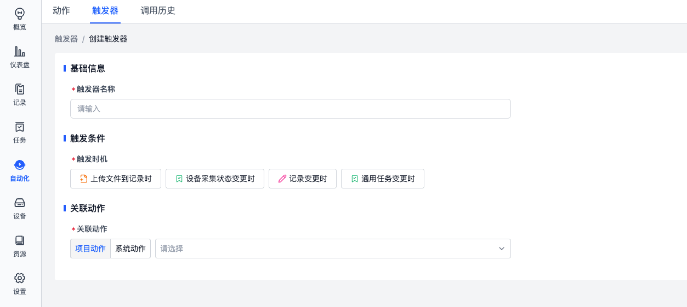
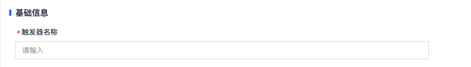
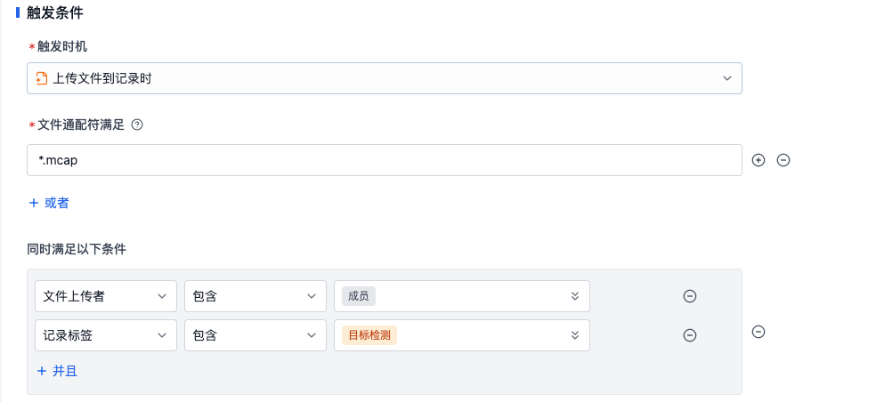
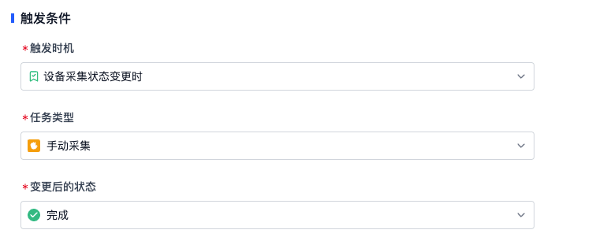
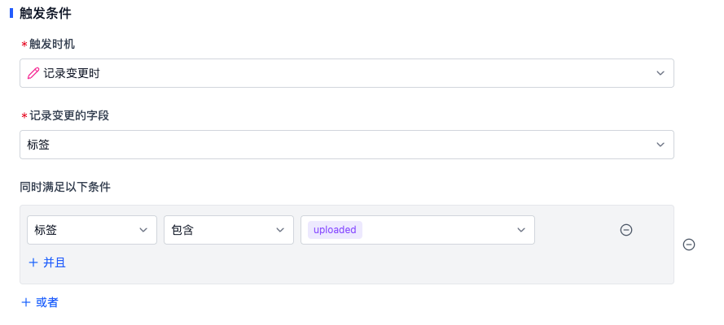

# 触发器
触发器定义了动作的触发条件，当满足触发时机时，触发器会依据配置进行检查，并执行对应的动作。

## 触发器名称
按照业务需求填写有含义的名称信息。

## 触发条件
平台支持以下两种触发时机：
- 上传文件到记录时
- 任务状态变更时

### 上传文件到记录时
当有新文件上传到记录时，触发器会检查文件的通配符、文件上传者与记录的标签是否满足触发条件。

- **文件通配符**：用于匹配上传的文件是否符合相关的格式定义，了解详细的[语法逻辑](https://www.malikbrowne.com/blog/a-beginners-guide-glob-patterns/)
- **文件上传者**：用于匹配文件上传的用户为成员/设备
- **记录标签**：用于匹配记录的标签信息。**注意，记录标签的改变并不会触发系统检验相关的触发器**。例如给记录打上一个新的标签，触发器并不会检验然后运行对应的动作，当前只有上传文件才会触发触发器的运行。

例如：文件通配符满足`*.mcap`，文件上传者包含`成员`，记录标签包含`目标检测`，表示当有文件上传到记录中，文件格式为 `.mcap`，文件上传者为成员，且记录有 `目标检测` 标签时，触发器会触发动作运行。

### 任务状态变更时
当「手动采集任务」或者「规则采集任务」的状态发生变更时，触发器会检查任务的状态是否满足触发条件。

例如：当手动采集任务完成时，触发器会触发动作运行。

## 关联动作
用户在动作页面创建的所有动作均属于项目动作，可按需选用。平台基于客户常见业务场景，预先开发并内置了一系列通用系统动作，如数据诊断功能。

