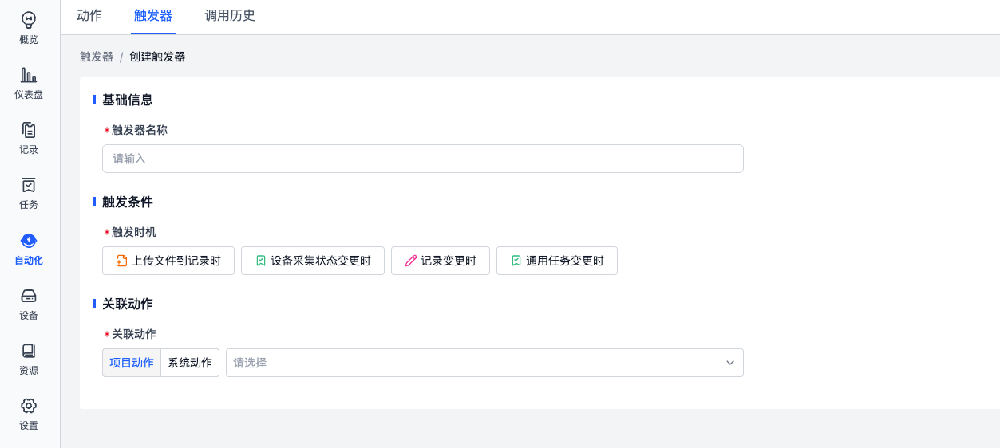
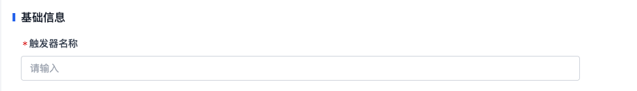
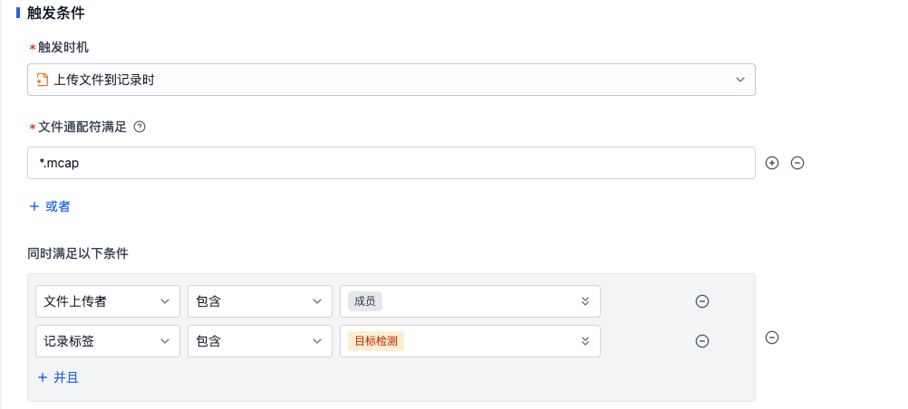
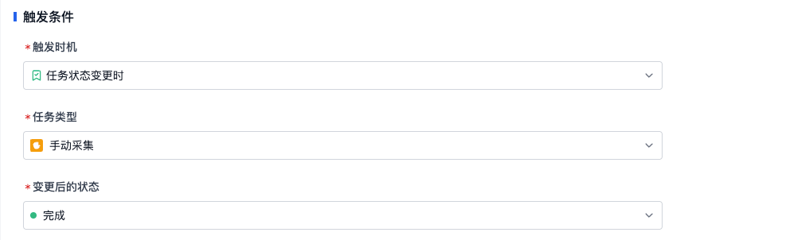
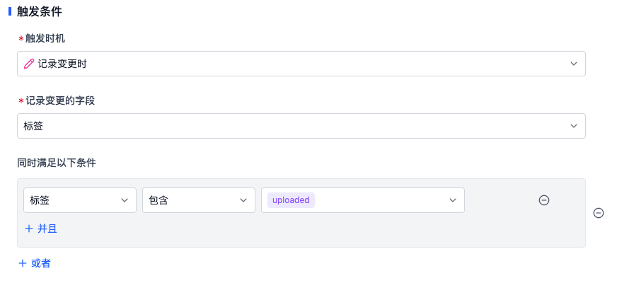
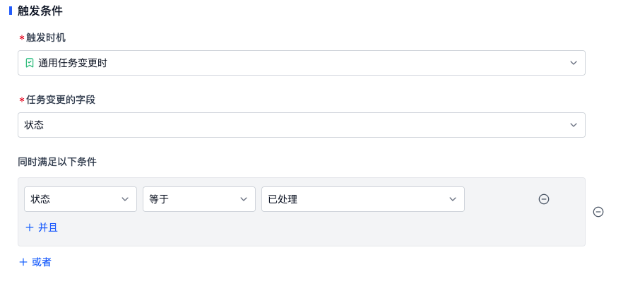
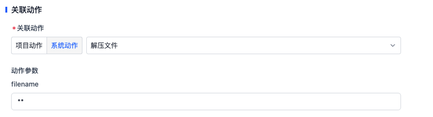

# 触发器

触发器定义了动作的触发条件，当满足触发时机时，触发器会依据配置进行检查，并执行对应的动作。

## 触发器名称

按照业务需求填写有含义的名称信息。

## 触发条件

平台支持以下触发时机：

- 上传文件到记录时
- 设备采集状态变更时
- 记录变更时
- 通用任务变更时
- 定时触发

### 上传文件到记录时

当有新文件上传到记录时，触发器会检查文件的通配符、文件上传者与记录的标签是否满足触发条件。

- **文件通配符**：用于匹配上传的文件是否符合相关的格式定义，了解详细的[语法逻辑](https://www.malikbrowne.com/blog/a-beginners-guide-glob-patterns/)
- **文件上传者**：用于匹配文件上传的用户为成员/设备
- **记录标签**：用于匹配记录的标签信息。这里的标签只在文件上传事件发生时参与判断；如果只是给已有记录新增或删除标签，并不会触发「上传文件到记录时」类型的触发器。需要监听标签变更时，请使用「记录变更时」触发器。

例如：文件通配符满足`*.mcap`，文件上传者包含`成员`，记录标签包含`目标检测`，表示当有文件上传到记录中，文件格式为 `.mcap`，文件上传者为成员，且记录有 `目标检测` 标签时，触发器会触发动作运行。

### 设备采集状态变更时{#collect-status-change}

当「手动采集」或者「规则采集」的状态发生变更时，触发器会检查设备采集的状态是否满足触发条件。

例如：当手动采集完成时，触发器会触发动作运行。

### 记录变更时

当记录的标签或自定义字段发生变更时，触发器会检查变更的内容是否满足触发条件。

例如：当记录添加 `uploaded` 标签时，触发器会触发动作运行。

### 通用任务变更时

当「通用任务」的字段发生变更时，触发器会检查变更的内容是否满足触发条件。

例如：当通用任务状态为「已处理」时，触发器会触发动作运行。

### 定时触发

定时触发器会按照 Cron 表达式和所选时区周期性运行关联动作，适合定期巡检、定期批处理、定期汇总等场景。

- **Cron**：使用 5 段 Cron 表达式定义触发时间，详见 [Cron 触发时间](./7-cron.md)。
- **时区**：用于解释 Cron 表达式中的小时和日期。创建触发器时会默认使用当前浏览器时区，也可以手动修改。
- **记录条件**：可以按记录字段、标签或自定义字段限制定时触发时匹配的记录范围。

例如：Cron 为 `0 9 * * 1`，时区为 `Asia/Shanghai`，表示每周一北京时间 09:00 触发动作。

## 关联动作

用户在动作页面创建的所有动作均属于项目动作，可按需选用。平台基于客户常见业务场景，预先开发并内置了一系列通用系统动作，如「解压文件」功能。

