# 触发器

本手册汇总了系统内5类核心触发器（上传文件到记录时、设备采集状态变更时、记录变更时、通用任务变更时、定时执行）的操作方法，旨在帮助用户快速掌握各类触发器的配置流程、功能用途及注意事项，实现流程自动化，减少人工重复操作，提升工作效率。

手册按「功能简介-操作流程-关键/常见说明-注意事项」的统一结构编写，每个触发器独立成篇，便于用户按需查询、对照操作，适用于系统所有需要配置触发器的相关岗位人员。

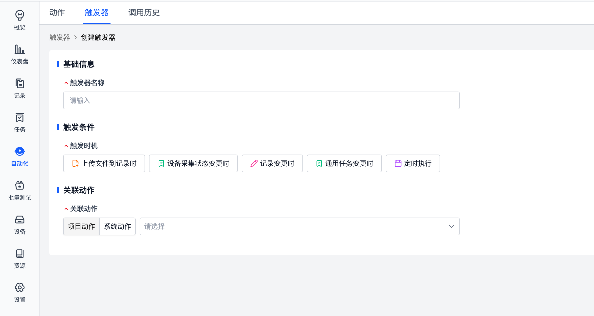

## 目录

1. 「上传文件到记录时」
2. 「设备采集状态变更时」
3. 「记录变更时」
4. 「通用任务变更时」
5. 「定时执行」

## 1. 「上传文件到记录时」

### 1.1 功能简介

「上传文件到记录时」是一款事件驱动型自动化工具，当满足你预设的文件匹配、上传者等条件时，系统会自动执行创建任务等指定动作，无需人工干预，帮你把文件上传后的流程自动化，大幅减少重复操作、提升效率。

### 1.2 操作流程

#### 步骤1：进入触发器创建页

在系统顶部导航栏，点击【触发器】标签页，进入触发器管理页面，点击创建新触发器，进入配置界面。

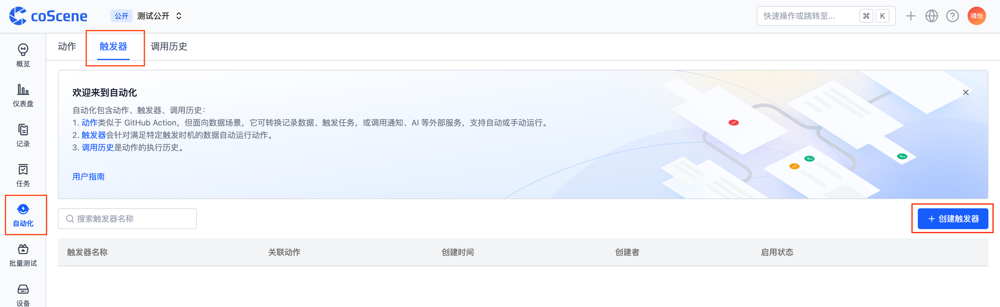

#### 步骤2：填写基础信息

在「基础信息」板块，找到触发器名称输入框，填写清晰可识别的名称（例如：上传bag文件自动创建审核任务），方便后续管理和排查问题。

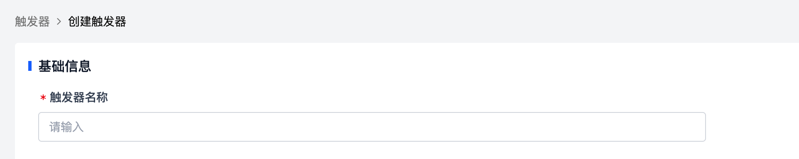

#### 步骤3：配置触发条件

1. **选择触发时机**：在「触发时机」下拉菜单中，选择【上传文件到记录时】。
2. **设置文件通配符**：在「文件通配符满足」输入框，填写匹配规则（示例：`**/bag_*.tar.gz` 代表匹配所有路径下、文件名以bag_开头、后缀为.tar.gz的文件），系统仅会对符合该规则的上传文件触发动作。
3. **（可选）添加额外过滤条件**：若需要更精准的触发控制，可点击【+并且/或者】，设置「文件上传者」「文件大小」等过滤规则（例如：仅当上传者为「成员」时触发）；无特殊要求可仅保留文件通配符规则。

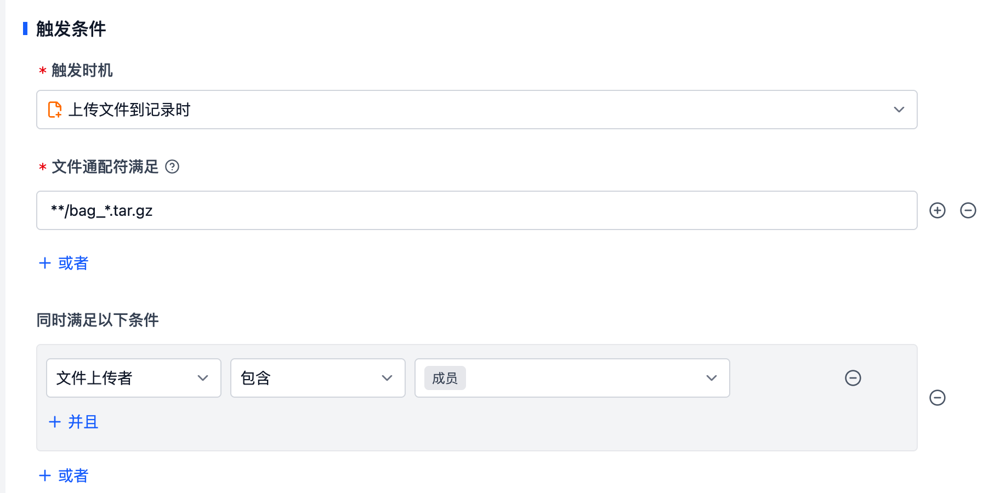

#### 步骤4：关联执行动作（举例）

在「关联动作」板块，完成以下配置：

1. **选择动作类型**：点击下拉菜单，选择需要自动执行的动作（示例：系统动作-创建通用任务）。
2. **填写动作必填参数**：
   - **任务标题**：填写自动创建任务的标题（可自定义，如「新文件上传待审核」）
   - **经办人**：选择任务的负责人
   - **审核人**：选择任务的审核人
   - **（可选）任务审核员/任务审核描述**：按需补充任务的审核人员、说明内容
3. **（可选）关联记录**：可开启「关联记录」开关，将自动创建的任务与上传文件的记录绑定，方便溯源。

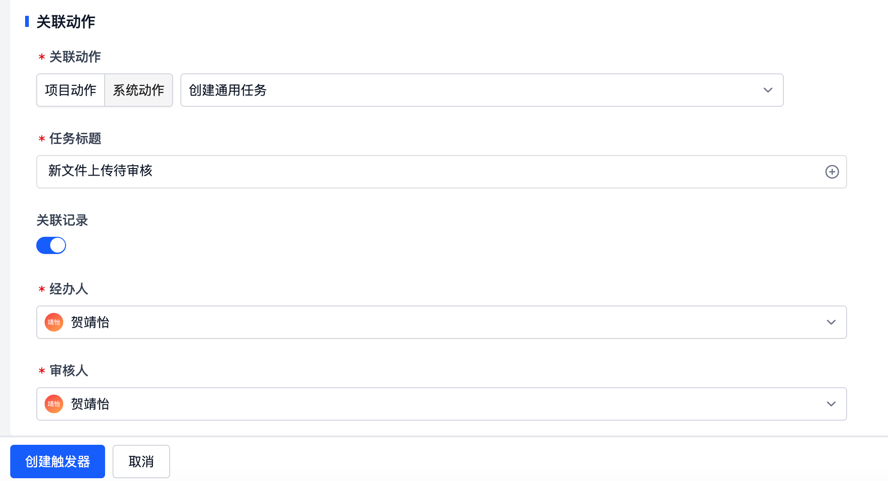

#### 步骤5：保存并生效

完成所有配置后，点击页面左下角的【创建触发器】按钮，触发器即可生效。后续只要有符合条件的文件上传，系统就会自动执行你设置的动作。

### 1.3 常见说明

- **通配符规则**：`**` 代表匹配任意路径，`*` 代表匹配任意字符，可灵活组合适配不同文件格式
- **文件上传者**：用于匹配文件上传的用户为成员或设备
- **记录标签**：用于匹配记录的标签信息。这里的标签只在文件上传事件发生时参与判断；如果只是给已有记录新增或删除标签，并不会触发「上传文件到记录时」类型的触发器。需要监听标签变更时，请使用「记录变更时」触发器
- **条件逻辑**：「并且」代表需同时满足所有条件，「或者」代表满足任意一个条件即可触发
- **查看执行记录**：可在【调用历史】标签页，查看所有触发器的执行日志，排查触发异常

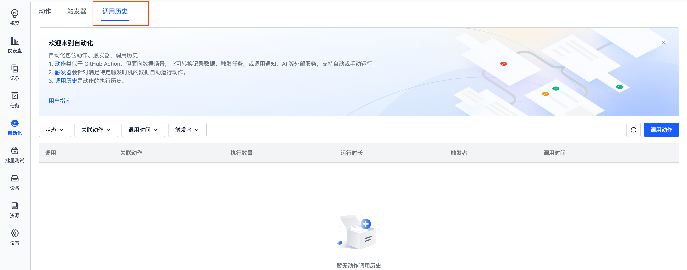

### 1.4 注意事项

- 触发器名称建议清晰易懂，方便后续区分不同的自动化规则
- 配置完成后可上传测试文件，验证触发器是否按预期触发、动作是否正常执行
- 若需修改规则，可重新进入编辑页调整，保存后新规则立即生效

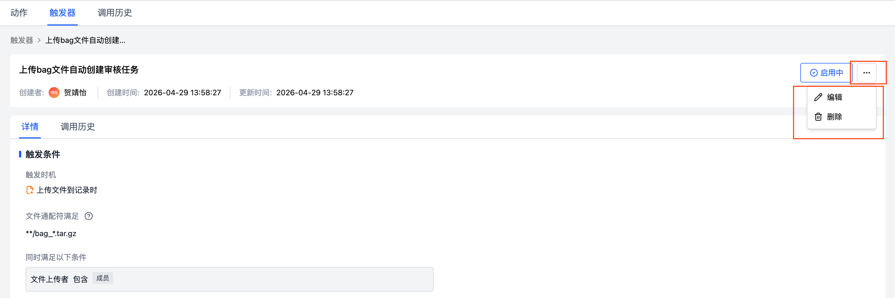

## 2. 「设备采集状态变更时」{#collect-status-change}

### 2.1 功能简介

「设备采集状态变更时」触发器可精准监听设备采集任务的状态变化，当监测到设备采集状态更新为你指定的目标状态（如「完成」）时，系统将自动执行创建通用任务等预设动作，实现设备采集流程的自动化闭环，减少人工盯守与重复操作。

### 2.2 操作流程

#### 步骤1：进入触发器创建页

在系统顶部导航栏点击【触发器】标签页，进入触发器管理界面后，点击【创建触发器】，进入配置页面。

#### 步骤2：填写基础信息

在「基础信息」板块的触发器名称输入框，填写易识别的名称（示例：设备采集完成自动创建复核任务），便于后续管理与问题排查。

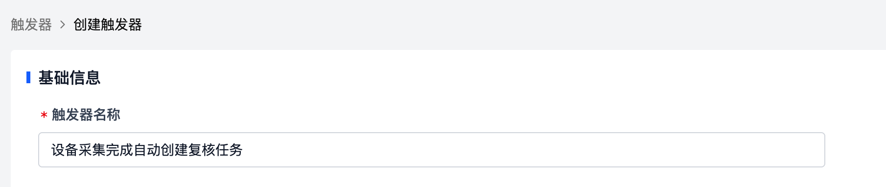

#### 步骤3：配置触发条件

1. **选择触发时机**：在「触发时机」下拉菜单中，选择【设备采集状态变更时】。

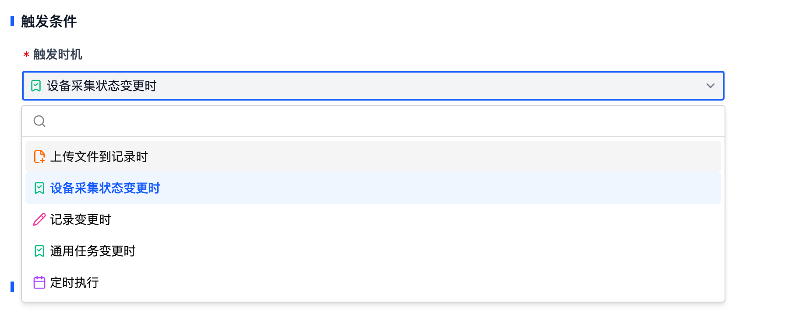

2. **选择任务类型**：在「任务类型」下拉框中，选择对应的设备采集任务类型（如「手动采集」「规则采集」），明确监听范围。

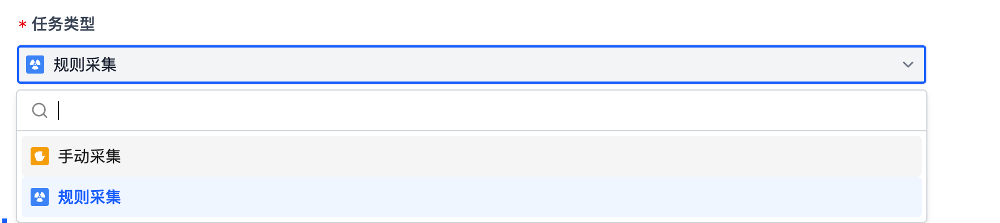

3. **设置变更后状态**：在「变更后的状态」选项中，勾选目标触发状态（示例：勾选「完成」，即仅当设备采集状态更新为「完成」时触发动作）。

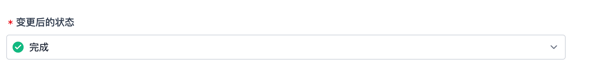

#### 步骤4：关联执行动作（举例）

在「关联动作」板块，完成自动化动作配置：

1. **选择关联动作**：点击下拉菜单，选择需自动执行的动作（如「系统动作-创建通用任务」）。
2. **填写动作必填参数**：
   - **任务标题**：填写自动创建任务的标题（可自定义为「设备采集完成待复核」等）
   - **经办人**：通过下拉框选择任务负责人
   - **审核人**：选择任务的审核人员
   - **（可选）任务审核员/任务审核描述**：按需补充审核人员信息、任务说明等内容

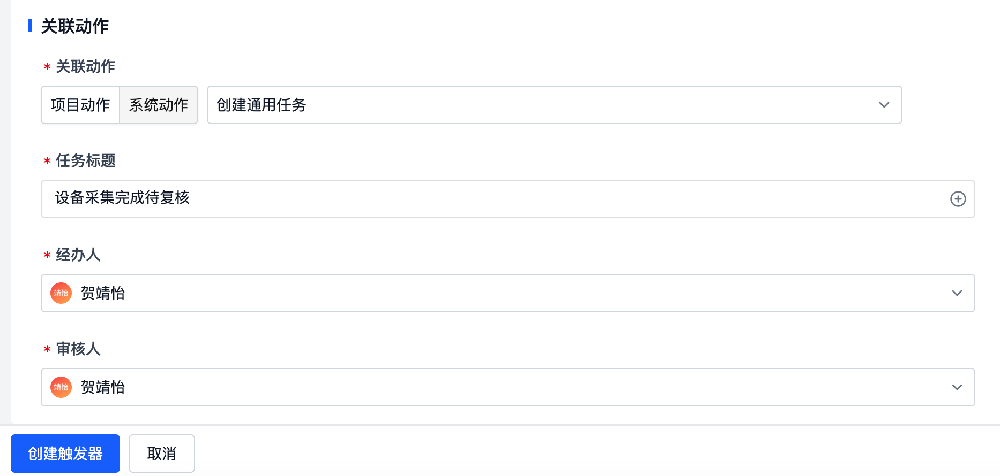

#### 步骤5：保存并生效

确认所有配置无误后，点击页面左下角的【创建触发器】按钮，触发器即可生效。后续对应设备采集任务状态变更为指定状态时，系统将自动执行预设动作。

### 2.3 关键说明

- **状态触发逻辑**：仅当设备采集任务的状态更新为勾选的目标状态时才会触发，未变更为目标状态不执行动作
- **任务类型匹配**：需选择与实际设备采集任务一致的类型，避免因类型不匹配导致触发器无效
- **执行记录查询**：可在页面顶部【调用历史】标签页，查看触发器的执行日志，排查异常情况

### 2.4 注意事项

- 触发器名称建议结合业务场景命名，清晰区分不同设备采集的触发规则
- 配置完成后，可手动模拟设备采集状态变更，测试触发器是否按预期触发
- 若需调整触发条件或关联动作，可进入触发器编辑页面修改，保存后新规则立即生效

## 3. 「记录变更时」

### 3.1 功能简介

「记录变更时」是一款数据驱动的自动化工具，当系统内指定记录的特定字段发生变更、且满足你预设的过滤条件时，系统会自动执行导出仪表盘数据等预设动作，帮你实现数据变更后的流程自动化，彻底替代人工重复操作，提升工作效率。

### 3.2 操作流程

#### 步骤1：进入触发器创建页

在系统顶部导航栏，点击【触发器】标签页，进入触发器管理页面，点击【创建触发器】，进入配置界面。

#### 步骤2：填写基础信息

在「基础信息」板块，找到触发器名称输入框，填写清晰可识别的名称（例如：质检员变更自动导出仪表盘数据），方便后续管理和排查问题。

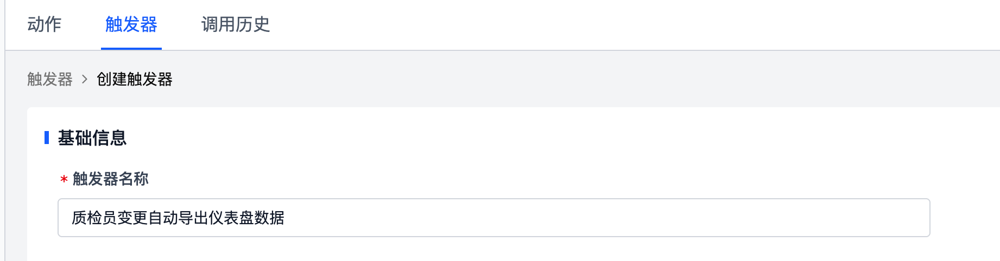

#### 步骤3：配置触发条件

1. **选择触发时机**：在「触发时机」下拉菜单中，选择【记录变更时】。
2. **选择记录变更的字段**：在「记录变更的字段」下拉框中，选择需要监听的目标字段（例如：质检员），系统仅会在该字段内容变更时触发动作。
3. **（可选）添加额外过滤条件**：若需要更精准的触发控制，可点击【+并且/或者】，设置字段匹配规则（例如：仅当「质检员包含郭家琪」时触发）；无特殊要求可仅保留字段监听规则。

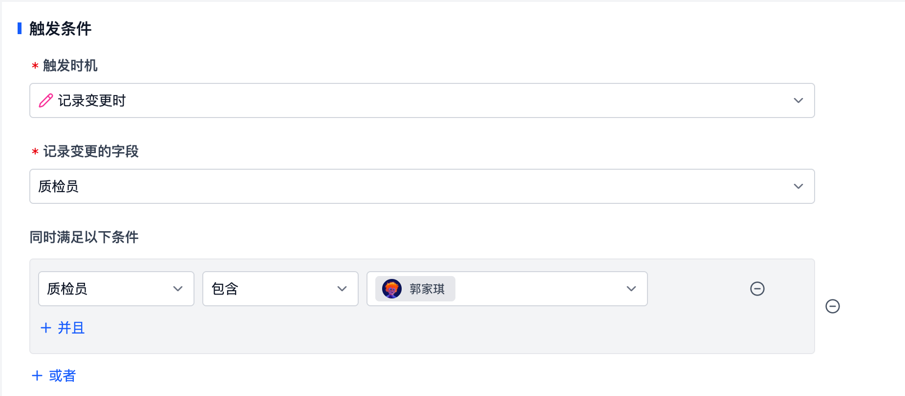

#### 步骤4：关联执行动作（举例）

在「关联动作」板块，完成自动化动作配置：

1. **选择关联动作**：点击下拉菜单，选择需要自动执行的动作（示例：系统动作-导出仪表盘数据）。
2. **填写动作参数**：（不同动作的参数项会根据选择的动作类型自动变化，按实际需求填写即可）
   - **end_date**：填写数据导出的结束日期（示例：2026-04-15）
   - **start_date**：填写数据导出的起始日期（示例：2026-04-15）

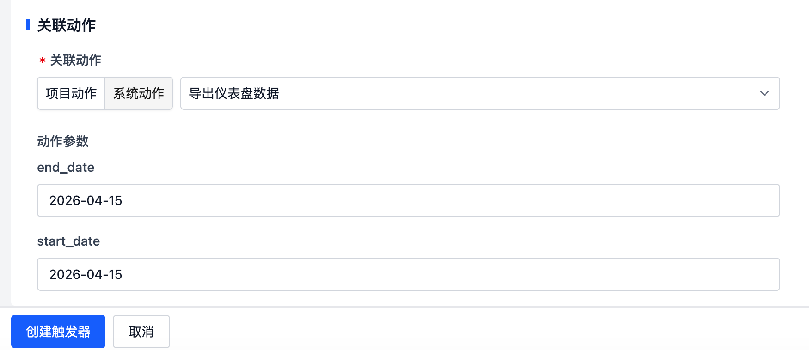

#### 步骤5：保存并生效

确认所有配置无误后，点击页面左下角的【创建触发器】按钮，触发器即可生效。后续只要有符合条件的记录变更，系统就会自动执行你设置的动作。

### 3.3 关键说明

- **触发逻辑**：仅当你指定的「记录变更的字段」内容发生修改时，才会触发动作；其他字段变更不会触发
- **条件逻辑**：「并且」代表需同时满足所有条件，「或者」代表满足任意一个条件即可触发，可灵活组合实现精准控制
- **执行记录查询**：可在页面顶部【调用历史】标签页，查看所有触发器的执行日志，排查触发异常

### 3.4 注意事项

- 触发器名称建议清晰易懂，方便后续区分不同的自动化规则
- 配置完成后，可手动修改对应记录的字段，验证触发器是否按预期触发、动作是否正常执行
- 若需修改规则，可重新进入编辑页调整，保存后新规则立即生效

## 4. 「通用任务变更时」

### 4.1 功能简介

「通用任务变更时」是一款任务流程自动化工具，可精准监听通用任务的指定字段变更，当任务字段更新为你预设的目标条件（如状态变为「已处理」）时，系统将自动执行导出仪表盘数据等预设动作，实现任务流程的自动化闭环，彻底替代人工重复操作，大幅提升工作效率。

### 4.2 操作流程

#### 步骤1：进入触发器配置页

在系统顶部导航栏，点击【触发器】标签页，进入触发器管理页面，点击【创建触发器】，进入配置界面。

#### 步骤2：填写基础信息

在「基础信息」板块，找到触发器名称输入框，填写清晰可识别的名称（例如：通用任务已处理自动导出仪表盘数据），方便后续管理和排查问题。

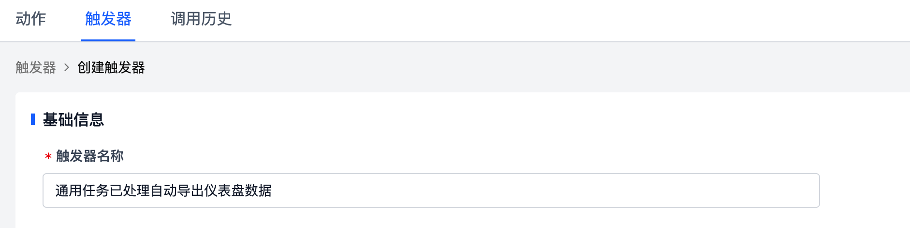

#### 步骤3：配置触发条件

1. **选择触发时机**：在「触发时机」下拉菜单中，选择【通用任务变更时】。
2. **选择任务变更的字段**：在「任务变更的字段」下拉框中，选择需要监听的目标字段（例如：状态），系统仅会在该字段内容变更时触发动作。
3. **（可选）添加过滤条件**：若需要精准控制触发场景，可设置匹配规则（例如：状态「等于」「已处理」），仅当字段变更为指定值时才触发；也可点击【+并且/或者】，添加多条件组合规则，无特殊要求可按需配置。

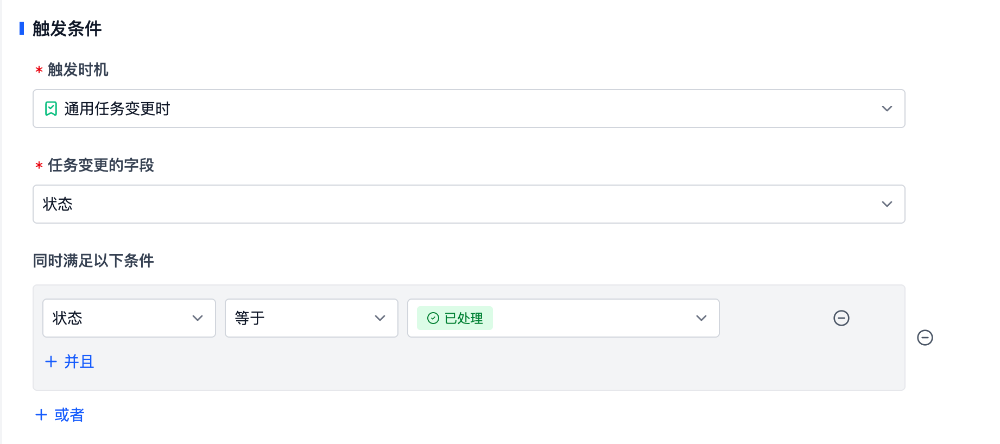

#### 步骤4：关联执行动作

在「关联动作」板块，完成自动化动作配置：

1. **选择关联动作**：点击下拉菜单，选择需要自动执行的动作（示例：系统动作-导出仪表盘数据）。
2. **填写动作参数**：（不同动作的参数项会根据选择的动作类型自动变化，按实际业务需求填写即可）
   - **end_date**：填写数据导出的结束日期（示例：2026-04-15）
   - **start_date**：填写数据导出的起始日期（示例：2026-04-15）

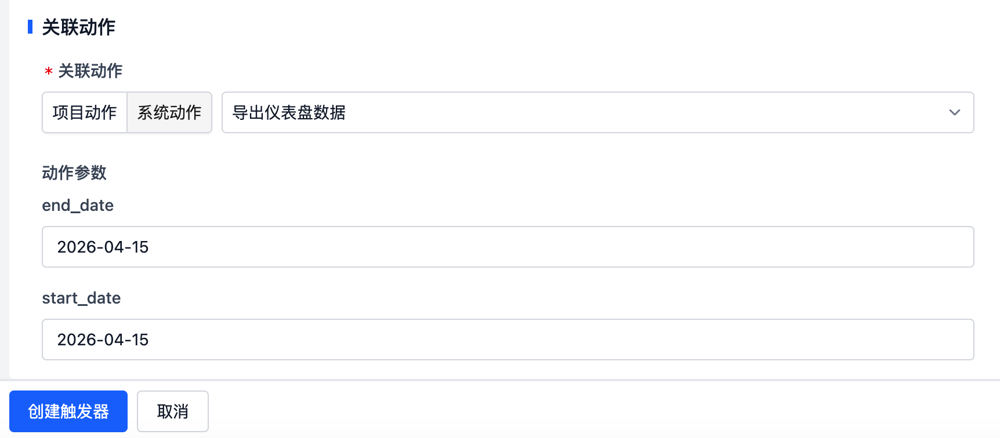

#### 步骤5：保存并生效

确认所有配置无误后，点击页面左下角的【保存】（或【创建触发器】）按钮，触发器即可生效。后续只要通用任务满足你设置的变更条件，系统就会自动执行预设动作。

### 4.3 关键说明

- **触发逻辑**：仅当你指定的「任务变更的字段」内容发生修改，且满足预设的过滤条件时，才会触发动作；其他字段变更不会触发
- **条件逻辑**：「并且」代表需同时满足所有条件，「或者」代表满足任意一个条件即可触发，可灵活组合实现复杂场景的精准控制
- **执行记录查询**：可在页面顶部【调用历史】标签页，查看所有触发器的执行日志，排查触发异常

### 4.4 注意事项

- 触发器名称建议结合业务场景命名，清晰区分不同任务的触发规则，方便后续管理
- 配置完成后，可手动修改对应任务的字段，验证触发器是否按预期触发、动作是否正常执行
- 若需修改触发条件或关联动作，可重新进入编辑页调整，保存后新规则立即生效

## 5. 「定时执行」

### 5.1 功能简介

定时执行是一项可自定义执行规则的自动化工具，支持你按日、月等周期配置触发时间，自动执行创建任务，彻底替代每日 / 每月的人工重复操作，大幅提升工作效率。

### 5.2 操作流程

#### 步骤1：进入触发器配置页

在系统顶部导航栏，点击【触发器】标签页，再点击【创建触发器】，进入触发器创建/编辑页面。

#### 步骤2：填写基础信息

在「基础信息」板块，找到触发器名称输入框，填写你能识别的名称（例如：每日9点自动创建审核任务），方便后续管理。

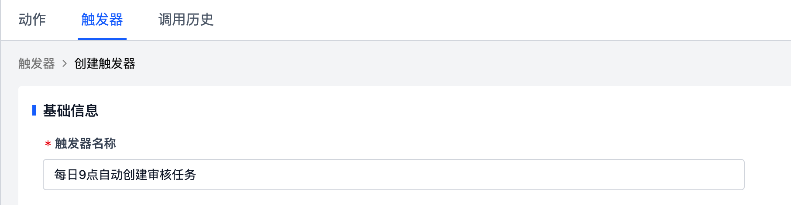

#### 步骤3：配置触发条件

1. **选择触发时机**：在「触发时机」下拉菜单中，选择【定时执行】。
2. **设置触发时间**：
   - 在「触发时间」输入框，按规则填写时间（格式示例：`0 9 * * *` 代表每日9点执行，`0 0 1 * *` 代表每月1号0点执行，`* * * * *` 代表每分钟执行）
   - 时区用于解释 Cron 表达式中的小时和日期，创建触发器时会默认使用当前浏览器时区，也可以手动修改
   - 填写后可查看「下次执行时间」，确认时间设置正确
3. **（可选）添加过滤条件**：若需要仅在满足特定条件时执行，可点击【+并且/或者】，设置标签、字段等过滤规则；无特殊要求则无需填写。

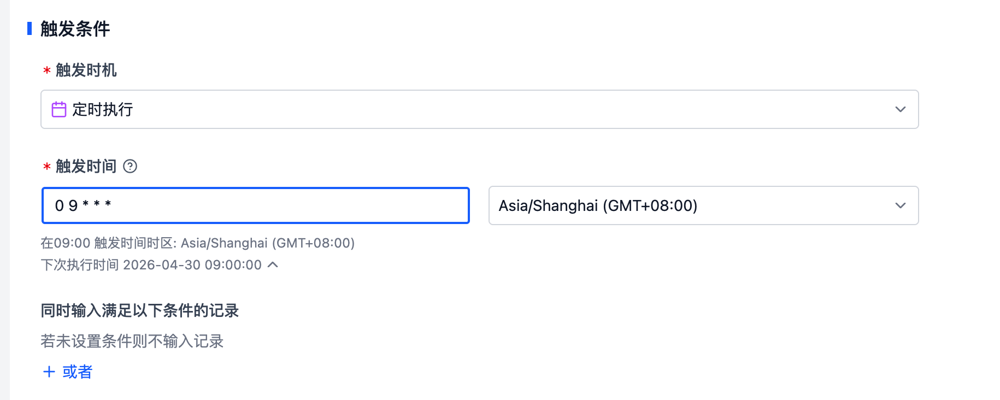

#### 步骤4：关联执行动作（举例）

在「关联动作」板块，点击下拉菜单，选择你需要自动执行的动作（分为项目动作、系统动作，例如选择系统动作，点击下拉框选择「数据定位」），并在「动作参数」中填写对应参数（如ruleId等），完成动作绑定。

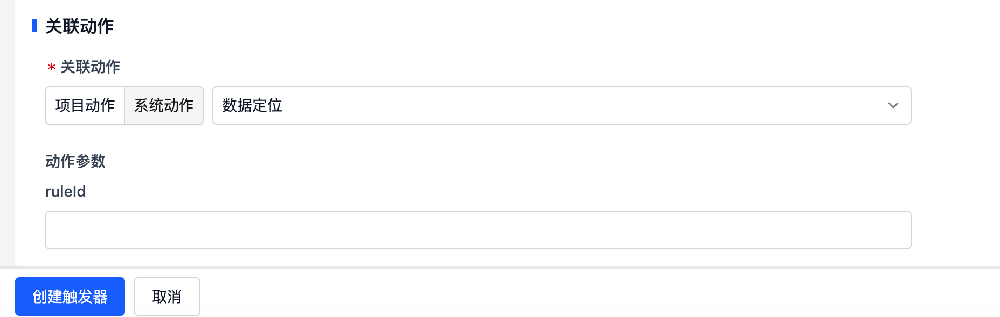

#### 步骤5：保存并生效

完成所有配置后，点击页面底部的【保存】按钮，触发器即可按你设置的规则自动运行，无需手动重复操作。

### 5.3 常见说明

- **Cron**：使用 5 段 Cron 表达式定义触发时间，`* * * * *` 对应「分 时 日 月 周」，可根据需求灵活配置，详见 [Cron 触发时间](./7-cron.md)
- **时区说明**：用于解释 Cron 表达式中的小时和日期，可按触发器需求手动修改
- **记录条件**：可以按记录字段、标签或自定义字段限制定时触发时匹配的记录范围
- **查看执行记录**：可在【调用历史】标签页，查看所有触发器的执行日志，排查问题

例如：Cron 为 `0 9 * * 1`，时区为 `Asia/Shanghai`，表示每周一北京时间 09:00 触发动作。

### 5.4 注意事项

- 触发器名称建议清晰易懂，方便后续区分不同的定时任务
- 配置完成后务必核对「下次执行时间」，确保时间设置符合预期
- 若需修改规则，可重新进入编辑页调整，保存后新规则立即生效
