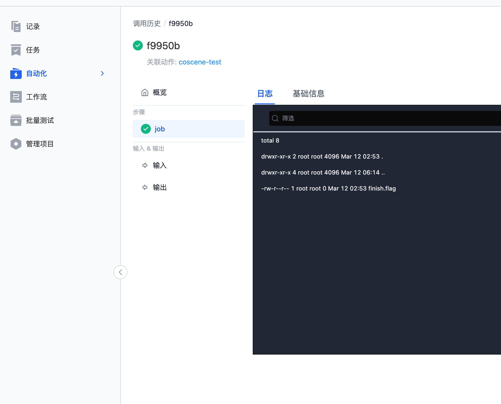

# 调用历史
调用历史展示了项目内所有动作的执行历史，包括时间、状态、执行结果等信息。

## 调用历史界面
### 调用历史列表页

### 调用详情页

## 调用动作
### 直接调用动作
1. 在「项目-自动化-调用历史」页面，点击【调用动作】按钮。

    

2. 选择需要调用的动作与需要输入的记录，执行动作。

   

3. 在调用详情页，可以查看动作的执行结果。

### 在记录中调用动作
1. 在「项目-记录详情」页面，点击【调用动作】按钮，选择需要调用的动作。

   

2. 在记录详情的调用历史页，可以查看动作的执行结果。

   

### 触发器调用动作
1. 当触发条件满足时，触发器会自动执行对应的动作。
2. 在调用历史页，可以查看动作的执行结果。

    