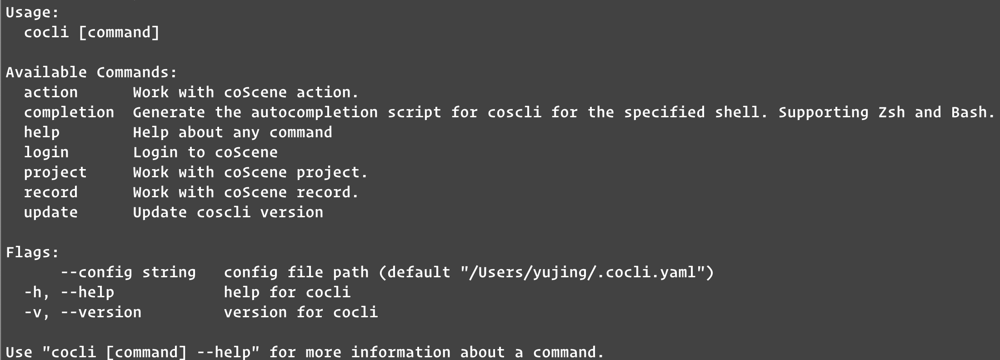
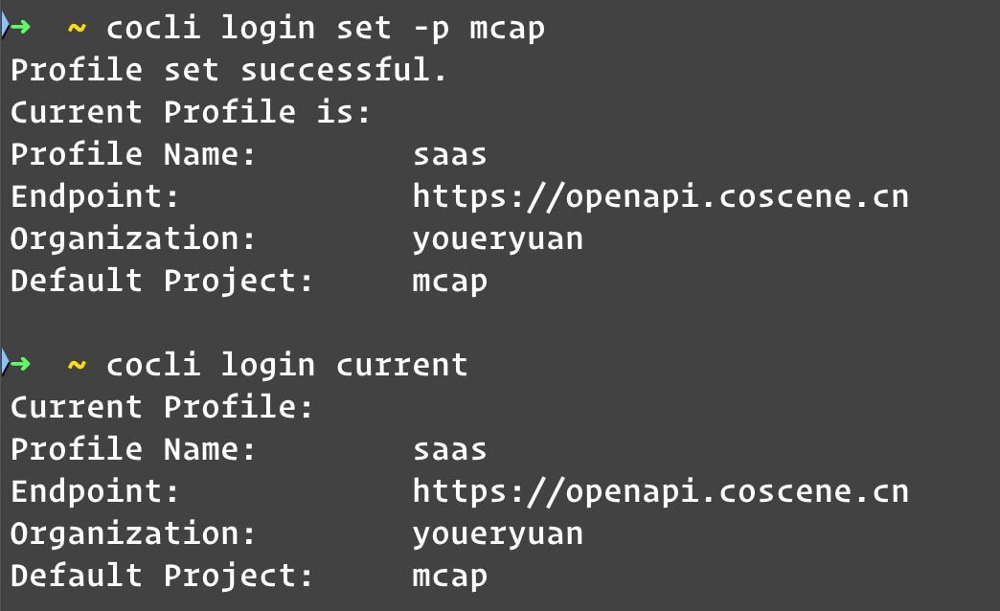

# 安装和初始化

## 安装

在命令行运行下面的命令安装最新版本的 coScene 命令行工具

```Bash
curl -fL https://download.coscene.cn/cocli/install.sh | sh
```

在命令行中可以使用 `cocli -h` 来确认命令行工具已经成功安装，并查看工具的基基本用法。

```bash
cocli -h
```



### 更新至最新版本

```Bash
cocli update
```

## 登陆

:::tip

登陆和初始化刻行 CLI 需要如下信息

- 个人访问令牌(Token)：
- 默认工作项目的(Slug)：

:::

您可以在[刻行-我的设置](https://coscene.cn/profile?section=security)页面中生成访问令牌。

命令行工具同时需要指定一个默认项目作为所有操作的默认环境，请选择您想要工作的项目，并在 URL 中获取项目的 Slug。


### 配置命令行权限

```Bash
# -p 后填写 <项目 slug>
# -t 后填写 <个人访问令牌>
cocli login set -p <项目 slug> -t <个人访问令牌>
```

:::info
如果您是刻行的企业用户，单独部署了刻行的实例，您需要在 login 的同时设置
您所在企业实例的 endpoint

例如 https://server2.coscene.cn -> https://openapi.server2.coscene.cn

```bash
cocli login set -p <项目 slug> -t <个人访问令牌> -e <openapi 地址>
```

:::

## 切换默认项目

命令行成功认证之后，就可以使用命令行来切换默认的工作项目，我们可以首先列出组织中所有用户有权限访问的项目和对应的项目 Slug

```
cocli project list
```


找到目标项目之后，使用 `cocli login set` 来更新默认的工作项目， 如果需要，可以使用 `cocli login current` 来确认

```bash
cocli login set -p mcap
cocli login current
```


