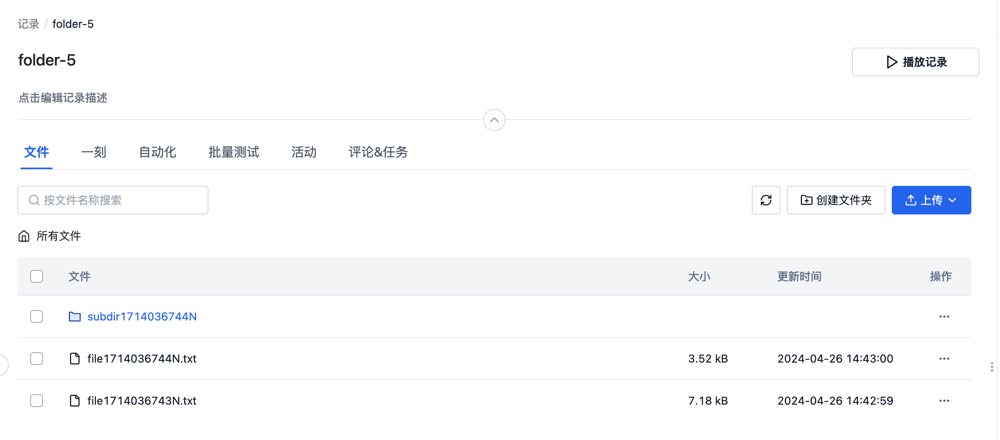

# 常见批量操作举例

## 上传同一个文件到项目中的所有记录中

```
cocli record list | grep -v 'ID' | cut -d ' ' -f1 | xargs -I {} cocli record upload {} ./FILE_FLAG
```


## 为当前目录下的所有文件夹建立一个记录并上传文件

假定我们有如下的 5 个文件夹，文件夹中包含若干个随机文件和文件夹，具体结构如下图所示。


我们立刻利用刻行命令行工具和标准的 Linux 命令行工具来一次性完成所有文件记录的创建和文件上传。

```bash
# 遍历当前目录下的所有子目录
for dir in */; do
  # 去除目录名称末尾的斜杠，并创建一个新的记录，获取记录ID
  record_id=$(cocli record create -t "${dir%/}" | head -n1 | cut -d " " -f3)

  # 上传当前子目录的内容到创建的记录中
  cocli record upload -R "$record_id" "$dir"
done
```


打开网页端任意记录就可以看到，命令行将本地的文件夹内的所有文件和文件夹都上传到了对应记录



## 遍历所有记录并进行操作

一种常见的命令行操作模式是遍历用户指定项目内的所有记录，并根据特定的模式进行操作

```bash
# 获取项目中的所有记录列表，遍历并提供 Record 的 ID 作为后续操作的依据
for id in $(cocli record list | grep -v 'ID' | cut -d ' ' -f1); do
    # 使用 $id 进行后续的批量操作
done
```

根据这个模式也可以举一反三，连接更复杂的批量操作。

### 找出所有不含任何文件的空记录

```bash
for id in $(cocli record list | grep -v 'ID' | cut -d ' ' -f1); do
    # 获取记录中的文件列表，去掉表头
    files=$(cocli record list-files $id | tail -n +2)

    # 检查文件列表是否为空
    if [[ -z "$files" ]]; then
        # 如果文件列表为空，则输出该记录ID
        echo "Record $id has no files."
    fi
done
```

### 给所有空记录打上标签

```bash
for id in $(cocli record list | grep -v 'ID' | cut -d ' ' -f1); do
    # 获取记录中的文件列表，去掉表头
    files=$(cocli record list-files $id | tail -n +2)

    # 检查文件列表是否为空
    if [[ -z "$files" ]]; then
        # 给所有空的记录打上标签 empty-record
        cocli record update $id -l empty-record
    fi
done
```

### 删除所有空记录

:::danger
请非常小心`删除`操作，这可能会删除重要数据！！
:::

```bash
for id in $(cocli record list | grep -v 'ID' | cut -d ' ' -f1); do
    # 获取记录中的文件列表，去掉表头
    files=$(cocli record list-files $id | tail -n +2)

    # 检查文件列表是否为空
    if [[ -z "$files" ]]; then
        # 删除当前记录，使用 -f 标志来跳过手工确认的步骤
        cocli record delete $id -f
    fi
done
```
