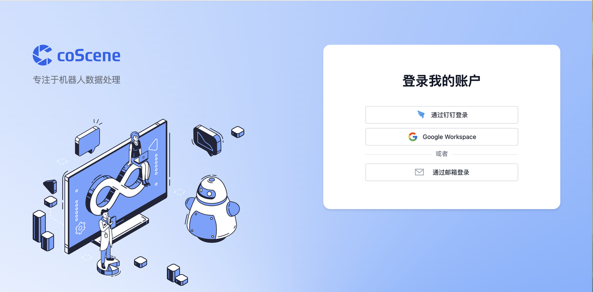
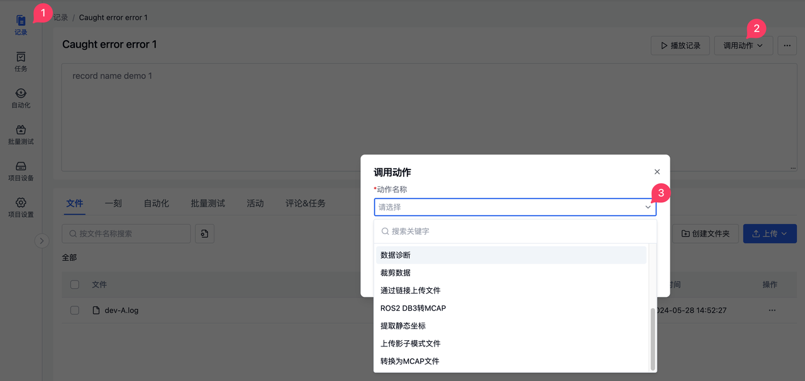

# 自动数据采集与诊断

## 背景

机器人行业的设备常见环境故障、软件故障和硬件故障等问题，这些故障通常都有对应的错误码。当这些故障出现时，机器将上报自身的状态，随后由运维人员负责解决。

为应对这些行业通病，刻行平台提供了一套完整的数据自动采集与诊断解决方案，通过实时监测设备日志，采集目标数据并执行自动诊断，实现数据的远程采集、自动上传和自动诊断。

本文将通过一个名称为 dev-A 的设备，模拟当 dev-A 出现故障时（即在其日志中出现「error1」），日志文件自动上传到平台进行自动诊断，展示平台的数据自动采集与诊断功能。实现该功能需要完成以下四个步骤：

1. 配置规则
2. 配置数据采集设备信息
3. 注册设备
4. 以及查看实例

## 准备工作

首先，登陆刻行平台并创建项目：

1. 通过浏览器访问 https://www.coscene.cn/
   点击右上角的快速登陆进入登陆界面。选择登陆方式进入刻行平台。若要使用邮箱登陆请联系 contact@coscene.io。



3. 在平台创建一个项目，项目作为数据管理单元，负责数据的存储、管理、隔离及权限控制。


4. 随后，请查看用户在刻行的组织角色是否为管理员，出于数据安全考虑，只有组织管理员才有配置数据自动采集与诊断的权限，若不是管理员，请联系组织管理员更新组织角色。

5. 准备一台机器人设备

## 添加规则

1. 进入创建的项目，点击左侧边栏的项目设置，进入页面后找到数采与诊断规则的页面，点击添加规则组\*。在命名这个规则组名称之后，就可以在里面添加规则了。

- 规则是规则组中的单个规则，用于定义触发数据采集与诊断的条件，以及触发后的操作。

2. 填写模版化信息（可选）：当规则想用于创建多个高度相似但部分信息不同的规则场景，可以将信息不同的部分参数化，进而使用模版化实现自动生成多条规则的操作。例如，当有 「error 1」 和 「error 2」 时，可在平台上创建如下的模板化规则。


3. 添加触发条件：可添加多个触发条件，只要有一个条件满足即可触发操作。单引号包围的信息是在 log 中出现的信息。 以图片中为例，log 中包含 'error 1' 的信息都会被自动采集并上传到平台。


4. 选择触发操作：生成记录和创建一刻。前者对设备端生效，在设备端触发规则后会生成记录并上传文件；后者对记录生效，在记录中触发规则后，在触发时间点创建一刻。


5. 点击保存完成对规则参数信息的配置，回到数采与诊断规则页面通过按钮启用刚刚添加的规则组。


## 添加数据诊断触发器

添加了规则之后，满足触发条件的数据会自动进行上传。但是需要完成自动诊断还需要两个步骤。第一是配置数据处理逻辑，第二是配置触发条件。数据处理逻辑在刻行的平台中被定义为动作，触发条件则被定义为触发器。当前刻行平台中已经预定义了一些系统动作，通过点击记录详情中的“调用动作” 可以手动调用一个动作。 触发器的配置中可绑定动作来自动化完成数据诊断。 在此次样例的演示中，我们不会手动触发动作，会将动作绑定在触发器中，由触发器自动触发。



当触发器满足调用动作的条件的时候，会自动进行诊断。按照以下步骤可完成触发器的创建：

1. 在左侧栏中的自动化-触发器中创建触发器


2. 输入触发器的名称，触发条件和关联动作。
   例如，我们将触发器命名为数据诊断，文件通配符模式为 \*.log（格式使用 Glob，详情可以参考附录链接），从系统动作下拉框中选择数据诊断，点击创建触发器。


## 配置数采信息

配置完规则和触发器之后，还需要配置数采设备信息去定义需要监控的设备日志所在目录、设备信息文件的存放目录等信息。

1. 点击右上角的用户头像，在下拉栏中选择组织管理，进入设备详情页后点击编辑数采规则。


2. 清空规则中的默认内容后，复制下述规则，粘贴在编辑器中后点击保存编辑，您就完成了数采信息的配置了。

```yaml
mod:
  name: 'default' # mod 名称，默认 default，定制版请联系刻行产品了解详细信息
  conf:
    enabled: true # 是否启用，默认为 true
    base_dir: '/root/logs/' # 数据监听目录

event_code: # 错误码功能
  enabled: false # 错误码白名单配置，默认 False
```

## 准入设备&添加设备

在配置完规则和数采信息，我们需要将您需要实现自动化的设备添加到刻行平台中。
以 Linux 设备为例

1. 打开设备终端，执行以下命令并输入密码，进入 root

```yaml
sudo su
```

2. 在设备终端，创建文件监听目录 /root/logs

```yaml
mkdir /root/logs
```

3. 在组织管理-设备页面中选择添加设备
4. 在弹窗中选择从设备端添加，复制安装命令，以 root 账户粘贴到设备终端


5. 当在组织管理页面的设备看到该设备的时候（需耗时 1 分钟左右），该设备的刻行的 Agent 已经安装成功。对于该设备，通过刻行的前端页面可以执行两个操作： 准入数采，准入远程。


6. 点击进入项目设备页面，点击【添加设备】，找到需要添加的设备，将其添加到项目设备中。


## 写入文件

当配置好规则和设备之后，您可以在设备监听目录中写入文件。

1. 确认设备已获取到数采与诊断规则，当日志中出现如下字段时，表示已成功获取到规则。


2. 下载设备的示例 log 文件到设备 dev-A，先通过刻行平台网页 SSH 的能力，远程登录设备


3. 远程登录设备之后，执行以下命令

```yaml
cd /roots/logs
wget https://coscene-artifacts-prod.oss-cn-hangzhou.aliyuncs.com/docs/4-recipes/data-diagnosis/dev-A.log.zip
unzip dev-A.log.zip
```

执行成功以后，会有以下结果


示例 log 文件详情：


## 查看创建的记录和一刻

1. 当完成上述操作后，您可以前往先前创建的项目，点击左侧边栏中的记录，查看自动创建的记录。


2. 查看在触发时间点创建的一刻


## 附录链接

Glob 格式通配符：https://www.malikbrowne.com/blog/a-beginners-guide-glob-patterns/

## 总结

按照以上步骤，我们就完成了对名称为 dev-A 的设备，模拟当设备出现故障时，平台会按照定义的规则自动采集数据并进行诊断，提升其可观测性。
