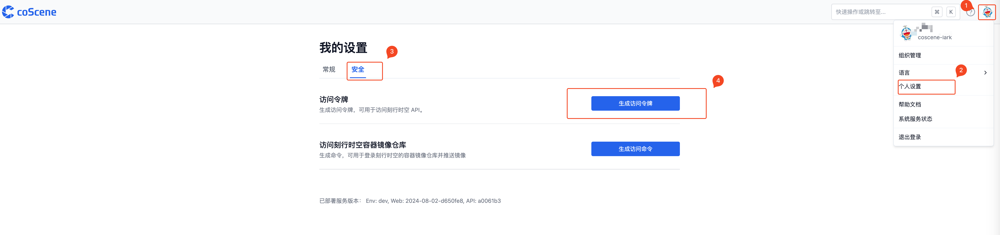

# 获取授权

打开刻行平台，按照图所示步骤（右上角头像 - 个人设置 - 安全 - 生成访问令牌），生成属于自己的 apikey。用户生成的 apikey 使用与当前账户一致的权限范围，请勿将个人 apikey 上传至公开平台，避免产生信息泄露等问题。

## 认证

刻行平台使用 Basic Auth 模式对 OpenAPI 进行认证，对应的逻辑为 Base64(username:password)，其中 username 固定为“apikey”, password 为对应生成的 apikey。
