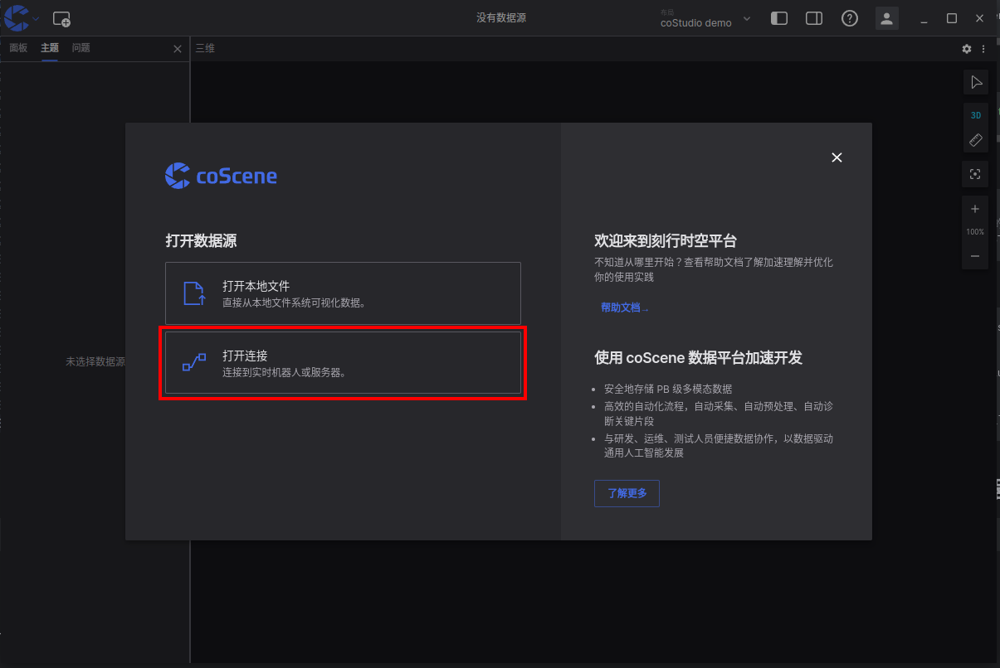

# 通过 CoBridge 连接机器

CoBridge 是刻行提供的一款开源机端软件，目前支持 **ros1** `noetic`、 **ros2** `foxy` 及 `humble` 版本。

## 安装 CoBridge
* 导入公钥
```bash
  wget https://coscene-download.oss-cn-hangzhou.aliyuncs.com/cobridge/coscene.gpg && sudo gpg --dearmor -o /etc/apt/trusted.gpg.d/coscene.gpg coscene.gpg
```

* 添加源
```bash
  echo "deb [signed-by=/etc/apt/trusted.gpg.d/coscene.gpg] https://coscene-download.oss-cn-hangzhou.aliyuncs.com/cobridge $(. /etc/os-release && echo $UBUNTU_CODENAME) main" | sudo tee /etc/apt/sources.list.d/cobridge.list
```

* 更新apt并安装
```bash
  sudo apt update
  # 注意: 如果 ROS_DISTRO 没有在你的环境变量里面，${ROS_DISTRO} 需要被 'noetic', 'foxy' or 'humble' 替换
  sudo apt install ros-${ROS_DISTRO}-cobridge -y
```

* 运行 coBridge
```bash
  source /opt/ros/${ROS_DISTRO}/setup.bash
  
  # for ros 1 distribution
  roslaunch cobridge cobridge.launch
  
  # for ros 2 distribution
  ros2 launch cobridge cobridge_launch.xml 
```

## 使用 CoStudio 对机器人进行实时可视化
* 开启 CoStudio 后，选择 “打开连接” 功能

* 选择 coScene Websocket 选项，在 WebSocket URL 中输入连接地址。`ws://localhost:21274` **（ 21274 为 CoBridge 的默认端口号 ）**


* [面板设置](https://docs.coscene.cn/docs/category/panel)
