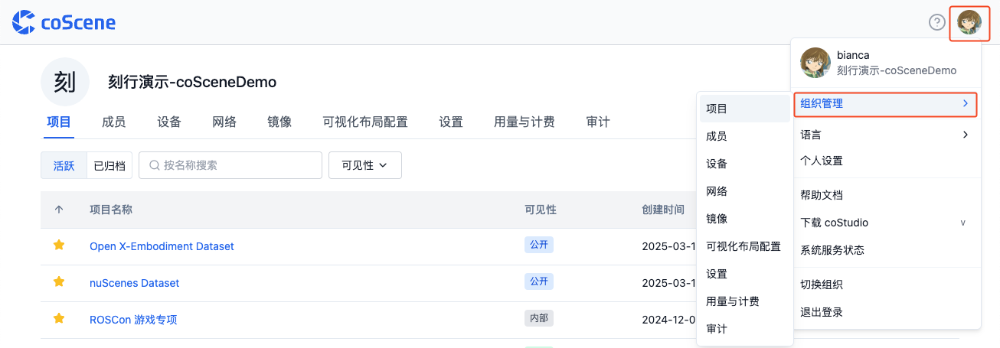
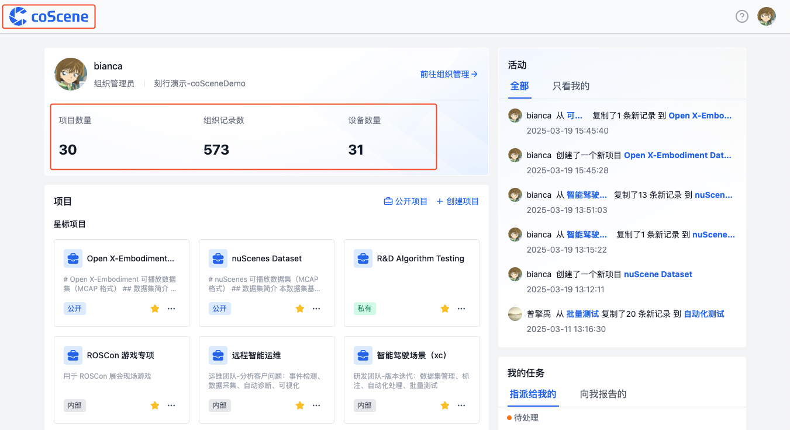

# 组织
组织是一个逻辑概念，它代表了一个团队或者一个公司。组织可以拥有多个项目，也可以拥有多个成员。

## 组织管理界面
在「组织管理」页面，可以查看组织的项目、成员、设备、镜像、计费等信息。

| 名称 | 说明 |
| --- | --- |
| 项目 | 在项目列表中管理组织内所有项目。项目是数据管理的单元，详见[项目](../project-collaboration/1-project.md) |
| 成员 | 在成员列表中管理组织内的所有用户及其权限 |
| 设备 | 在组织设备列表中统一管理组织内所有设备。设备可以与真实设备建立联系，详见[设备](../../device/1-device.md) |
| 镜像 | 平台提供专业的私有镜像仓库，统一管理组织内所有镜像，详见[镜像](../../image/1-intro.md) |
| 用量与计费 | 展示组织的存储量、设备数、计算时长等信息 |

## 创建组织
1. 通过浏览器访问[刻行时空平台 https://www.coscene.cn/](https://www.coscene.cn)，点击右上角的【快速登录】，进入登录界面
    
     

2. 选择登录方式进入平台：邮箱、飞书、钉钉或谷歌企业邮箱

    

3. 填写「组织名称」与「组织 ID」，勾选「同意」，点击【创建组织】按钮
    
    

4. 创建成功后，自动进入组织首页

## 添加项目

请参见[项目](../project-collaboration/1-project.md)章节

## 添加组织成员
通过不同方式创建的组织，添加成员的方式不同：
- **邮箱登录创建的组织**：
  - 组织管理员在「组织管理-成员」页面，点击【邀请成员】按钮，通过邮箱邀请成员加入组织。

    

- **飞书、钉钉、谷歌登录创建的组织**：
  - 企业用户登录后，会自动加入企业对应的组织，拥有「组织成员」权限。
  - 当用户不再是企业内的成员，则无法再进入对应的组织，但仍保留该用户的操作记录。

## 添加组织设备

> 组织中的设备可以添加到各个项目中，同一台设备可以添加到多个项目，用于[数据采集](../../use-case/1-common-task.md)与[远程连接](../../device/6-device-remote-control.md)。

请参见[添加设备](../../device/2-create-device.md)章节

## 添加镜像
> 组织中的镜像可以在各个项目中使用，用于[自动化](../../workflow/action/2-learn-coscene-action.md)或[批量测试](../../sim-and-tests/regression/1-intro.md)。

请参见[镜像](../../image/1-intro.md)章节

## 用量与计费
> 仅组织管理员可查看组织用量信息。

组织用量信息包括：组织的存储量、活跃设备数、计算时长等信息

在「组织管理-用量与计费」页面，可查看组织用量信息。

在首页，可查看组织记录数量、项目数量以及设备数量。

