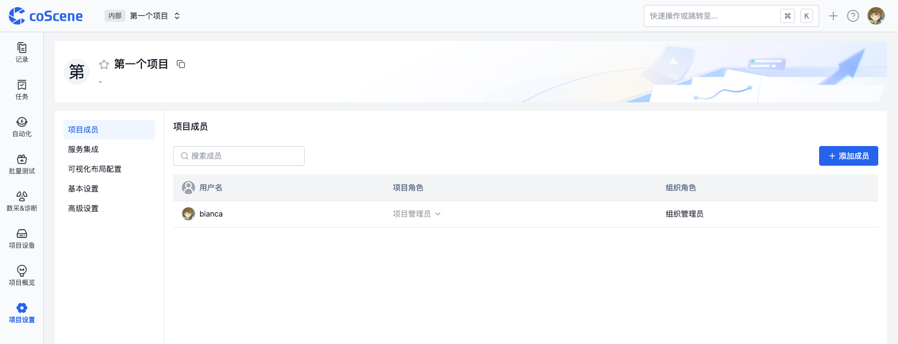
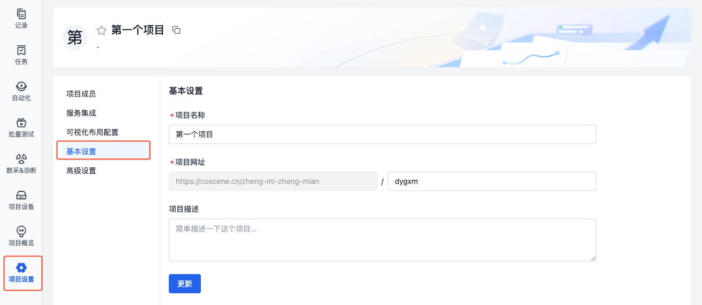
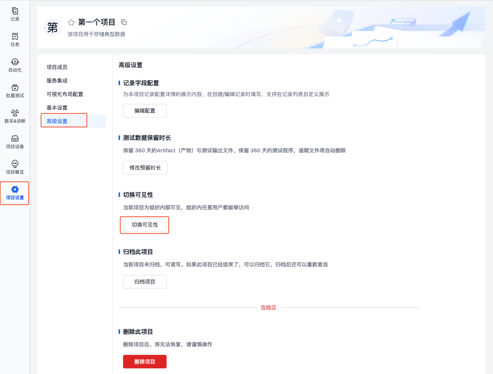
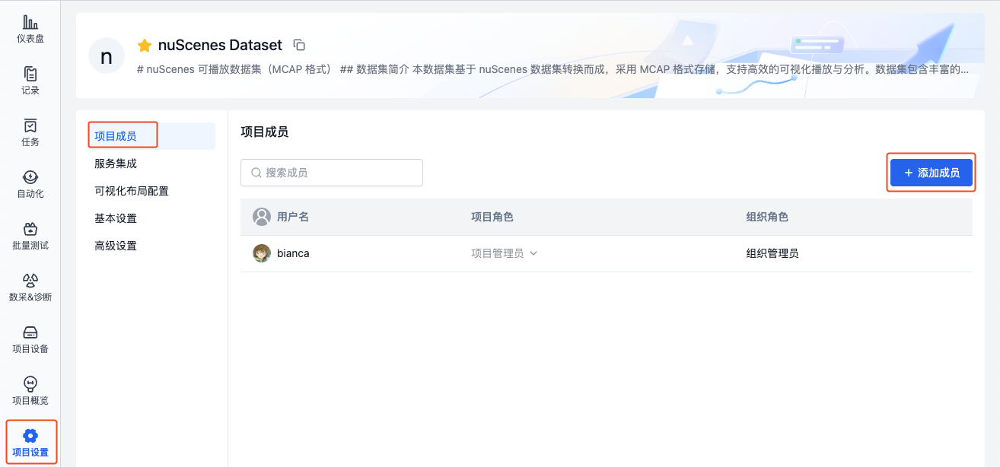
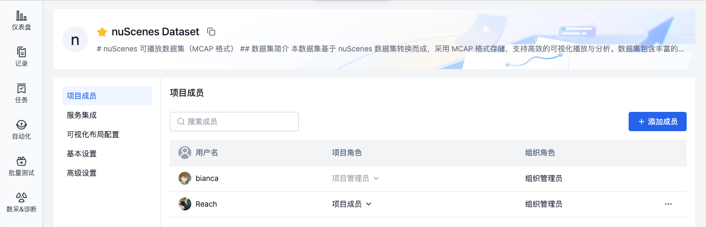
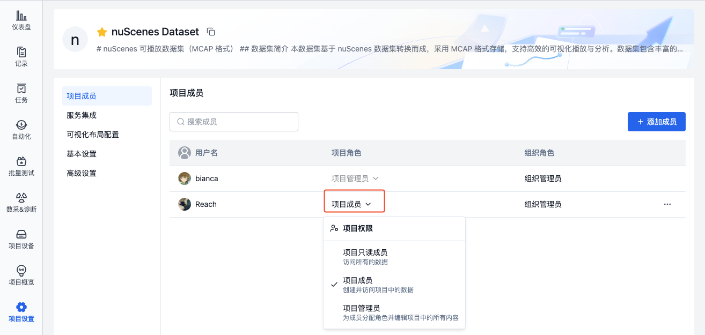
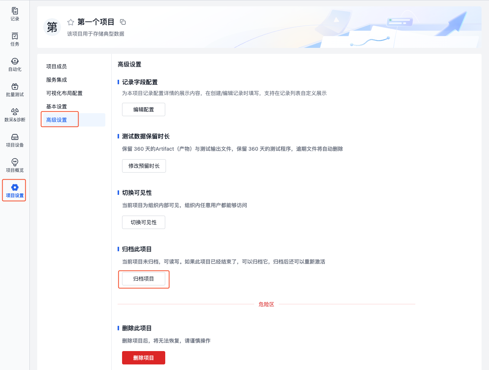
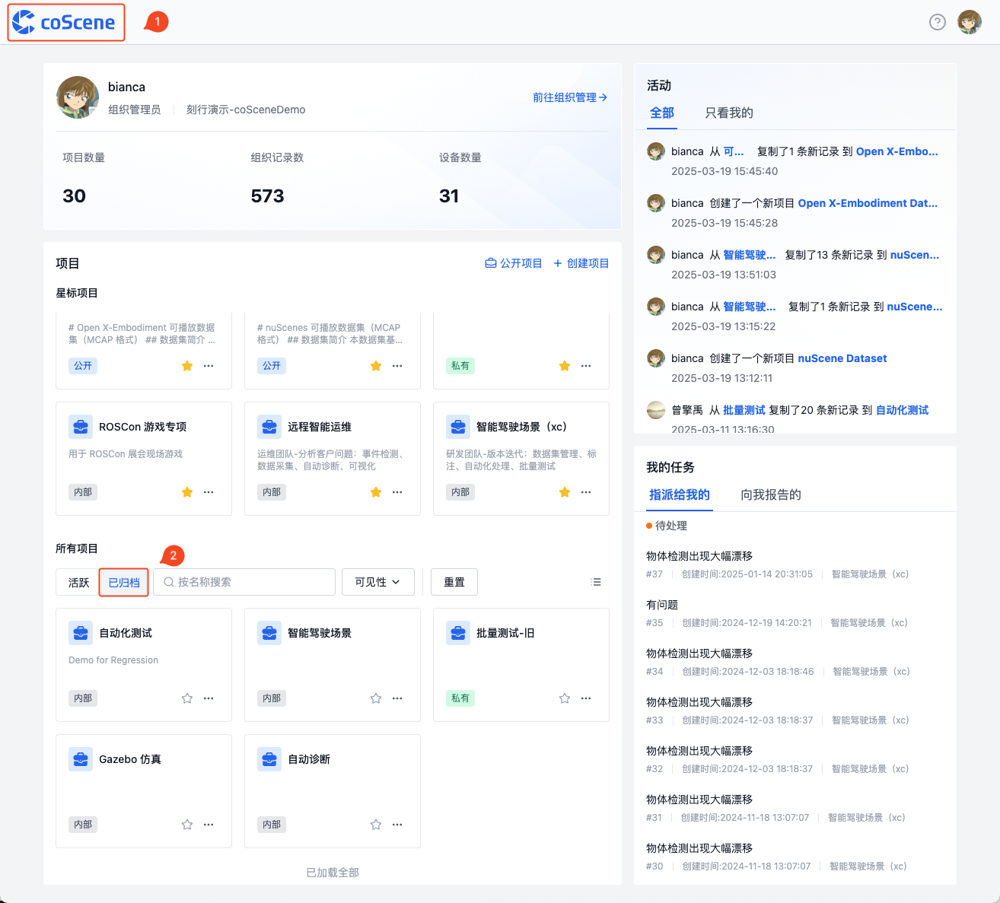
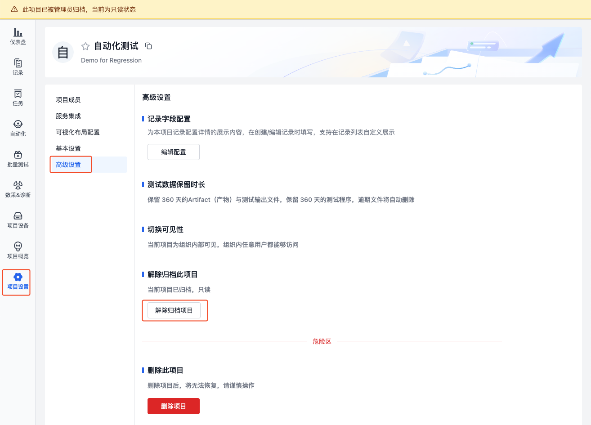

# 项目
项目是数据管理的单元，对于数据的存储、管理、隔离和应用都发生在项目级别。一个项目可以是一个部门、一个项目组或一个业务线。

## 项目界面
在项目中，有记录、任务、自动化、批量测试、数采&诊断、设备等模块，各模块释义如下：

| 名称 | 说明 |
| --- | --- |
| 记录 | 记录是数据的基本单元，用于存储和管理数据，详见[记录](../record/1-quick-start-record.md) |
| 任务 | 任务包括通用任务、标注任务与采集任务，用于管理数据处理流程 |
| 自动化 | 自动化包括动作、触发器、动作调用历史，用于自动化处理数据，详见[自动化](../../workflow/action/2-learn-coscene-action.md) |
| 批量测试 | 批量测试是一种并行执行多个测试任务的自动化解决方案，用于回归测试、仿真测试等大规模测试场景，详见[批量测试](../../sim-and-tests/regression/1-intro.md) |
| 数采&诊断 | 数采&诊断通过定义规则，实现设备监听，数据采集与自动诊断，详见[数采&诊断](../../use-case/data-diagnosis/1-intro.md) |
| 设备 | 设备与真实设备端建立连接，作为数据采集的目标对象。所有设备统一在组织中进行管理，按需分配到各个项目，详见[设备](../../device/1-device.md) |

## 创建新项目

在主页上点击"创建项目"按钮，然后按照指引步骤完成项目创建。

## 管理项目设置
> 仅项目管理员与组织管理员可管理项目设置。

### 编辑项目
进入项目基本设置页面，可修改项目名称、网址与描述：

### 项目可见性
项目可见性决定了项目的访问权限和用户的权限。项目的可见性分为以下三种：

- **私有项目**
   - 访问限制：仅组织管理员和项目成员可访问
   - 权限控制：项目成员权限由项目角色决定

- **内部项目**
   - 访问范围：组织内所有用户均可访问
   - 权限控制：访问用户若在项目中，则由项目角色决定；访问用户若不在项目中，则继承组织角色作为项目角色
      - 示例：当「组织成员角色」访问内部项目时，即使不是「项目成员角色」，也会自动获得「项目成员角色」的权限

- **公开项目**
   - 访问范围：公开项目可被所有用户访问
   - 权限控制：
      - 组织内用户：与内部项目权限相同
      - 组织外用户：可访问「记录」与「概览」页面，仅有查看权限

切换项目可见性的步骤如下：
1. 进入项目高级设置页面，点击【切换可见性】：

    

2. 选择可见性，并输入项目名称，即可切换项目可见性。

    

### 项目成员与角色
项目角色决定了用户在项目中的权限。项目角色包括以下三种：
- **项目管理员**
   - 拥有项目的所有权限
- **项目成员**
   - 可创建并访问项目中的数据
- **项目只读成员**
   - 仅可访问项目中的数据

可将组织成员添加到项目中，具体步骤如下：
1. 进入项目设置-项目成员页面，点击【添加成员】，在弹出的窗口中，选择成员。

    

2. 添加完成后，在项目成员列表中查看成员信息。

    
   
3. 点击列表中的项目角色，可修改成员角色。

    

### 项目归档与恢复
归档项目可将项目变为只读状态，数据停止更新。恢复项目后，项目恢复可读可写状态，正常运作。用于管理历史数据，使用场景如下：
- 数据分析工作已完成，需要长期保存结果
- 阶段性实验数据需要归档保存
- 历史数据需要与活跃数据分开管理
- 需要保护重要数据避免误操作

归档与恢复项目的步骤如下：
1. 进入项目高级设置页面，点击【归档项目】，输入项目名称后，项目将被归档。

    

2. 点击左上角 logo 返回首页，在项目列表的归档栏，可查看已归档的项目。

    

3. 在已归档项目的高级设置页面，点击【解除归档项目】，可将项目从归档状态恢复为可读写状态。

   

 
