# 通用任务
任务流转是项目协作的重要方式，在记录中创建任务并分配给团队成员，结合「评论」和「一刻」功能，高效地完成协作流程。

## 创建任务
### 在记录中创建
在记录详情页的「关联任务」模块，可查看与该记录相关联的任务。点击「创建」按钮即可创建一条任务。

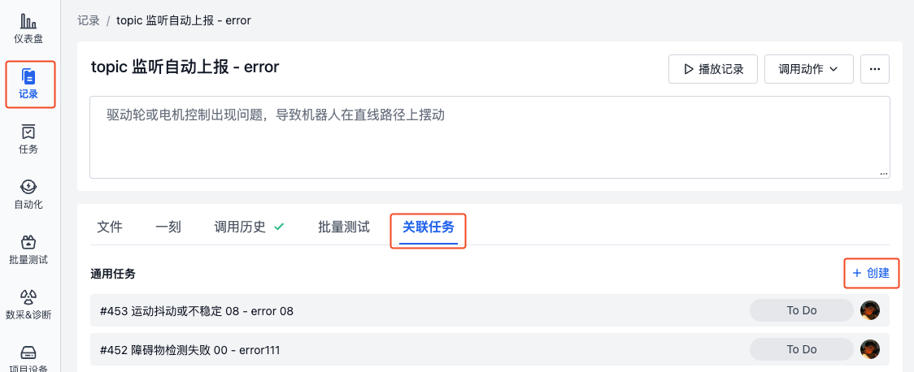

### 在可视化界面创建
在可视化界面中播放记录内容时，可以创建「一刻」进行关键帧的标记，同时勾选「创建一个新的任务」以便捷推进工作进展。

1. 播放记录时，点击左下角【创建一刻】按钮，标记起始时间点

     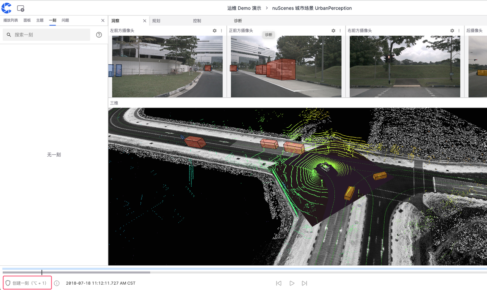

     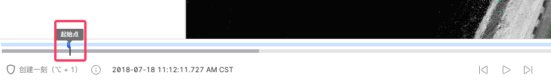

2. 继续播放，在需要的时间点再次点击【创建一刻】按钮，确定终点。时间轴上的蓝色部分即为「一刻」的时间范围。

     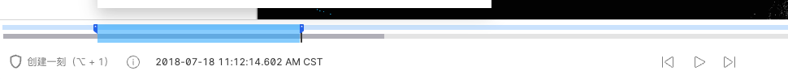

3. 在创建一刻的弹框中，勾选【创建一个新的任务】，并输入任务的名称与经办人等信息。

     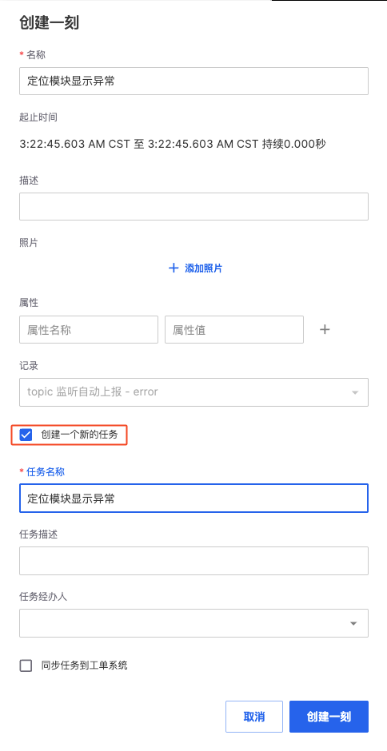

4. 创建成功后，在创建任务成功的提示框中点击【前往查看】，即可查看任务详情。

     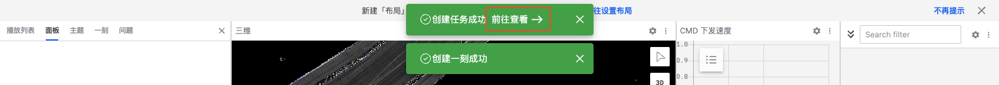

5. 创建的任务会在描述中自动引用该「一刻」，帮助快速定位关键帧。点击一刻即可播放该时间点的内容。

     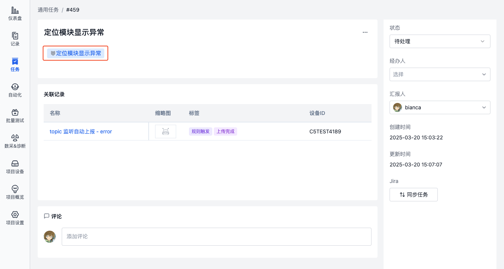

## 查看任务
### 查看我的任务
在首页「我的任务」中，可查看当前用户未处理完成的任务列表。点击任务名称即可跳转至对应任务详情页面，查看任务信息并进行处理。

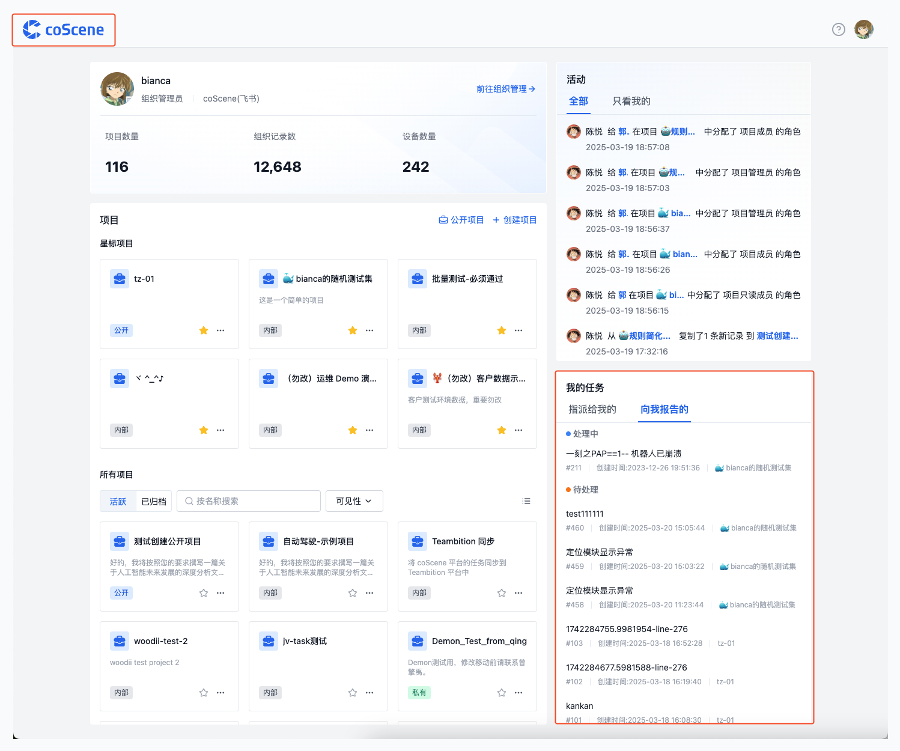

### 查看项目任务
在项目「任务-通用任务」中，可查看项目中的所有任务。点击任务名称可查看详细信息。

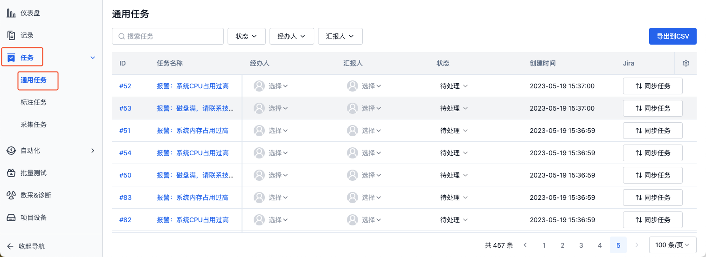

### 查看任务关联的记录
在任务详情页，可查看与该任务相关联的所有记录。点击记录名称即可跳转至对应记录详情页面。

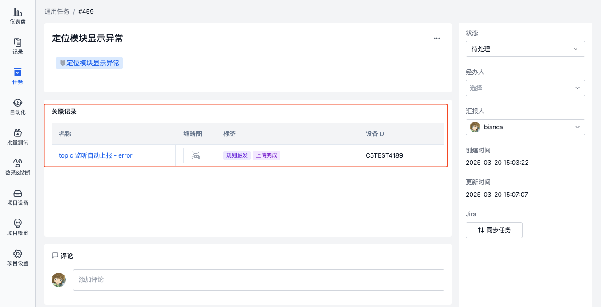

## 处理任务
### 变更状态
通用任务有三种状态：
- 待处理：默认状态
- 处理中：表示正在处理任务
- 已处理：处理完成的任务将不会再出现在首页「我的任务」列表中

在任务详情页，点击右侧的「状态」修改任务状态：

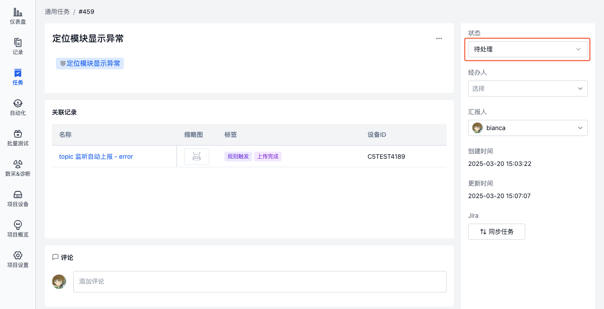

### 分配任务
当需要将任务转交给其他成员处理时，可以修改任务的经办人。

在任务详情页，点击「经办人」可将任务分配给其他成员：

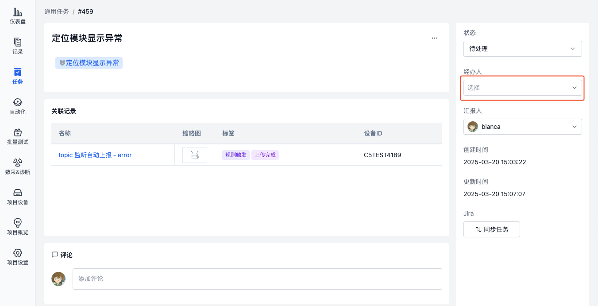

### 编辑任务
在任务详情页，点击标题或描述，即可编辑任务信息：

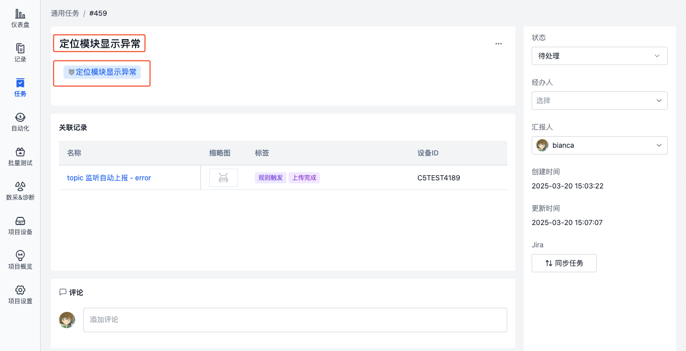

### 评论任务
在任务详情页，可查看与该任务相关联的所有评论。点击「评论」输入框，即可发表评论：

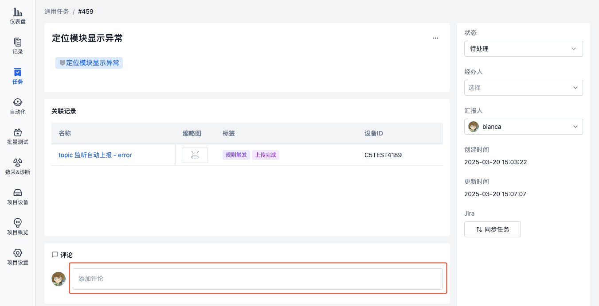

### 删除任务
在任务详情页，点击「更多操作」中的【删除】按钮，即可删除该任务。

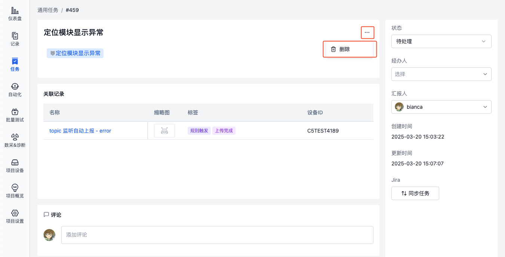

## 了解更多
- [记录](../record/1-quick-start-record.md)
- [一刻](../../viz/5-create-moment-viz.md)
- [将任务同步到 Jira](../integration/1-jira-integration.md)
- [将任务同步到 Teambition](../integration/2-teambition-integration.md)
