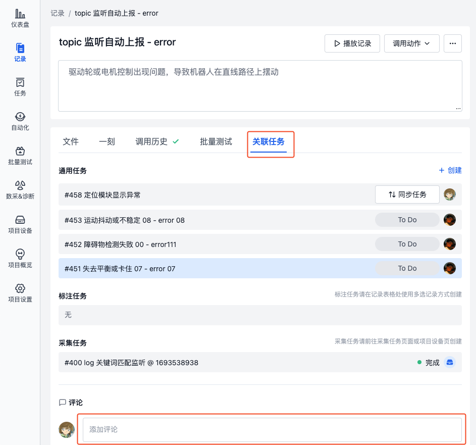
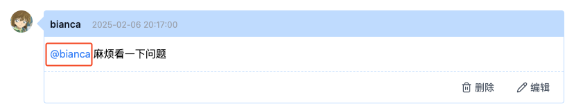
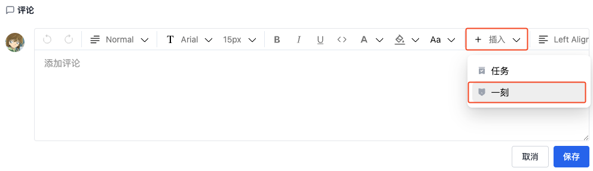
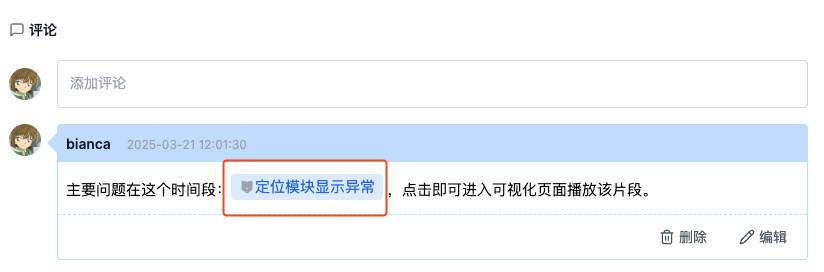
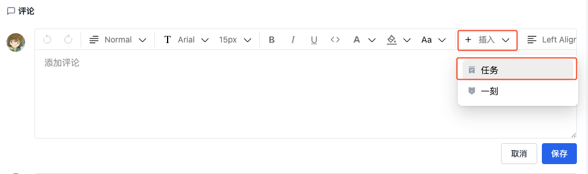
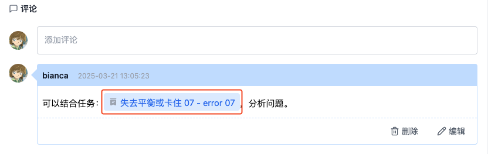
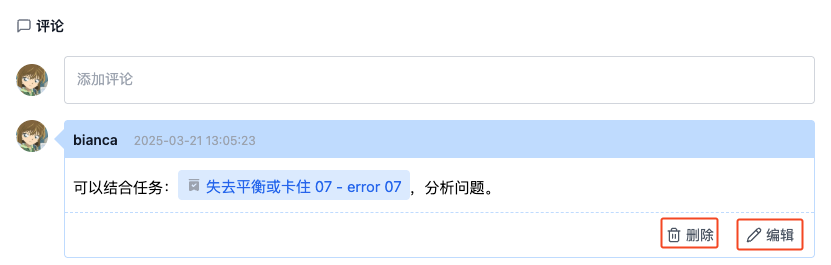

# 在记录中管理评论
在记录创建后，团队成员可能需要协作处理数据。通过「评论」功能，成员可以发布和获取相关信息，实现高效协作。

## 添加评论
在记录详情页的「关联任务」模块查看与该记录相关的评论。点击评论输入框，即可发表评论。

评论支持 @ 用户、引用「一刻」和任务链接等功能，帮助团队成员更高效地协作与沟通。

### 在评论中 @ 用户
在评论输入框中输入 @ 符号，即可搜索并选择需要 @ 的成员。

### 在评论中引用「一刻」
在评论中添加「一刻」链接后，成员可以点击一刻直接跳转到对应的关键帧位置，进行可视化播放。了解[「一刻」](../../viz/5-create-moment-viz.md)

1. 点击【插入一刻】按钮，在弹出的「插入一刻」窗口中，选择需要引用的「一刻」。

     

2. 发表评论后，点击一刻名称，即可进入可视化页面播放「一刻」。
    
     

### 在评论中引用「通用任务」
在评论内添加相关的「通用任务」链接后，成员可以点击链接直接跳转到对应任务的详情页面。了解[通用任务](./2-general-task.md)

1. 点击【插入任务】按钮，在弹出的「插入任务」窗口中，选择需要引用的「通用任务」。

     

2. 发表评论后，点击任务名称，即可进入任务详情页面。

     

## 管理评论
> 仅项目管理员或评论发表者可编辑或删除评论。

在评论右下角点击【编辑】或【删除】按钮，即可对评论进行管理。

