# 管理文件

文件分为两类：「通用文件」和「可视化文件」。其中，通用文件包括常见的文本、图片、压缩包等；可视化文件则是支持特殊预览和播放功能的文件，如 Rosbag、日志文件、地图数据、TF 文件等。

## 通用文件操作

文件操作包括：预览、搜索、重命名、复制、移动、下载、复制下载链接、删除等。

### 预览

1. 在「文件列表」中，点击文件名称，即可预览文件。

   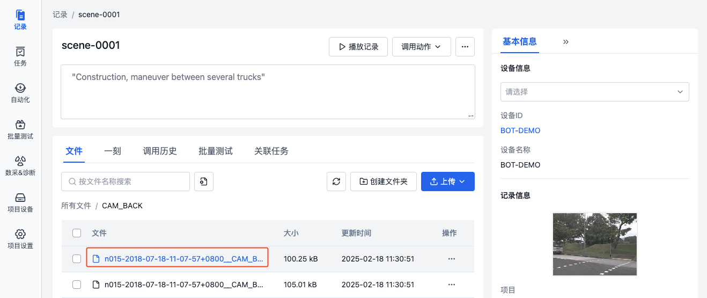

2. 点击预览界面右上角的「关闭」按钮，关闭预览界面。
   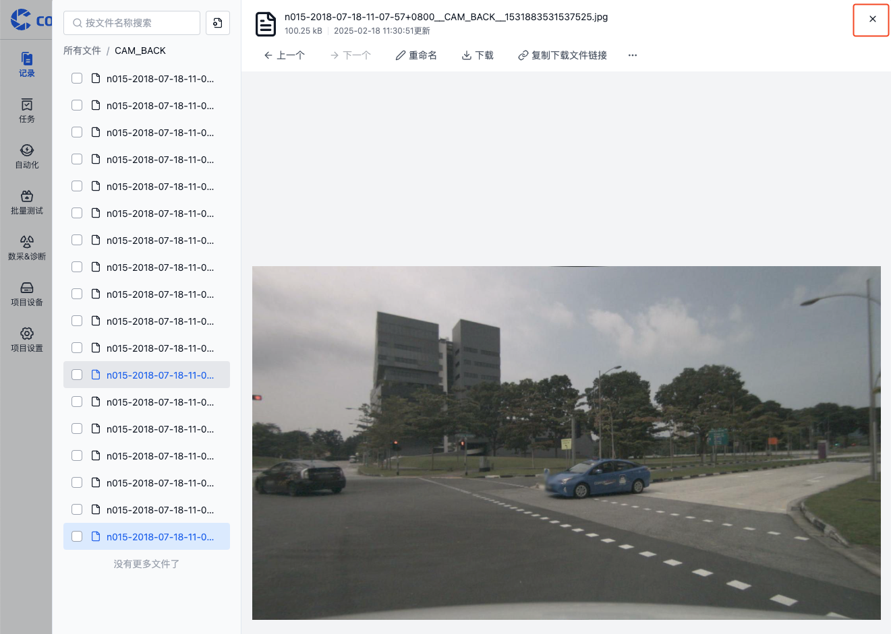

3. 点击预览界面上方的【上一个】、【下一个】按钮，或点击左侧边栏的文件名称，可预览不同的文件。

   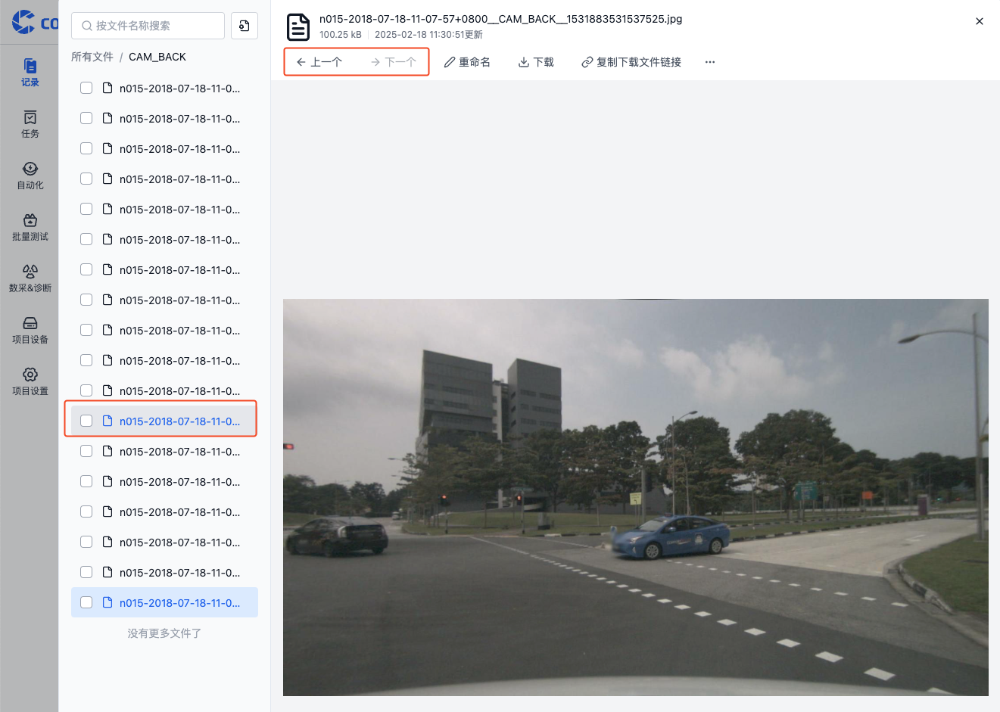

4. 不同的文件支持不同的预览方式，如：

   - **pcd 预览**

     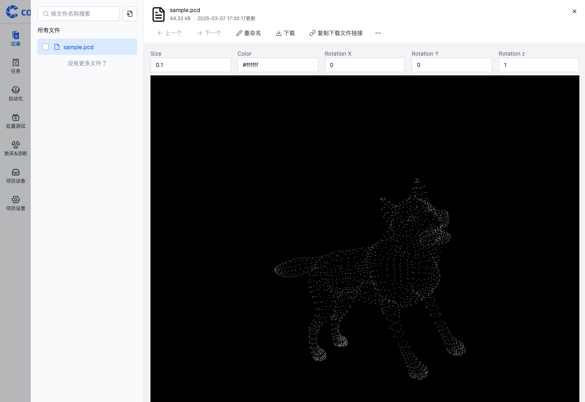

     | 参数       | 释义         |
     | ---------- | ------------ |
     | Size       | 点的大小     |
     | Color      | 点的颜色     |
     | Rotation X | x 方向的旋转 |
     | Rotation Y | y 方向的旋转 |
     | Rotation Z | z 方向的旋转 |

   - **文本预览**

     支持切换文本类型，如：log、yaml、json、xml 等。

     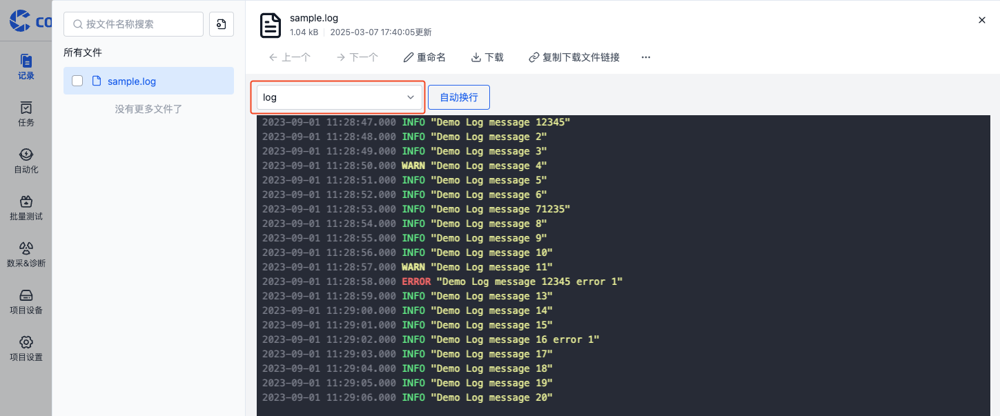

   - **表格预览**

     支持切换表格的编码，如：utf-8、gbk 等。

     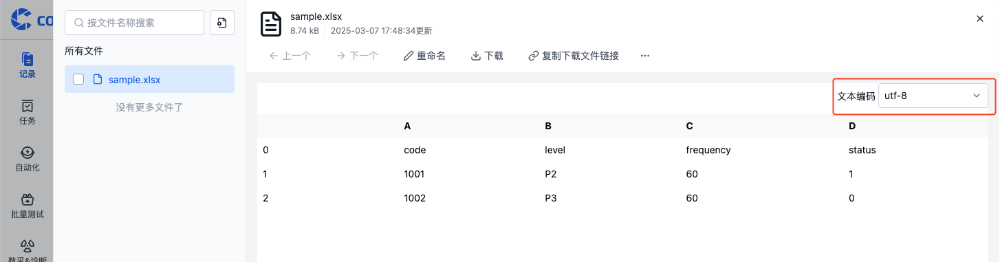

### 搜索

在「文件列表」中的搜索框中输入关键字，可对文件名称进行搜索。

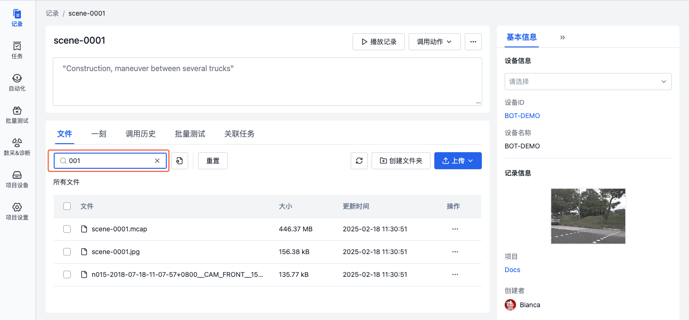

### 重命名

在「文件列表」，点击文件「更多操作」中的【重命名】按钮，可对文件进行重命名。

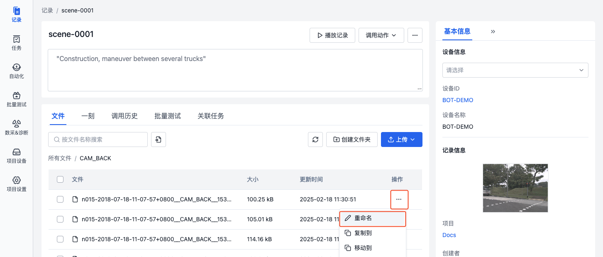

### 复制

1. 在「文件列表」，点击文件「更多操作」中的【复制到】按钮。

   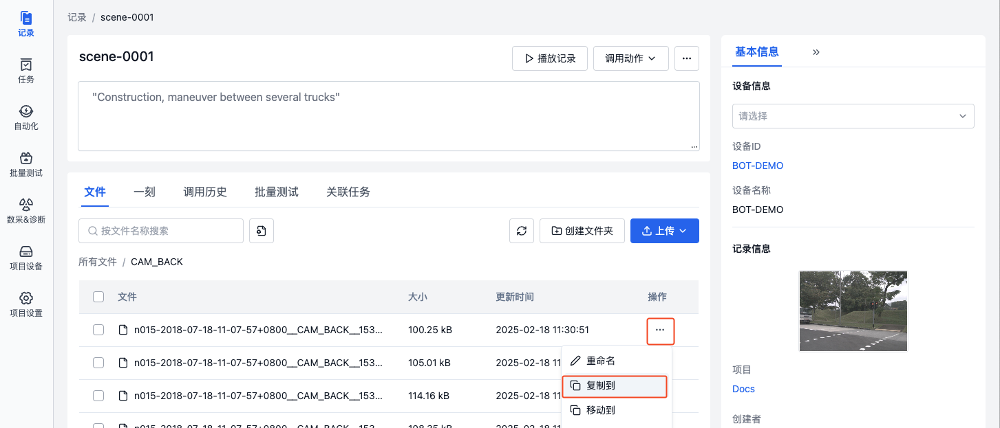

2. 在弹窗中选择要复制到的目标记录/创建一条新记录，点击【确定】按钮后，即可在对应记录中查看复制的文件。

   

### 移动

1. 在「文件列表」，点击文件「更多操作」中的【移动到】按钮。

   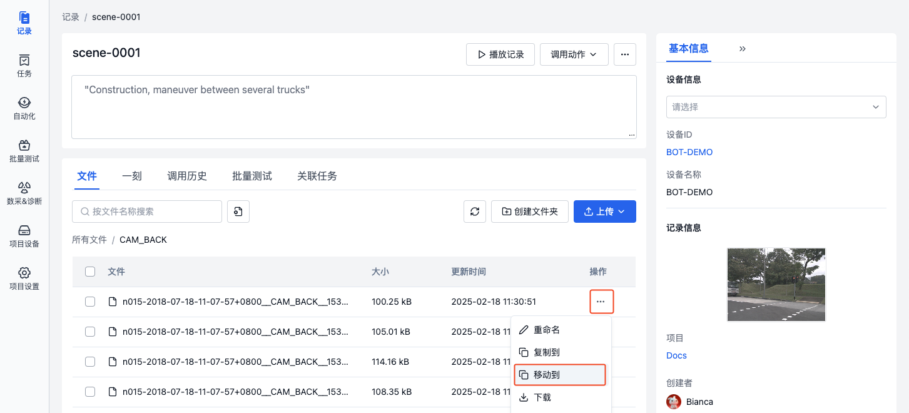

2. 在弹窗中选择要复制到的目标记录/创建一条新记录，点击【确定】按钮后，即可在对应记录中查看复制的文件。


### 下载

可直接下载文件，或复制下载链接分享给他人。

- **直接下载**

  在「文件列表」，点击文件「更多操作」中的【下载】按钮，可将文件下载到本地。

- **复制下载链接**

  > 复制的文件下载链接有效期为 7 天

  在「文件列表」，点击文件「更多操作」中的【复制下载文件链接】按钮，可复制文件的下载链接。

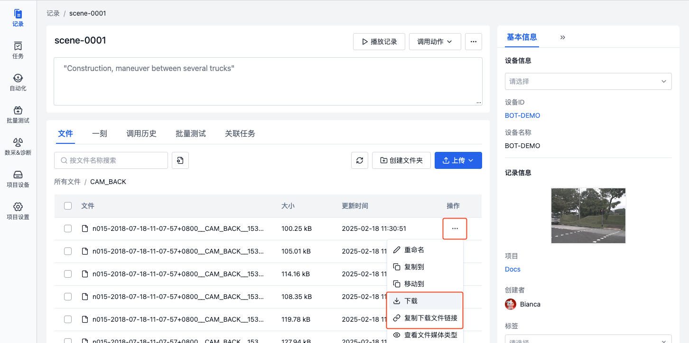

### 删除

在「文件列表」，点击文件「更多操作」中的【删除】按钮，二次确认后可删除文件。

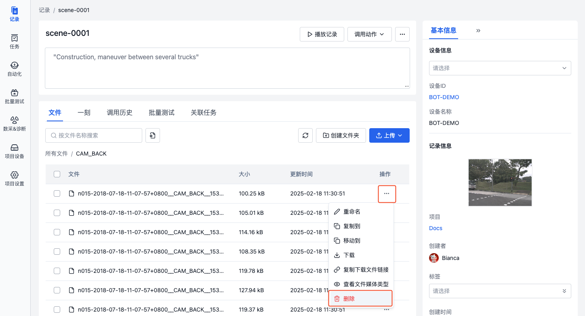

### 批量操作

在「文件列表」，勾选需要操作的文件，可进行批量下载、复制、移动、删除等操作。

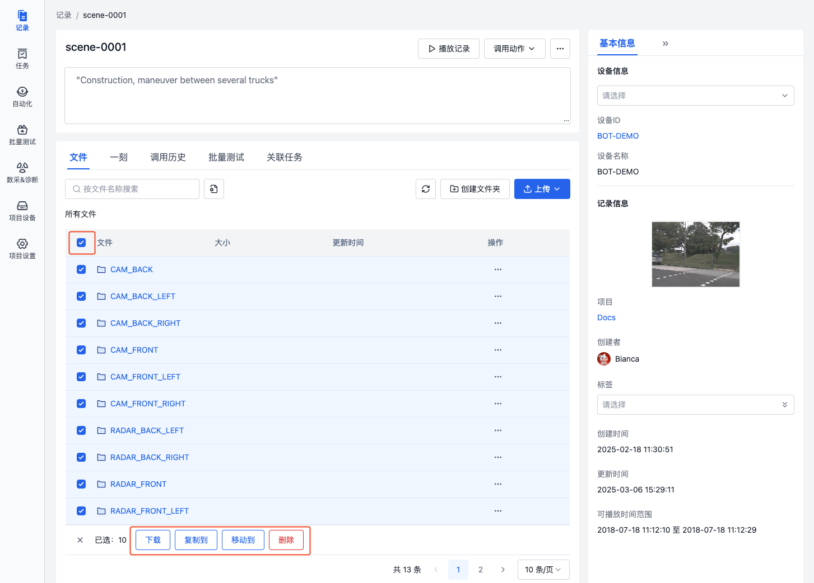

## 可视化文件操作

可视化文件除了通用文件的操作外，还支持设置文件媒体类型、播放。

### 文件媒体类型

媒体类型用于向可视化播放器描述以何种方式解析该文件。主要类型包括：mcap、bag、静态 bag、log、map、tf 等。

- **mcap**

  系统自动识别 .mcap 格式文件并将其作为 mcap 进行解析。

- **bag**

  系统自动识别 .bag 和 .bag.active 格式文件，并将其作为 bag 进行解析。

- **静态 bag**

  静态 bag 主要用于需要固定参考系统的场景。将 bag 文件标记为静态后，系统仅使用其中的地图和坐标变换数据作为参考，而不会播放其他数据流。

- **log**

  系统会自动将后缀为 .log 且包含标准时间戳的文件识别为日志文件。日志文件需要配合 bag 文件一起使用，可在播放 bag 文件时同步显示对应时间点的日志信息。

- **map**

  支持将图片（.png）设置为地图文件。系统会将其作为 2D 地图进行解析，在可视化界面中显示机器人的环境信息。

- **tf**

  支持将 yaml 设置为 tf 文件，系统会解析这些变换数据，用于在可视化界面中正确展示机器人的姿态和运动状态。

### 设置静态 bag

> 仅支持将 .bag 和 .bag.active 格式的文件设置为静态 bag。

使用场景：当在播放记录时需要使用一个特定 bag 中的地图和 tf 信息，而不希望播放该 bag 时，可将该文件设置为静态 bag。

例如：记录中有两个文件 sample_1.bag（包含地图和 tf）和 sample_2.bag（不含地图和 tf），可以按以下步骤将 sample_1.bag 设置为静态 bag：

1. 在「文件列表」，点击文件「更多操作」中的【设置媒体类型】按钮。

   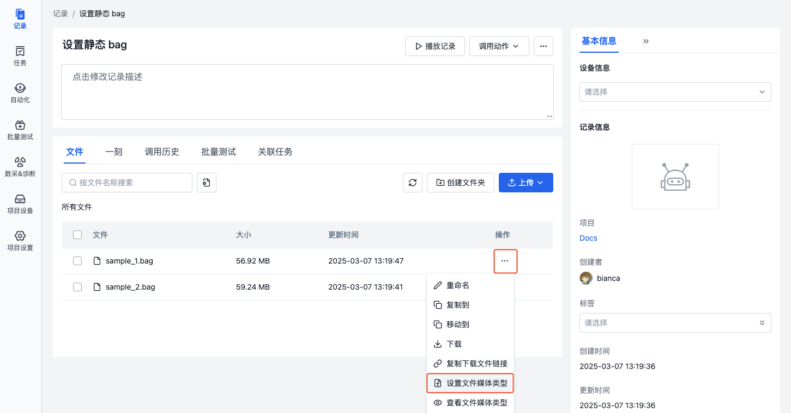

2. 在弹窗中选择「静态 bag」，点击【确定】按钮后，即可将文件设置为静态 bag。

   

3. 查看文件媒体类型，可看到文件已被设置为静态 bag。

   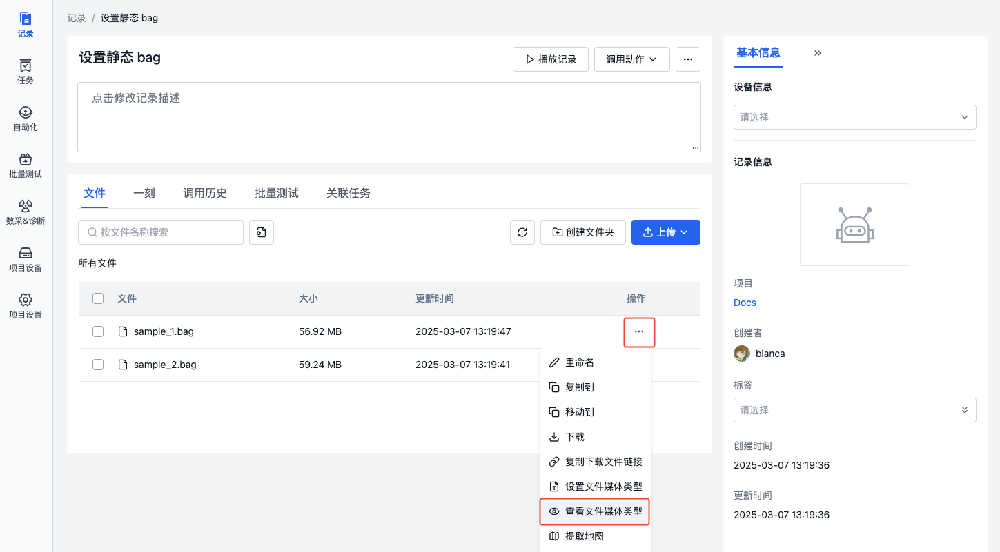

   

4. 在播放记录时仅播放普通的 bag，不会播放静态 bag。

   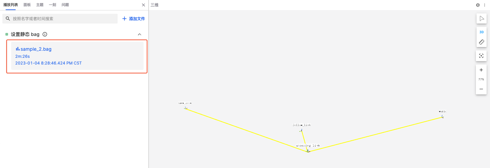

### 设置 log

> 支持将未识别的 .log 的文件设置为 log。

使用场景：当需要在播放记录时同步显示日志信息时，可以将日志文件设置为 log。

例如：记录中有两个文件 sample.log 与 sample.bag，可按以下步骤将文件设置为 log：

1. 在「文件列表」，点击文件「更多操作」中的【设置媒体类型】按钮。

   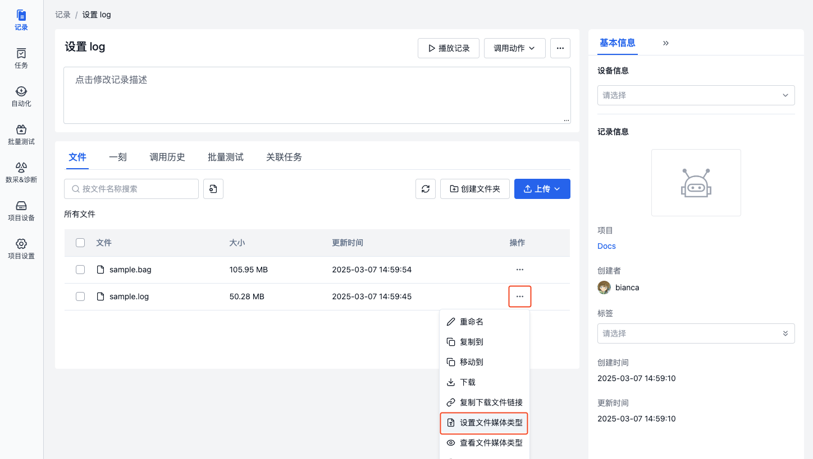

2. 在弹窗中选择「日志」，点击【确定】按钮后，即可将文件设置为 log。

   

3. 查看文件媒体类型，可看到文件已被设置为 log。

   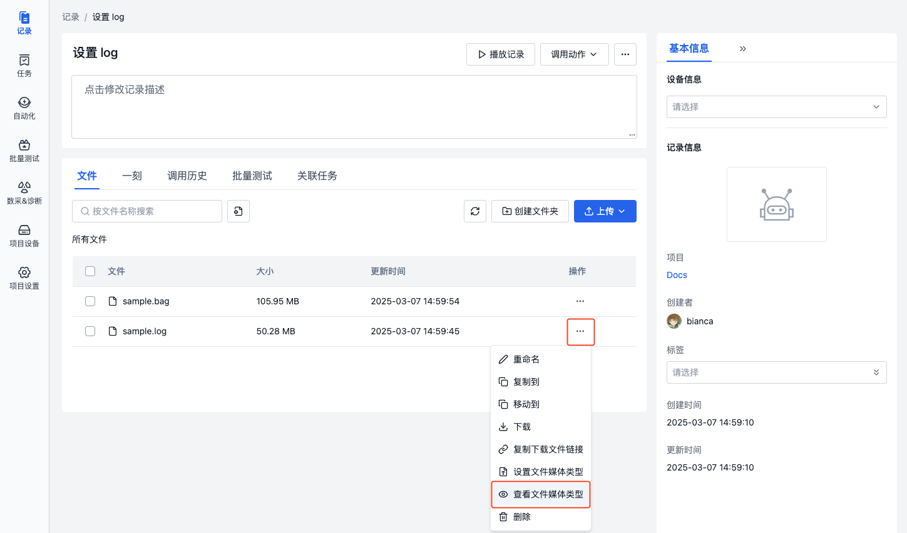

   

4. 在播放记录时，会同步显示日志信息。详见[可视化日志面板](../../viz/4-panel/3-log-panel.md)

### 设置 map

> 仅支持导入 2D 地图，可将 .png 格式的图片设置为 map。

使用场景：当播放的 ROSbag 数据中没有地图信息时，可将图片设置为地图，在可视化界面中进行展示。

例如：记录中有两个文件 map.png 与 sample.bag，可按以下步骤将文件设置为 map：

1. 在「文件列表」，点击文件「更多操作」中的【设置媒体类型】按钮。

   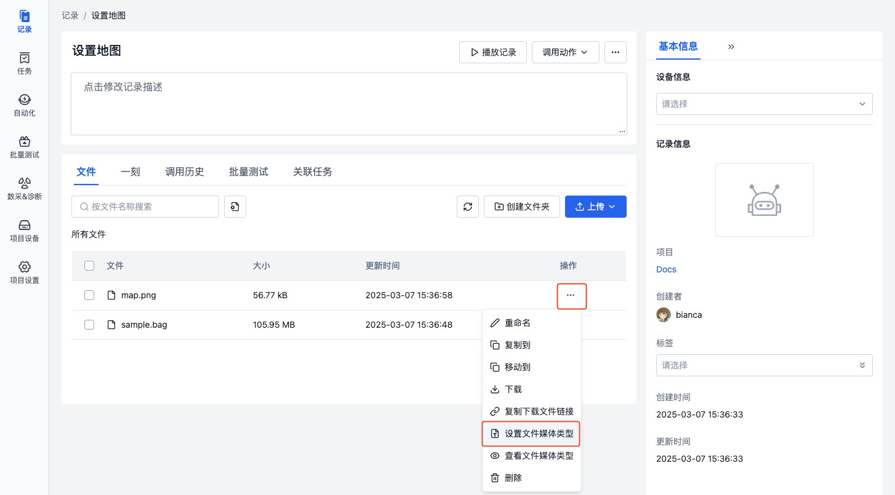

2. 在弹窗中选择「地图」，设置参数（x、y、yaw、resolution）后，点击【确定】按钮后，即可将文件设置为 map。

   

   可手动输入对应参数值，也可选择 yaml 文件，自动获取其中的参数值。支持的 yaml 文件格式如下：

   ```yaml
   resolution: 0.05
   origin: [10, -10, 0] # [x, y, yaw]
   ```

   其中各参数的释义如下，详见[map_server - 1.2 YAML format](https://wiki.ros.org/map_server)：
   | 参数 | 释义 |
   | --- | --- |
   | x | 参考点的 x 坐标 |
   | y | 参考点的 y 坐标 |
   | yaw | 地图的 yaw 角度（绕 Z 轴的旋转角度） |
   | resolution | 地图的分辨率 |

   注意：

   - 默认该地图的坐标系为 map
   - 默认以地图左下角作为参考点
   - 默认整张图都在 z 坐标为 0 的平面

3. 查看文件媒体类型，可看到文件已被设置为 map。

   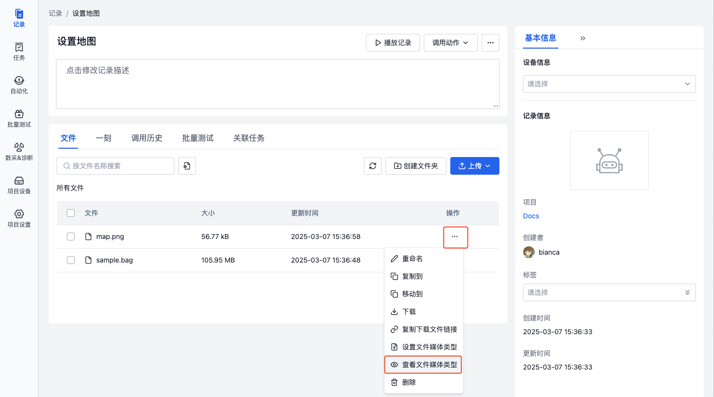

   

4. 在播放记录时，会在可视化界面中显示地图。详见[可视化三维面板-话题-外部导入地图](../../viz/4-panel/2-3d-panel.md)

### 设置 tf

> 支持将 .yaml 文件设置为 tf。

使用场景：当播放记录时，因缺失 tf 信息，无法正确展示机器人的姿态和运动状态时，可将 yaml 文件设置为静态 tf。

例如：记录中有两个文件 tf.yaml 与 sample.bag，可按以下步骤将文件设置为 tf：

1. 准备 yaml 文件，按以下格式定义坐标变换关系：

   > 每行格式为：`frame1,frame2: x y z roll pitch yaw parent_frame child_frame`
   >
   > - x、y、z：表示平移
   > - roll、pitch、yaw：表示旋转
   > - parent_frame、child_frame：分别表示父坐标系和子坐标系的名称

   ```yaml
   base_link,camera_link1: 0.2 0.1 0.0 0.0 0.0 0.5 base_link camera_link4
   base_link,ultrasonic1: 0.4 -0.1 0.0 0.0 0.0 -0.2 base_link ultrasonic1
   ```

2. 在「文件列表」，点击文件「更多操作」中的【设置媒体类型】按钮。

   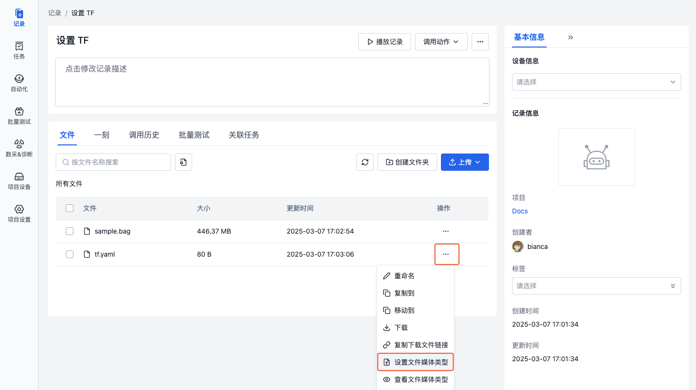

3. 在弹窗中选择「静态 TF」，点击【确定】按钮后，即可将文件设置为 tf。

   

4. 查看文件媒体类型，可看到文件已被设置为 tf。

   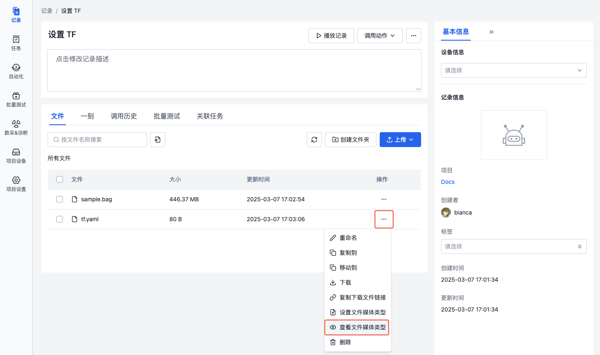

   

5. 在播放记录时，可使用对应的 TF 信息。详见[可视化三维面板-变换](../../viz/4-panel/2-3d-panel.md)

### 播放文件

在「文件列表」中，点击 mcap 或 bag 文件的名称，会自动跳转到可视化页面。在可视化页面中，可以：

- 查看和播放文件中的传感器数据
- 调整播放速度和时间轴
- 配置各种可视化参数
- 导出数据或截图

详细的可视化操作说明，请参考[可视化](../../viz/1-about-viz.md)章节。
