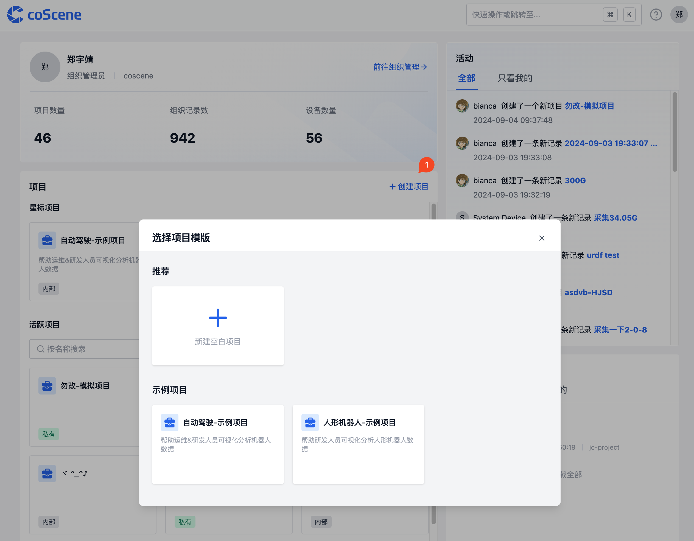

# 项目
项目是数据管理的单元，对于数据的存储、管理、隔离和应用都发生在项目级别。一个项目可以是一个部门、一个项目组或一个业务线。

## 项目界面
在项目中，有记录、任务、自动化、批量测试、数采&诊断、设备等模块，各模块释义如下：

| 名称 | 说明 |
| --- | --- |
| 记录 | 记录是数据的基本单元，用于存储和管理数据，详见[记录](../record/1-quick-start-record.md) |
| 任务 | 任务包括通用任务、标注任务与采集任务，用于管理数据处理流程 |
| 自动化 | 自动化包括动作、触发器、动作调用历史，用于自动化处理数据，详见[自动化](../../workflow/action/2-learn-coscene-action.md) |
| 批量测试 | 批量测试是一种并行执行多个测试任务的自动化解决方案，用于回归测试、仿真测试等大规模测试场景，详见[批量测试](../../sim-and-tests/regression/1-intro.md) |
| 数采&诊断 | 数采&诊断通过定义规则，实现设备监听，数据采集与自动诊断，详见[数采&诊断](../../use-case/data-diagnosis/1-intro.md) |
| 设备 | 设备与真实设备端建立连接，作为数据采集的目标对象。所有设备统一在组织中进行管理，按需分配到各个项目，详见[设备](../../device/1-device.md) |

## 创建新项目

在主页上点击"创建项目"按钮，然后按照指引步骤完成项目创建。

## 2. 项目可见性设置

刻行提供两种项目可见性选项，项目管理员可以根据需求进行设置：

### 2.1 可见性类型

1. **私有项目**

   - 访问限制：仅组织管理员和项目成员可访问
   - 权限控制：项目成员权限由项目角色决定

2. **内部项目**
   - 访问范围：组织内所有用户均可访问
   - 权限控制：访问用户具有项目成员权限，具体权限由项目角色决定

### 2.2 修改项目可见性

项目管理员可在项目设置中切换项目可见性。

## 3. 项目归档与恢复

刻行支持项目归档功能，用于管理历史数据或低活跃度项目。

归档效果：

- 归档后：项目变为只读状态，数据停止更新
- 恢复后：项目恢复可读可写状态，正常运作

### 3.1 归档项目

项目管理员可在项目设置中执行归档操作。

### 3.2 恢复已归档项目

组织管理员可通过以下步骤恢复已归档项目：

1. 在组织项目列表中切换至已归档项目视图
2. 选择需要恢复的项目
3. 点击"取消归档"以恢复项目

