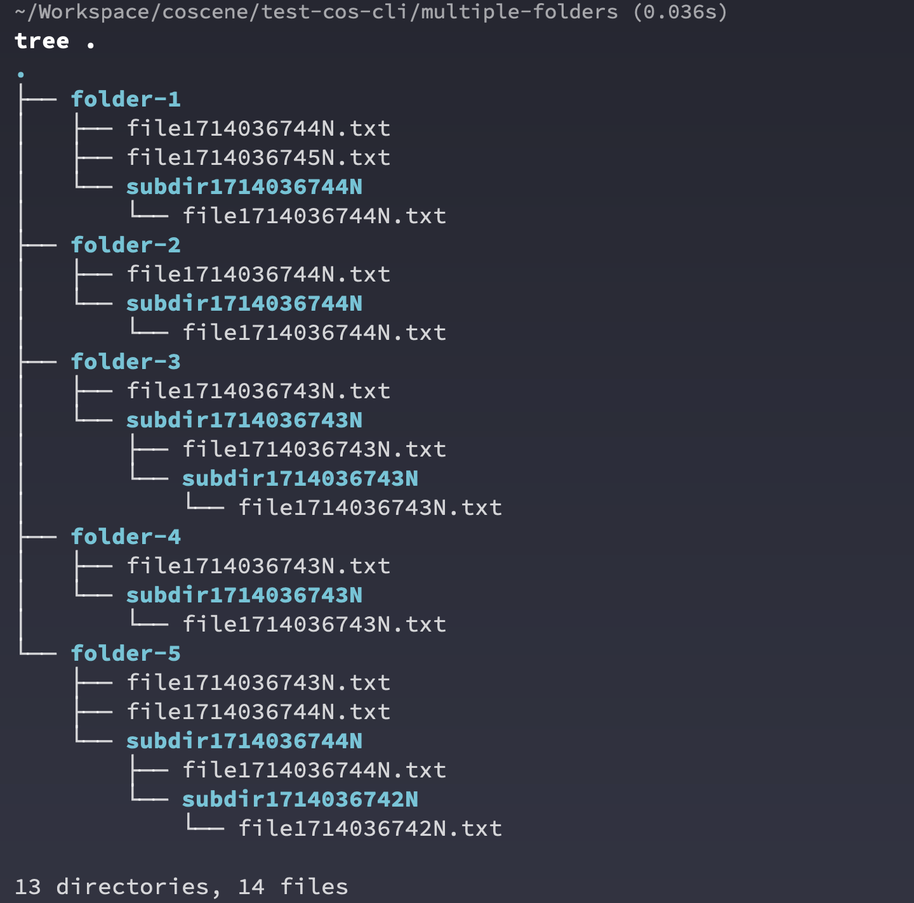
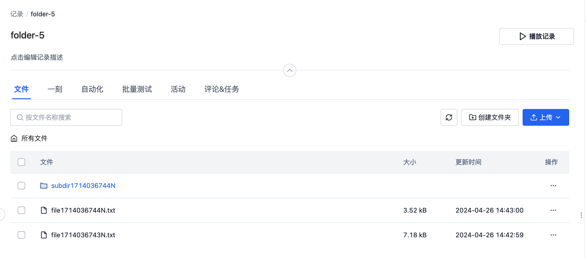

# 常见批量操作举例

:::tip 推荐使用 JSON 输出
本文档中的批量操作示例使用 `jq` 工具来解析 JSON 输出，这比解析表格输出更加可靠和稳定。
如果您的系统没有安装 `jq`，可以通过以下命令安装：
- macOS: `brew install jq`
- Ubuntu/Debian: `sudo apt-get install jq`
- CentOS/RHEL: `sudo yum install jq`
:::

## 上传同一个文件到项目中的所有记录中

```bash
# 使用 JSON 输出和 jq 提取记录 ID
cocli record list -o json | jq -r '.records[].name' | \
  xargs -I {} cocli record upload {} ./FILE_FLAG
```

## 为当前目录下的所有文件夹建立一个记录并上传文件

假定我们有如下的 5 个文件夹，文件夹中包含若干个随机文件和文件夹，具体结构如下图所示。



我们立刻利用 coScene 命令行工具和标准的 Linux 命令行工具来一次性完成所有文件记录的创建和文件上传。

```bash
# 遍历当前目录下的所有子目录
for dir in */; do
  # 去除目录名称末尾的斜杠，并创建一个新的记录，获取记录的完整资源名称
  record_name=$(cocli record create -t "${dir%/}" -o json | jq -r '.name')

  # 上传当前子目录的内容到创建的记录中
  cocli record upload -R "$record_name" "$dir"
done
```


打开网页端任意记录就可以看到，命令行将本地的文件夹内的所有文件和文件夹都上传到了对应记录



## 遍历所有记录并进行操作

一种常见的命令行操作模式是遍历用户指定项目内的所有记录，并根据特定的模式进行操作

```bash
# 使用 JSON 输出获取项目中的所有记录，遍历并提供记录的完整资源名称
cocli record list -o json | jq -r '.records[].name' | while read -r record_name; do
    # 使用 $record_name 进行后续的批量操作
    # 如需提取 record ID，可以使用: record_id=$(basename "$record_name")
done
```

根据这个模式也可以举一反三，连接更复杂的批量操作。

### 找出所有不含任何文件的空记录

```bash
cocli record list -o json | jq -r '.records[].name' | while read -r record_name; do
    # 获取记录中的文件数量
    file_count=$(cocli record file list "$record_name" -o json 2>/dev/null | jq '.files | length')

    # 检查文件列表是否为空
    if [[ "$file_count" -eq 0 ]]; then
        # 提取记录 ID 并输出
        record_id=$(basename "$record_name")
        echo "Record $record_id has no files."
    fi
done
```

### 给所有空记录打上标签

```bash
cocli record list -o json | jq -r '.records[].name' | while read -r record_name; do
    # 获取记录中的文件数量
    file_count=$(cocli record file list "$record_name" -o json 2>/dev/null | jq '.files | length')

    # 检查文件列表是否为空
    if [[ "$file_count" -eq 0 ]]; then
        # 给所有空的记录打上标签 empty-record
        cocli record update "$record_name" --append-labels empty-record
    fi
done
```

### 批量下载所有有特定标签的记录到文件夹

```bash
# 使用 --labels 参数过滤特定标签的记录
cocli record list --labels test-label -o json | jq -r '.records[].name' | while read -r record_name; do
    # 下载所有有 test-label 标签的记录
    cocli record download "$record_name" download-folder
done
```

### 删除所有空记录

:::danger
请非常小心`删除`操作，这可能会删除重要数据！！
:::

```bash
cocli record list -o json | jq -r '.records[].name' | while read -r record_name; do
    # 获取记录中的文件数量
    file_count=$(cocli record file list "$record_name" -o json 2>/dev/null | jq '.files | length')

    # 检查文件列表是否为空
    if [[ "$file_count" -eq 0 ]]; then
        # 删除当前记录，使用 -f 标志来跳过手工确认的步骤
        cocli record delete "$record_name" -f
    fi
done
```
