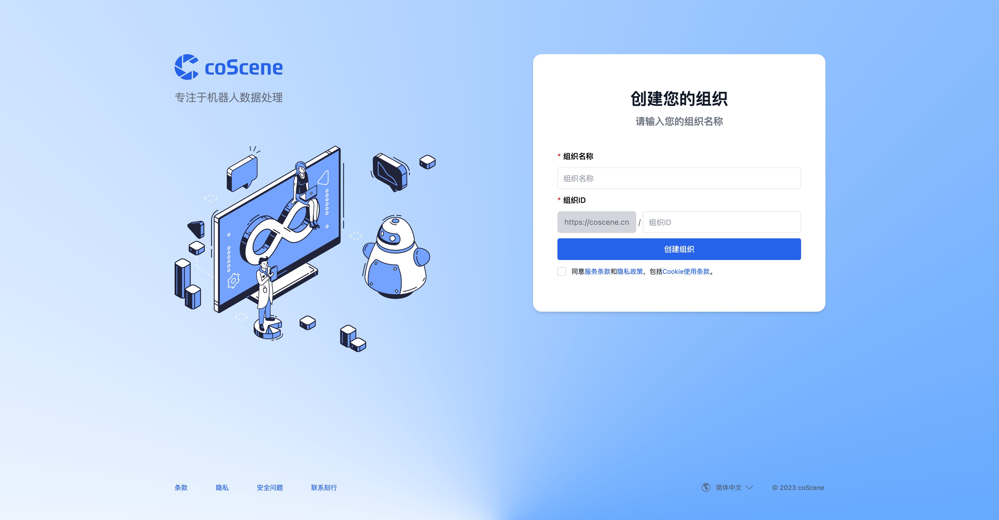

# 数据模型

从权限和数据归属看，coScene 最常用的数据层级是：组织统一管理成员、设备和镜像仓库；项目承载具体的数据和协作；记录是项目中的数据容器；一刻是记录时间轴上的关键片段。

## 组织 Organization

组织是一个逻辑概念，它代表了一个团队或者一个公司。组织可以拥有多个项目，也可以拥有多个成员。

在登录刻行时空平台时，如果你是所选择组织中第一个登录刻行平台的用户，你会成为该组织的管理员，并进行组织的初始化设置。
如果你不是第一个登录的用户，你将会成为该组织的普通成员。

## 设备 Device

设备是组织级资源，通常对应一台机器人、车辆、采集主机、传感器套件或测试设备，也可以是仅用于数据管理的虚拟设备。

设备先在组织中统一管理；当设备需要参与某个项目的数据采集、规则监听、远程控制或统计时，再将组织设备添加到项目中。一台组织设备可以添加到多个项目，但这些项目设备仍然指向同一个真实设备和同一个设备 ID。关于设备的详细操作，请参见[设备的操作指南](../../device/1-device.md)。

## 项目 Project

组织作为资源的管理容器，本身并不会存储用户和设备在运行时产生的场景数据。对于数据的存储、管理、隔离和应用都发生在项目级别。

项目是平台中主要的数据边界和权限边界。记录、记录文件、一刻、任务、自动化动作和触发器等项目内资源都属于某个项目。用户在项目中的角色决定其对项目资源的读取、写入和管理权限；设备被添加到项目后，才能使用该项目的采集规则并将数据上传到该项目。

## 记录 Record

很多的已有系统和工具都能处理单个或者单一序列的文件，例如 WebViz 能直接打开一个 Bag 文件进行播放，Uber XVIZ 能用一系列的 GLB 和 json 文件还原事件发生时的场景，这些都是了不起的工程能力。但在开发机器人和自动驾驶等复杂系统中，许多环境因素以及程序和人为的干预，都会使得单个文件或者文件序列不足以完整的还原系统运行时的情况。

一个设备在运行和研发过程中所产生的文件，不仅仅有数据本身，还包括例如所运行软件版本、气候、路面情况、硬件配置、校准文件、地图等一系列直接或者间接关联的数据。记录就是为了这种复杂的关联关系而生，在同一个容器内存储相互紧密关联的文件，并在后期处理时，把这些文件有机地关联在一起。

记录本身也会不停地迭代和丰富，用户和自动化动作可以不断向记录内更新有用的信息。一个常见的例子是原始数据被送往标注供应商进行特定框体、语义等标注，这些标注信息在后续的机器学习、训练和测试等流程中都会发挥作用。

在文件管理之上，刻行也对文件的版本和血缘进行了管理。你可能听过机器学习界的一句名言，garbage in garbage out，即垃圾输入垃圾输出。在刻行时空平台中，我们通过记录的版本和血缘管理，来保证数据的质量。在记录的版本中，我们可以看到记录的历史版本，以及每个版本的修改记录。在记录的血缘中，我们可以看到记录的上游和下游记录，以及每个记录的血缘关系。关于血缘和历史版本的详细信息，请参看关于记录对于[血缘和历史版本的说明](../../3-collaboration/record/3-manage-records.md)。

## 一刻 Moment

一刻是记录时间轴上的关键片段，用来标记故障、异常、兴趣点或其他值得协作处理的时间范围。一个一刻通常包含名称、描述、触发时间、持续时间以及自定义字段，也可以关联任务，方便团队围绕具体片段进行讨论和处理。

一刻不是评论，也不是新的记录；它依附于项目中的记录，帮助用户快速定位记录中的关键时间段。关于一刻的创建和管理，请参见[一刻](../../viz/5-create-moment-viz.md)。

## 支持的数据格式和平台处理能力

| 数据格式   | 读取   | 写入   |
| ---------- | ------ | ------ |
| ROS1       | ✅     |        |
| MCAP       | ✅     | ✅     |
| CyberRT    | ✅     |        |
| 非标准格式 | 可定制 | 可定制 |
