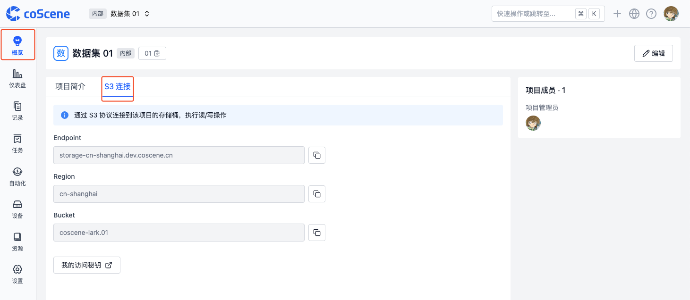
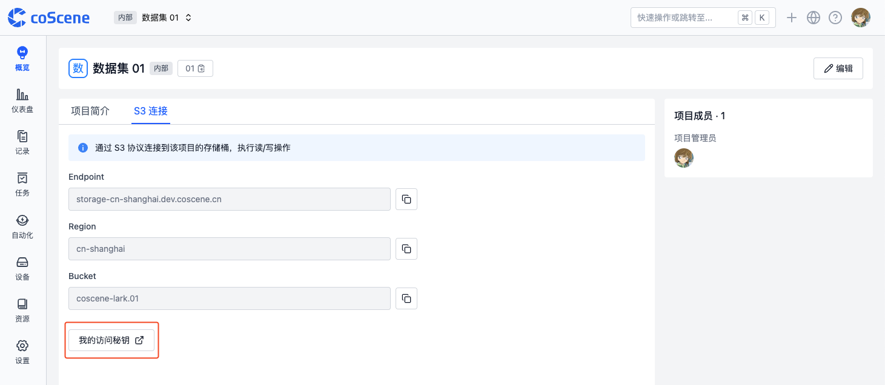
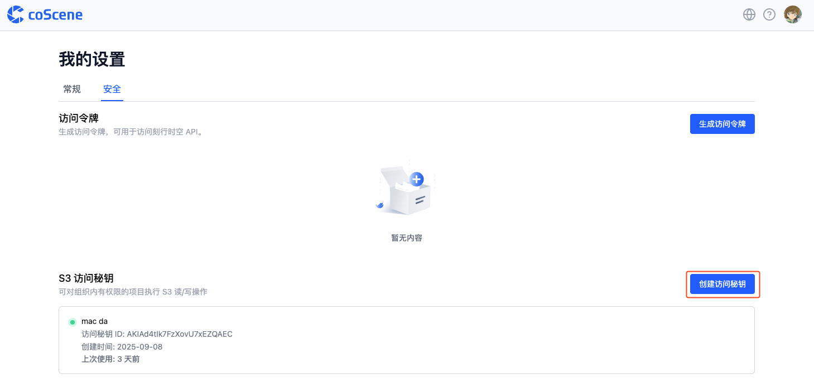

# S3 身份验证

了解如何使用 S3 进行身份验证，从而对组织内有权限的项目执行 S3 操作。

1. 进入项目概览-S3 连接页面，获取 Endpoint、Region、Bucket 等信息。

    

2. 点击【我的访问秘钥】，前往个人设置-安全页面，管理个人的 S3 访问秘钥。

    

3. 点击【创建访问秘钥】，输入备注信息后，创建 S3 访问秘钥。

    

4. 复制访问秘钥 ID 和访问秘钥，用于后续 S3 操作。例如，使用 [AIStor Client(mc)](https://docs.min.io/enterprise/aistor-object-store/reference/cli/) 工具进行 S3 身份验证：

    ```bash
    mc alias set coscene <endpoint> <access-key-id> <secret-access-key>
    ```

注意：**个人的 S3 访问秘钥可对组织内有权限的所有项目执行操作，仅用于个人使用，不建议分享给他人。**