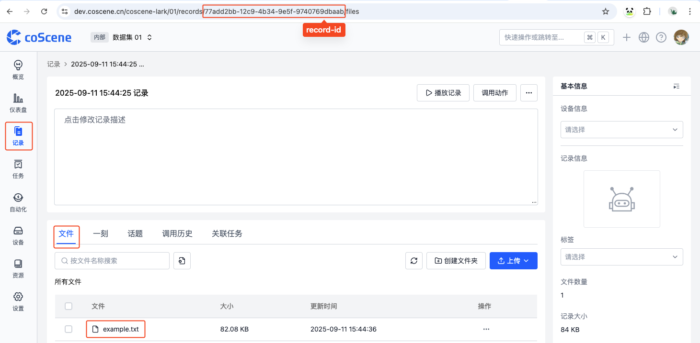
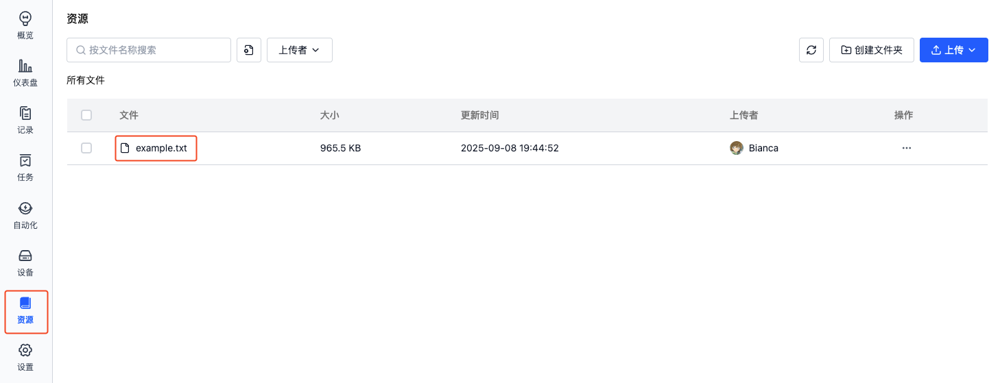

# S3 操作

在项目中，通过 S3 可对记录、资源进行上传、下载等操作。

## 存储路径

1. **记录**

    记录中的文件在 S3 对应 Bucket 中的路径为 `records/<record-id>/files/<file-name>`。

    例如，记录的 ID 为 `123456`，文件名为 `example.txt`，则文件的路径为 `records/123456/files/example.txt`。

    

2. **资源**

    资源中的文件在 S3 对应 Bucket 中的路径为 `files/<file-name>`。

    例如，资源中文件名为 `example.txt`，则文件的路径为 `files/example.txt`。

    

## 操作示例
以 [AIStor Client(mc)](https://docs.min.io/enterprise/aistor-object-store/reference/cli/) 工具为例。假设项目 Bucket 为 `coscene.01`，记录的 ID 为 `123456`，文件名为 `example.txt`，S3 配置的别名为 `coscene`。

### 列出文件

1. 列出记录中的文件

    ```bash
    mc ls coscene/coscene.01/records/123456/files/
    ```

2. 列出资源中的文件

    ```bash
    mc ls coscene/coscene.01/files/
    ```

### 上传文件

1. 上传文件到记录中：

    ```bash
    mc put example.txt coscene/coscene.01/records/123456/files/
    ```

2. 上传文件到资源中：

    ```bash
    mc put example.txt coscene/coscene.01/files/
    ```

### 下载文件

1. 从记录中下载文件

    ```bash
    mc get coscene/coscene.01/records/123456/files/example.txt .
    ```

2. 从资源中下载文件

    ```bash
    mc get coscene/coscene.01/files/example.txt .
    ```