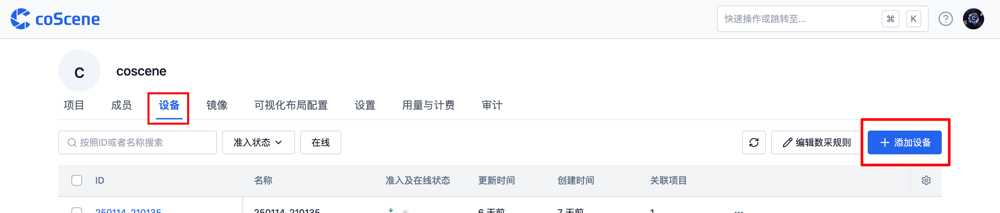
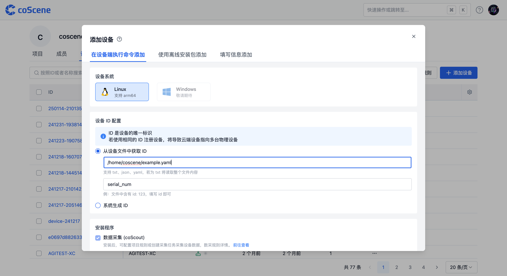
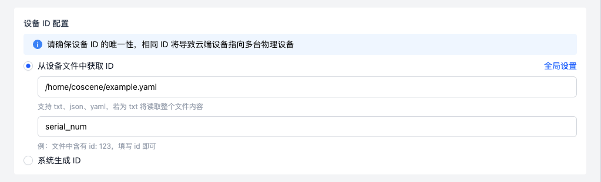
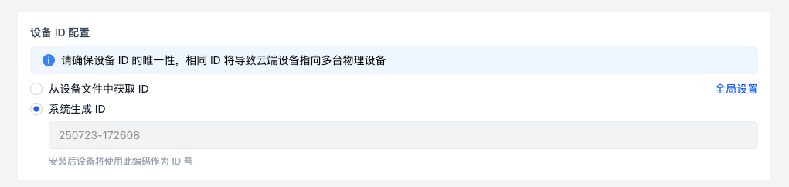
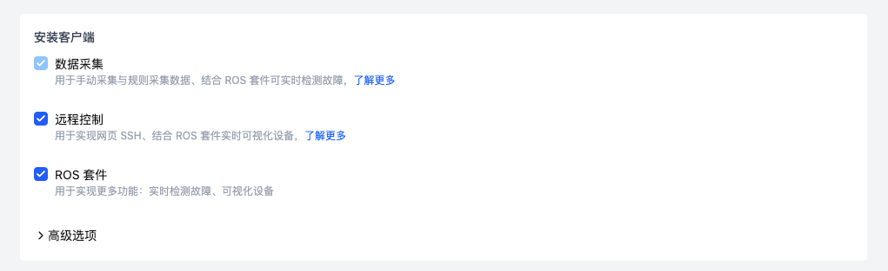
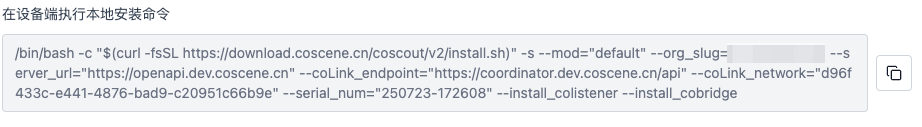
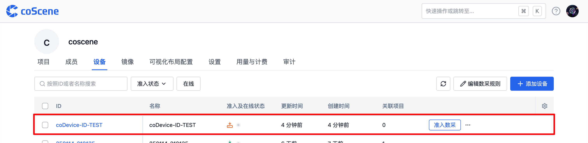
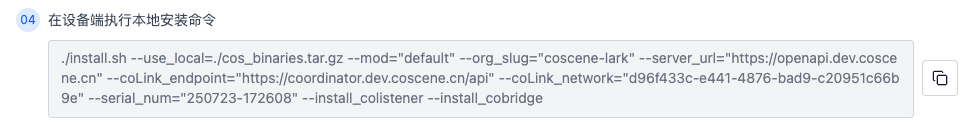
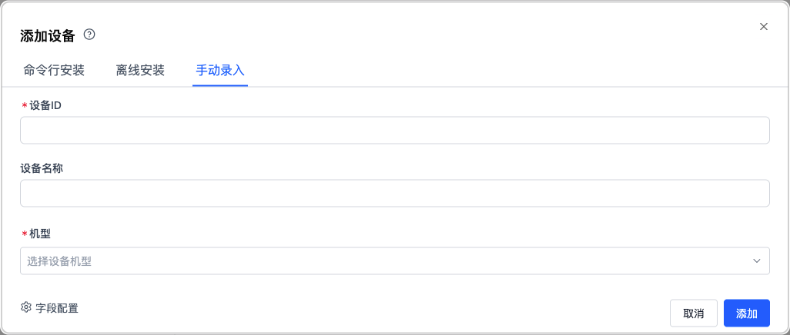

# 添加设备

## 权限说明

:::info
🤖 权限：仅**组织成员**及以上权限可以添加设备
:::

当组织引入新设备，并期望在平台中创建一台与线下真实设备相对应的设备，可前往组织设备页面进行添加。

## 添加方式概述

平台提供以下 3 种添加新设备到组织的方式：

| 添加方式             | 适用场景                                   |
| -------------------- | ------------------------------------------ |
| 在设备端执行命令添加 | 少量设备逐一准入与平台通信                 |
| 使用离线安装包添加   | 设备出厂批量准入与平台通信                 |
| 填写信息添加         | 快速创建仅用于数据流转的设备，不与平台通信 |

## 在设备端执行命令添加 {#add-device-from-device}

### 适用情况与入口

此方式适用于少量设备逐次接入平台。用户需手动通过 SSH 登录设备执行命令。入口位于「组织管理」页面的「设备」分页，点击【添加设备】按钮，进入添加设备弹窗





### 设备系统要求

1. 当前仅支持 Linux 设备，涵盖 arm64 和 x86_64 架构；

2. 暂不支持 Windows 设备，如有 Windows 设备接入需求，请联系刻行团队。

### 设备 ID 配置

1. 可填写存放设备唯一标识码（如 ID 或 SN）的位置，支持 txt、json、yaml 文本文件类型。

   - 若为 txt 文件，系统读取整个文件内容。

   - 若为 json、yaml 文件，需在下方输入框填写 ID 号的变量值（如文件中含 `id:123`，则在此处填写 `id`）。

2. 组织管理员可在「组织设备 - 编辑数采规则」中预设 ID 统一存放地址配置，实现弹窗自动填充，且支持二次更改。

   

   1. 若选择系统生成 ID，平台将生成默认 ID 号，安装后不可修改。

   

### 安装客户端选择

1. **数据采集（coScout）客户端**

   安装后设备可依据项目规则或采集任务采集数据，安装前需管理员配置数采监听目录等信息，详情参考编辑数采规则文档。

2. **远程控制（coLink）客户端**

   安装后可实现网页 SSH、结合 [coBridge](https://github.com/coscene-io/coBridge) 实时可视化设备，功能详情参阅远程控制设备[文档](https://docs.coscene.cn/docs/recipes/device/device-remote-control)；

3. **初始化客户端配置**

   若设备更换上位机或 ID 后需重新安装注册，勾选【初始化客户端配置】；仅升级客户端版本则取消勾选，更多使用方法参阅换机、升级、卸载流程指南

   

### 执行安装命令

1. 完成设备 ID 及安装客户端选项配置后，系统生成安装命令。用户复制命令至设备端 shell 终端执行。

   

2. 设备端出现 `Installation completed successfully 🎉` 提示即安装成功。受设备性能影响，安装完成后设备列表页显示可能存在延迟，此时设备已完成注册，后续操作参考设备准入部分

   

   

## 使用离线安装包添加

### 适用情况与相关设置

1. 此方式是相当于把数据采集、远程控制的安装包打包到设备软件版本更新包里，并且在安装包启动脚本里可以预先写好要执行的脚本赋权命令和安装命令，适合大规模的准入，比如设备出厂设置就自带了这两个客户端；

2. 此添加方式中的「设备系统」、「设备 ID 配置」、「安装客户端选择」与在设备端执行命令添加的方式相同，可参考对应部分教程。以下重点介绍安装方式区别

### 安装步骤

1. 假设用户位于 `/root` 目录下（切换目录时需注意更改路径），下载安装脚本 [coscene.sh](https://download.coscene.cn/coscout/coscene.sh)、离线二进制文件压缩包 [cos_binaries.tar.gz](https://download.coscene.cn/coscout/tar/latest/cos_binaries.tar.gz) 至设备端，存放位置分别为 `/root/coscene.sh`, `/root/cos_binaries.tar.gz`。

2. 在 root 目录下，给安装脚本赋予执行权限：

   ```plain text
   chmod +x /root/coscene.sh
   ```

3. 执行安装命令（以 `cos_binaries.tar.gz` 位于 `/root/cos_binaries.tar.gz` 为例）：

   ```plain text
   ./coscene.sh --server_url=*** --project_slug=*** --virmesh_endpoint=*** --use_local=/root/cos_binaries.tar.gz
   ```

   其中，参数 `--server_url` ，`--project_slug` ，`--virmesh_endpoint` 请参考网页端添加设备弹窗中的安装命令生成结果替换 `***`，参数 `--use_local` 为离线二进制文件压缩包路径，修改目录位置时需同步修改该参数。

   

## 填写信息添加

### 适用情况

此方式平台数据库创建虚拟设备字段，不与真实设备对应。

### 操作步骤

1. 在「添加设备」弹框输入设备 ID 及其他信息（设备 ID 不可重复），点击【添加】即可创建设备。

2. 若组织管理员设置自定义字段，用户需按页面提示填写完整必填项（如示例中的门店、机型）



---

通过以上步骤，您可根据实际需求在平台成功添加设备。

如有任何疑问，请随时联系我们获取支持。
