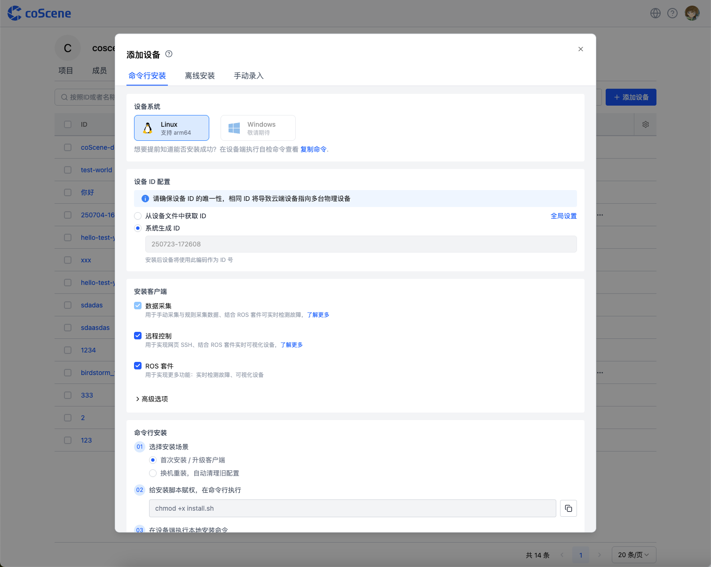
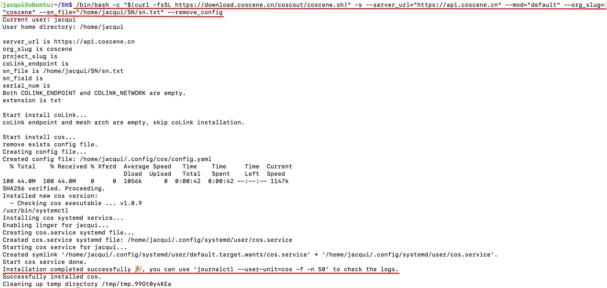

# 添加设备

:::info
🤖 权限：仅**组织成员**及以上权限可以添加设备
:::

当组织引入新设备，并期望在平台中创建一台与线下真实设备相对应的设备，可前往组织设备页面进行添加。

平台提供以下 3 种设备添加方式：

| 添加方式             | 适用场景                                   |
| -------------------- | ------------------------------------------ |
| 在设备端执行命令添加 | 少量设备逐一安装
| 使用离线安装包添加   | 设备出厂批量安装
| 填写信息添加         | 快速创建仅用于数据管理的设备，不与平台通信 |

## 在设备端执行命令添加 {#add-device-from-device}

### 适用情况与入口

此方式适用于少量设备逐次接入平台。用户需在真实设备上打开终端，执行相应的注册命令。

入口位于「组织管理」页面的「设备」分页，点击【添加设备】按钮，进入添加设备弹窗




### 设备系统要求

1. 当前仅支持 Linux 设备，涵盖 arm64 和 x86_64 架构；

2. 暂不支持 Windows 设备，如有 Windows 设备接入需求，请联系我们。

### 设备 ID 配置

设备 ID 是设备在平台中的唯一标识，注册后不可修改。设备 ID 的生成方式如下：
- 从设备端获取设备的唯一标识码（推荐使用设备 SN）
- 由系统自动生成随机 ID

1. **从设备端获取 ID**：从设备端指定文件中获取 ID，支持 txt、json、yaml 文本文件类型。
   - txt 文件
      - 系统会读取文件的全部内容作为设备 ID
      - 只需填写该文件在设备上的完整路径
   - json、yaml 文件
      - 系统会读取文件中指定的字段作为设备 ID
      - 除文件路径外，还需在下方输入框填写字段标识名。（如文件内容为 `id:123`，在此处填写 `id`，则会将 `123` 作为设备 ID）。
   - ID 设置
      - 为提高效率，组织管理员可在「组织设备 - 设备配置」中设置统一的设备 ID 文件路径
      - 设置后，添加设备时将自动填充该路径，用户仍可根据实际情况修改。详见[设备配置](./4-device-collector.md#存储设置mod)

   

2. **系统生成 ID**：平台生成默认 ID 号

   

### 安装客户端选择

1. **数据采集（coScout）客户端**

   安装后设备可依据项目规则或采集任务采集数据，使用前需配置数采监听目录等信息，详情参考[设备配置文档](./4-device-collector.md#存储设置mod)。

2. **远程控制（coLink）客户端**

   安装后可实现网页 SSH、结合 [coBridge](https://github.com/coscene-io/coBridge) 实时可视化设备，功能详情参阅[远程连接设备文档](./5-device-remote-control.md)；

3. **初始化客户端配置**

   - 设备重新安装时：
     - 更换上位机或修改设备 ID：请勾选【初始化客户端配置】
     - 仅升级客户端版本：无需勾选【初始化客户端配置】
   - 详细操作步骤请参阅[换机、升级、卸载流程指南](./7-change-device-guide.md)

   

### 执行安装命令
> 注意：
> 设备端执行命令添加时，若以 root 用户执行命令，或在命令前加 `sudo`，会将 coScout 安装在 root 下；若直接使用当前用户执行命令，会将 coScout 安装在当前用户下。

1. 完成设备 ID 及安装客户端选项配置后，系统生成安装命令。用户复制命令至设备端 shell 终端执行。

   

2. 设备端出现 `Installation completed successfully 🎉` 提示即安装成功(受设备性能影响，安装完成后设备列表页显示可能存在延迟)。此时设备已完成注册，后续操作参考[设备启用文档](./3-manage-device.md#设备启用)。

   

   

## 使用离线安装包添加

### 适用情况与相关设置

1. 使用离线安装包添加设备：将数据采集和远程控制功能相关的安装包集成到设备的软件更新包中：
   - 适用于设备出厂批量部署场景
   - 可实现设备开箱即用，无需单独安装客户端

2. 配置说明：
   - 基础配置项（设备系统、设备 ID 配置、安装客户端选择）与「在设备端执行命令添加」方式相同，请参考上述章节了解详情
   - 下文将重点说明离线安装包特有的安装步骤

### 安装步骤

1. 下载安装脚本 **install.sh**、安装包 **cos_binaries.tar.gz**，将其存放于至设备端。

   

2. 打开设备终端，在对应目录下，给安装脚本赋予执行权限：

   ```plain text
   chmod +x install.sh
   ```

3. 在设备终端，执行安装命令：

   ```plain text
   ./install.sh --use_local=./cos_binaries.tar.gz --mod="default" --org_slug="***" --server_url="***" --coLink_endpoint="***" --coLink_network="***" --sn_file="***" --sn_field="***" --remove_config
   ```

   其中，参数 `--use_local` 为离线安装包在设备上的路径，需根据实际情况进行修改。

   

## 填写信息添加

### 适用情况

创建虚拟设备字段，仅用于数据管理，不与真实设备对应。

### 操作步骤

1. 在「添加设备」弹框输入设备 ID 及其他信息（设备 ID 不可重复），点击【添加】即可创建设备。

2. 若组织管理员设置了设备自定义字段，用户需按页面提示填写必填项（如示例中的门店、机型）


## 后续操作
- [设备准入](./3-manage-device.md#device-admission)
- [将设备添加到项目](./3-manage-device.md#分配设备到项目)
  - [手动采集数据](../use-case/1-common-task.md)
  - [根据错误码自动采集数据](../use-case/data-diagnosis/2-get-started.md)
- [远程连接设备](./5-device-remote-control.md)
  - 实时可视化
  - 网页 SSH
  - 远程下发命令
  - 端口映射
