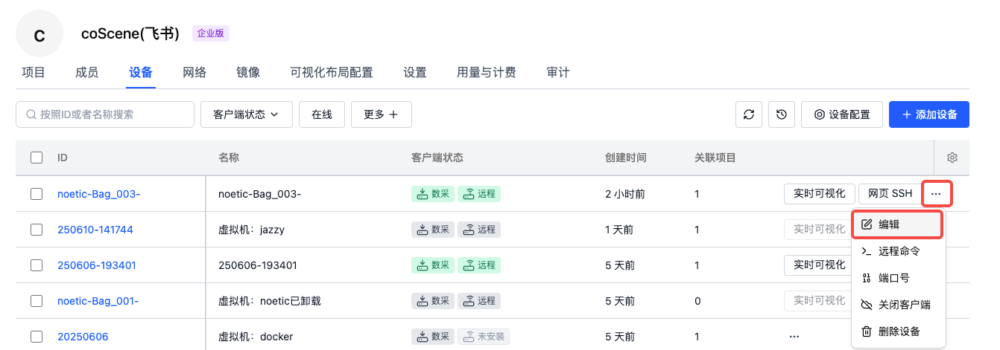

# 管理设备

设备在组织层面进行统一管理，在「组织管理 - 设备」页面可查看组织内的全部设备。

## 设备信息筛选与表格设置

:::info
🤖 权限：所有**组织内的用户**均可查看过滤设备信息
:::

### 过滤设备信息

系统默认支持对「设备 ID」、「客户端状态」、「在线状态」这 3 个字段进行筛选，在「更多」选项中，还能选择设备的自定义字段进行过滤操作，以满足用户更个性化的信息查找需求。


### 表格设置

当设备字段较多时，可通过表格右上角的【设置】按钮，按照个人偏好对表格显示字段进行排序、隐藏等操作。同时，也可通过【恢复默认】将表格恢复到初始状态


## 设备自定义字段管理

:::info
🤖 权限：仅**组织管理员**拥有设定设备自定义字段的权限
:::

1. 在「组织管理 - 设置 - 自定义字段」页面，定义组织全局字段

        

2. 在「设备字段配置」页面，选择设备需要使用的字段

        

3. 添加完成后，在创建与查看设备时，会相应出现这些自定义字段

    

- **注意事项：** 若删除某一设备自定义字段，该字段的所有数据将一并删除且无法恢复，请谨慎操作。

## 设备信息编辑

:::info
🤖 权限：**组织成员及以上角色**可对设备信息进行编辑更新
:::

在设备列表中选中需操作的设备后点击【编辑】按钮，或者在设备详情页面点击【编辑】按钮，都能对设备的各项信息进行修改操作。




## 设备与项目关联操作

:::info
🤖 权限：**组织管理员**可以分配设备到某个项目中
:::

### 分配设备到项目 {#assign-devices-to-projects}

设备添加到项目后，若安装了数据采集客户端，客户端将拉取项目中已启用的规则进行自动监听与诊断，也可在项目中创建采集任务采集数据。

在设备列表选定设备后点击【添加关联项目】按钮；


或者在项目中点击【添加设备】按钮来拉取组织中的设备，均可完成设备与项目的关联。


### 从项目移除设备

若项目不再需要某设备，可在项目中将其【从本项目移除】。移除后设备仍保留在组织中，但项目不再接收该设备采集的数据，后续若有需要仍可再次添加该设备到项目中。


## 设备准入 {#device-admission}

:::info
🤖 权限：**仅组织管理员**可进行设备启用操作
:::

完成添加设备后，设备列表会出现【启用客户端】的操作按钮。


启用客户端后，若「数据采集」在线，机器端程序将按规则采集数据并自动上传至对应项目；若「远程控制」在线，用户可对机器进行 SSH 连接、结合 [coBridge](https://github.com/coscene-io/coBridge) 实时可视化设备

### 查看客户端信息

在设备端执行以下命令，可查看客户端的版本、日志信息。

| 名称 | 查看版本 | 查看日志 |
| ---- | -------- | -------- |
| 数据采集（coScout）v1.1.2 及以上 | `~/.local/bin/cos --version` | `tail -f ~/.local/state/cos/logs/cos.log` |
| 数据采集（coScout）v1.1.2 以下 | `~/.local/bin/cos --version` | `journalctl -fu cos` |
| 远程控制（coLink） | `colink --version` | `journalctl -fu colink` |

### 卸载数据采集、远程控制客户端

在设备端中，执行以下命令可卸载数据采集、远程控制客户端，执行过程中需观察输出直至卸载流程完成。

注意：若数采客户端安装在 root 用户下，卸载时需切换为 root 用户。

```yaml
/bin/bash -c "$(curl -fsSL https://download.coscene.cn/coscout/uninstall.sh)"
```


## 删除设备

:::info
🤖 权限：若设备**为填写信息添加的设备，组织成员及以上角色**均可删除；其余设备仅组织管理员可删除
:::

在设备列表选择要删除的设备并点击【删除设备】，经二次确认后即可删除。当删除设备之后

1. 组织中将清除该设备及来自设备端的请求
2. 记录中将无法添加该设备
3. 记录中将无法查看该设备的详细信息
4. 项目中无法添加该设备
5. 已添加该设备的项目，在项目设备中将同步被删除


<br />

---

通过以上步骤和操作说明，您可全面地对设备进行管理操作，确保设备在组织和项目中的有效应用与维护。

如有任何疑问，请随时联系我们获取支持。
